Bienvenue dans ce guide de prise en main du **DataPlug**, la nouvelle fonctionnalité de votre contrôleur HAI-P200-4G. Ce tutoriel vous montrera comment utiliser notre configurateur graphique pour collecter, structurer et publier en quelques clics des données issues de vos équipements industriels en **OPC-UA, Modbus TCP, Modbus RTU, S7-Com, BACnet/IP, NMEA 0183, ou publiées par vos propres flux Node-RED.** À la fin de ce guide, vos données seront disponibles sur le broker MQTT interne, prêtes à être utilisées par le Data-Explorer, Node-RED ou vos propres applications.

## Prérequis

- Le contrôleur HAI-P200-4G
- HAI-OS

* * *

## Configuration

### Paramétrage des Inputs

#### Modbus TCP


Pour Modbus, il est possible de nommer votre appareil utilisant ce protocole (Input Name), de saisir son URL composée de son port (Controller URL), de sélectionner l’identifiant de l’esclave (Slave ID), son timeout et l’intervalle de collecte des données (Interval).

Vous pouvez ensuite ajouter les champs dont vous souhaitez récupérer la valeur. Il existe 4 types de champs :

- **Holding Registers** (Registres de maintien) : **Code 0x03** (Read Holding Registers)

    - Il s'agit de la lecture de mots de 16 bits en lecture/écriture.
- **Input Registers** (Registres d'entrée) : **Code 0x04** (Read Input Registers)

    - Correspond à la lecture de mots de 16 bits en lecture seule.
- **Coils** (Bobines) : **Code 0x01** (Read Coils)

    - Permet la lecture de bits (booléens) en lecture/écriture.
- **Discrete Inputs** (Entrées TOR) : **Code 0x02** (Read Discrete Inputs)

    - Utilisé pour la lecture de bits (booléens) en lecture seule.

Pour paramétrer techniquement un champ Modbus afin de lire la bonne information, vous devrez renseigner les éléments suivants :

- **Address (Adresse) :** L'adresse numérique du registre dans la table Modbus de l'équipement (ex: 0, 100). _Note : Si vous choisissez un type de donnée sur 32 ou 64 bits, l'interface calculera automatiquement les adresses des registres consécutifs nécessaires._

- **Data Type (Type de donnée) :** Indique comment décoder la valeur lue (ex: INT16 pour un entier standard, FLOAT32-IEEE pour un réel, STRING pour du texte, ou BIT).

- **Byte Order (Ordre des octets) :** Le standard Modbus ne définissant pas l'ordre des mots pour les valeurs supérieures à 16 bits, celui-ci varie selon le constructeur de l'automate (ex: AB, ABCD, CDAB). Ce paramètre permet de remettre les octets dans le bon ordre pour obtenir la valeur correcte.

- **Scale (Échelle) :** Un multiplicateur appliqué automatiquement à la valeur brute lue (ex: saisir 0.1 pour diviser par 10 une valeur entière et simuler une virgule flottante).

- **Bit :** Ce paramètre n'apparaît que si vous sélectionnez le Data Type "BIT". Il permet d'isoler et de lire un bit spécifique (de 0 à 15) à l'intérieur d'un registre de 16 bits.

Vous pourrez également nommer ces champs, et choisir leurs paramètres de contextualisation (catégorie, unité, description). Concernant l’unité des champs, il est possible que malgré le nombre important d’unités proposées, celle que vous souhaitez n'y soit pas. Vous pouvez alors créer votre propre unité en tapant son nom dans la zone de sélection puis en appuyant sur la touche _Entrée_.

#### OPC-UA

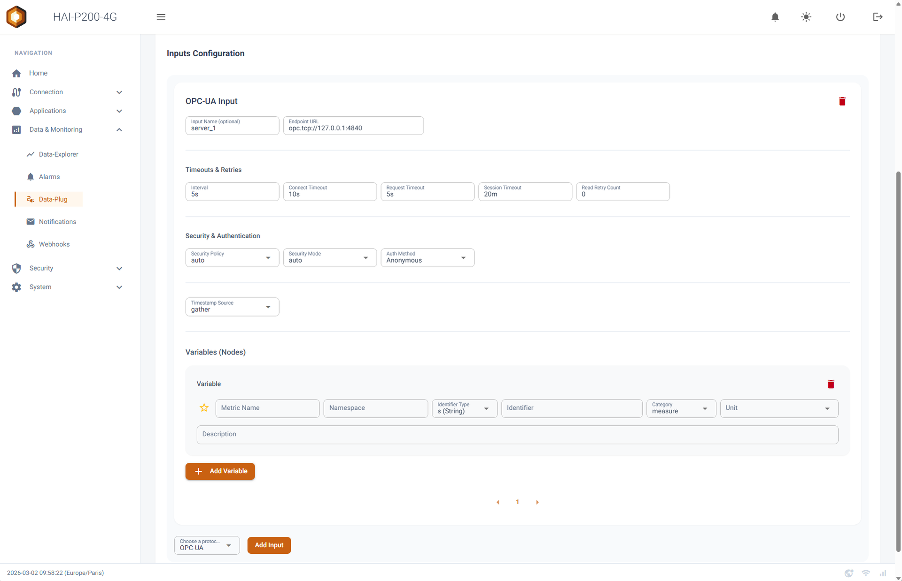

Pour l’OPC-UA, il est possible de choisir le nom de l’entrée (Input Name) ainsi que son URL avec son port (Endpoint URL) au format opc.tcp://ADRESSE\_IP:NUMERO\_DE\_PORT.

Vous pouvez également paramétrer les délais d'attente et tentatives. Voici les champs modifiables :

- **Interval** (Intervalle de collecte) : Ce paramètre définit la fréquence à laquelle Telegraf interroge le serveur OPC-UA pour récupérer les données. C'est le rythme de base de la collecte. Si ce champ est réglé sur '10s', Telegraf demandera les valeurs de toutes les variables configurées toutes les 10 secondes.
- **Connect Timeout** (Délai de connexion) : Cela correspond au temps maximum que le client attend pour établir la **connexion initiale** avec le serveur OPC UA. Si le serveur ne répond pas à la tentative de connexion dans ce délai (par exemple, '10s'), la connexion est considérée comme échouée. C'est la première porte à franchir.
- **Request Timeout** (Délai de requête) : Une fois connecté, ce délai s'applique à chaque demande individuelle (lecture ou écriture d'une variable). Si le client demande la valeur d'un capteur et que le serveur ne répond pas dans ce délai (par exemple, '5s'), la requête échoue, même si la connexion globale est toujours active. Cela évite d'attendre indéfiniment une réponse pour une seule opération.
- **Session Timeout** (Délai de session) : Ce champ définit la durée maximale pendant laquelle une session de communication peut rester inactive. Une session est un "contexte" de communication entre le client et le serveur. Pour éviter que le serveur ne ferme la connexion par manque d'activité, le client envoie périodiquement des messages "keep-alive" (signe de vie). Ce timeout garantit que si le client et le serveur ne communiquent plus pendant cette durée (par exemple, '20m'), la session est invalidée et devra être rétablie.
- **Read Retry Count** (Nombre de tentatives de lecture) : Ceci correspond au nombre de fois où le client va réessayer de lire une variable si la première tentative échoue (par exemple, à cause d'un Request Timeout). Si ce champ est réglé sur 3, en cas d'échec de lecture, le client tentera 3 fois de plus avant d'abandonner et de signaler une erreur. Un réglage à 0 signifie qu'il n'y aura aucune nouvelle tentative.

Vous pouvez aussi modifier la section Security & Authentication (Sécurité et Authentification), qui est cruciale en OPC UA, car elle garantit que vos données industrielles sont protégées contre l'interception, la modification et l'accès non autorisé. Elle s'articule autour de trois piliers : la politique, le mode et la méthode d'authentification **:**

- **Security Policy** (Politique de sécurité) : Ce paramètre définit quels algorithmes de chiffrement seront utilisés pour sécuriser la communication. C'est le "comment" de la sécurité.

    - auto ou None : Aucune sécurité. Les données circulent en clair. À n'utiliser que pour des tests ou sur un réseau totalement isolé.
    - Basic128Rsa15, Basic256, Basic256Sha256 : Ce sont des ensembles prédéfinis d'algorithmes de plus en plus robustes. Plus la politique est forte, plus la communication est sécurisée (mais cela peut avoir un impact minime sur les performances).

    Le choix d'une politique autre que None nécessite des certificats (.pem) pour le client et le serveur afin d'établir une connexion sécurisée.

- **Security Mode** (Mode de sécurité) : Ce paramètre définit ce qui est protégé en utilisant la politique de sécurité choisie.

    - None : Rien n'est sécurisé.
    - Sign (Signer) : Chaque message est accompagné d'une signature numérique. Cela garantit l'intégrité (le message n'a pas été modifié en chemin) et l'authenticité (on est sûr de qui l'a envoyé). Cependant, le contenu du message n'est pas chiffré et reste lisible.
    - SignAndEncrypt (Signer et Chiffrer) : C'est le niveau le plus élevé. Les messages sont à la fois signés ET chiffrés. Cela garantit l'intégrité, l'authenticité et la confidentialité (personne ne peut lire le contenu des messages).
- **Auth Method** (Méthode d'authentification) : Ce paramètre définit comment un utilisateur ou une application prouve son identité au serveur.

    - Anonymous (Anonyme) : Aucune authentification n'est requise. N'importe quel client peut se connecter, bien que les règles de sécurité (chiffrement) puissent toujours s'appliquer.
    - UserName : Le client doit fournir un nom d'utilisateur et un mot de passe valides pour être autorisé à se connecter.
    - Certificate (Certificat) : L'authentification se fait via le certificat numérique du client. C'est une méthode très sécurisée.

Vous pouvez également sélectionner la source du Timestamp que le Data-Plug transmettra.

Puis, vous pouvez ajouter vos différentes variables (appelées "Nodes" en OPC-UA). Contrairement à Modbus ou S7 qui utilisent des adresses mémoires classiques, OPC-UA utilise un système d'adressage spécifique que vous devez renseigner :

- **Namespace (Index) :** C'est l'index numérique de l'espace de noms (par exemple 2 ou 3) défini dans le serveur OPC-UA pour organiser et séparer les variables.

- **Identifier Type :** Indique le format de l'identifiant de votre variable. Il peut s'agir d'un format numérique (i), d'une chaîne de caractères (s), d'un GUID (g) ou d'un format opaque (b).

- **Identifier :** L'identifiant exact (le nom ou le numéro) de la variable dans ce namespace. (ex: 1002 pour un type numérique, ou path.to.my.variable pour un type string).

##### Explorer le serveur depuis l'interface (Browse server)

Plutôt que de saisir le triplet Namespace / Identifier Type / Identifier à la main, cliquez sur **Browse server**, à côté de l'URL de l'endpoint. Le configurateur se connecte au serveur avec les paramètres déjà saisis (endpoint, sécurité, authentification, certificats) et affiche son arborescence, pré-chargée sur 6 niveaux.

Cochez les variables voulues — seules les Variables dont le type est exploitable (BOOL, INT, FLOAT, STRING) sont cochables — puis validez. Chaque variable importée arrive avec son chemin BrowseName complet comme nom (ex. Plant/Line1/Temperature), ainsi que sa description et son type lus sur le serveur.

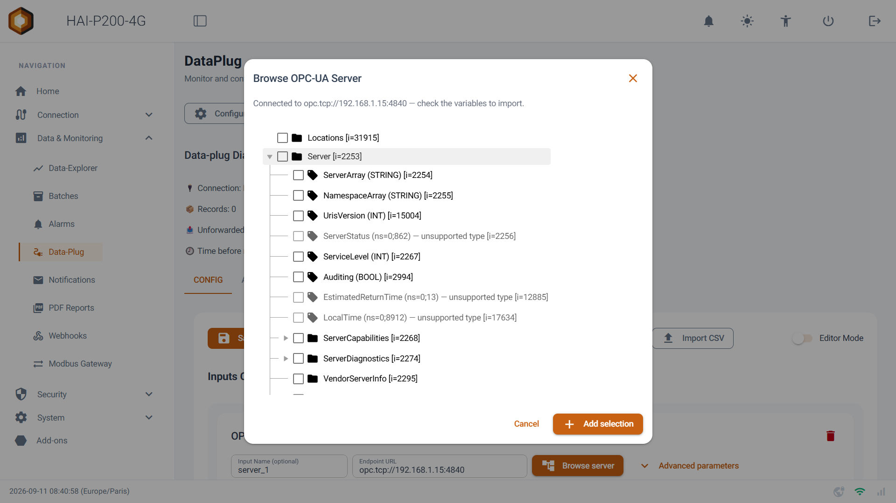

##### Certificats

Dès que la politique de sécurité n'est plus None, le bouton **Generate client key pair** crée et télécharge un certificat client auto-signé (validité 10 ans) directement depuis l'interface : inutile de le fabriquer à part. Le champ **Trusted Server Certificate** permet en complément d'épingler le certificat du serveur, pour n'accepter que lui.

<details>
<summary>Astuce : Trouver facilement vos paramètres OPC-UA avec UaExpert</summary>

:::tip
**Astuce : Trouver facilement vos paramètres OPC-UA avec UaExpert**

Si vous ne connaissez pas par cœur l'adressage de vos variables, il est fortement recommandé d'utiliser un client OPC-UA gratuit tel que **UaExpert**. En vous connectant à votre serveur via ce logiciel, naviguez dans l'arborescence (_Address Space_) jusqu'à votre variable. Dans le panneau des propriétés à droite (_Attributes_), dépliez la ligne **NodeId**. Vous y retrouverez très exactement les trois valeurs attendues par le Data-Plug : le NamespaceIndex, l'IdentifierType (et sa valeur associée), ainsi que l'Identifier complet à copier-coller.

[Télécharger UaExpert](https://www.unified-automation.com/downloads/opc-ua-clients.html)
:::

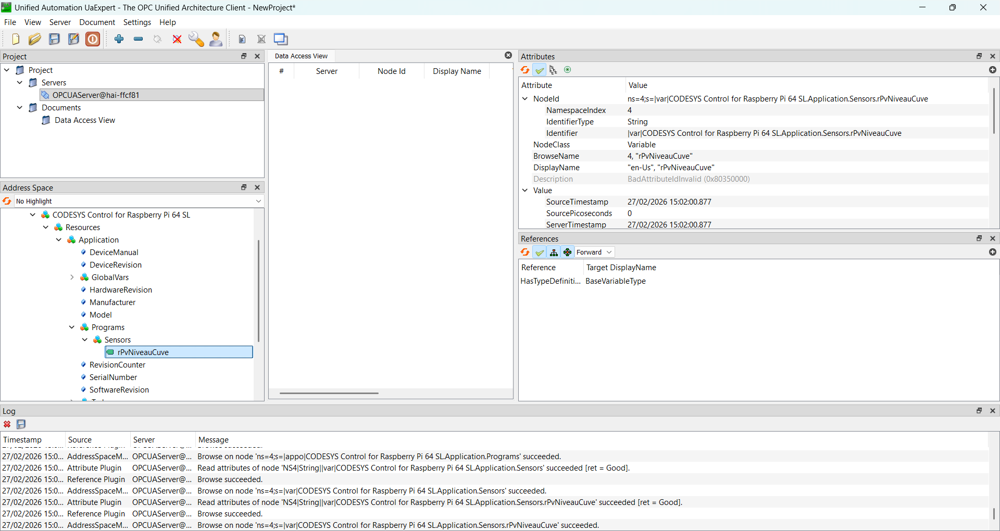

A l'aide de cet outil, nous pouvons voir que les champs doivent être écrits de cette façon sur le Data-Plug :

- Namespace : 4
- Identifier Type : s (String)
- Identifier : |var|CODESYS Control for Raspberry Pi 64 SL.Application.Sensors.rPvNiveauCuve

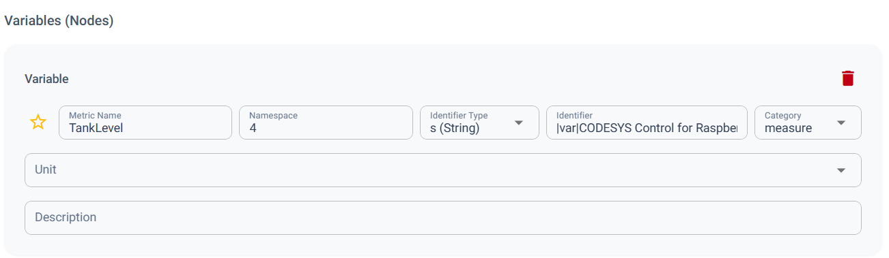

Vous pourrez également paramétrer pour chaque variable son nom d'affichage, sa catégorie, son unité et sa description.

</details>

#### S7

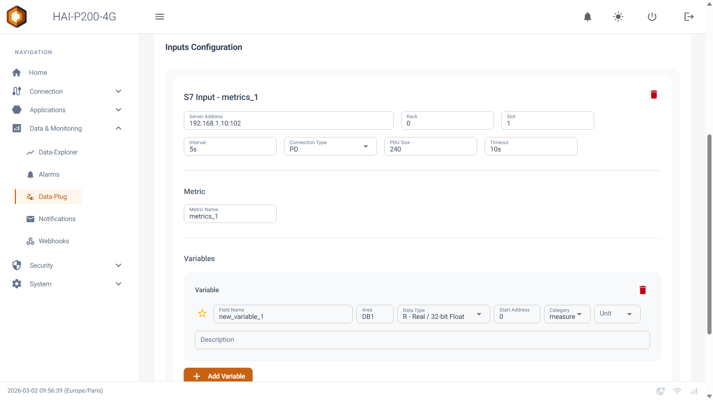

Pour le protocole S7, il est possible d’entrer l’adresse IP du serveur ainsi que son port (Server Address), avec son rack et son slot. Vous pouvez également saisir le type de communication (Connection Type) à établir avec l'automate. Les options sont :

- PD: Pour les connexions aux "Processing Devices" (CPU). C'est le type le plus courant.
- OP: Pour les connexions aux "Operator Panels" (IHM).
- basic: Pour les connexions basiques avec des modules de communication plus simples.

Vous pouvez ensuite saisir le pdu\_size, qui correspond à la taille maximale (en octets) des paquets de données (PDU - Protocol Data Unit) échangés avec l'automate. Une taille plus grande peut améliorer les performances mais doit être supportée par l'automate. La valeur par défaut est 240.

Vous pouvez ensuite paramétrer le Timeout, ainsi que le Interval qui définit la fréquence à laquelle Telegraf doit interroger l'automate. Ce délai entre chaque collecte s'exprime avec une unité de temps (ex: 5s).

Enfin, vous pouvez choisir le nom de la métrique et ajouter vos variables en dessous.

Lorsque vous ajoutez une variable, vous pouvez paramétrer son nom (Field Name), sa catégorie, son unité et sa description. Vous devrez également indiquer son adresse à l’aide des paramètres suivants :

- **Area** : La zone mémoire où se trouve la variable (ex: DB1 pour le bloc de données 1, MK0 pour les variables adressées en %M).
- **Data Type** : Le type de données de la variable (ex: R pour Real/Flottant, I pour Integer, X pour Bit, S pour String).
- **Start Address** : L'adresse de départ du mot ou de l'octet dans la zone mémoire.
- **Extra (Bit/Length)** : Un paramètre supplémentaire qui dépend du type de données :

    - Pour le type X (Bit), c'est le numéro du bit (de 0 à 7).
    - Pour le type S (String), c'est la longueur de la chaîne de caractères à lire.
    - Pour les autres types, ce champ n'est pas utilisé.

Cas d'une variable adressée en %M :

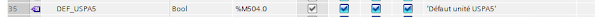

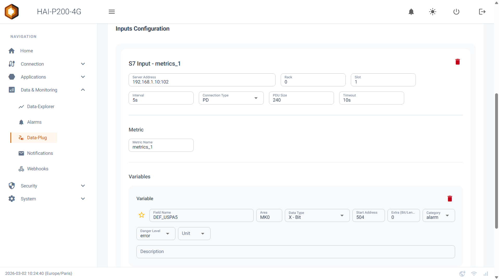

#### BACnet

Le protocole **BACnet/IP** permet de collecter les données de vos équipements de gestion technique du bâtiment (CVC, éclairage, comptage).

:::caution
Contrairement aux autres protocoles, BACnet/IP n'est pas géré par Telegraf mais par un collecteur dédié intégré à HAI-OS. Cela ne change rien à votre utilisation, mais explique que ses variables n'apparaissent pas dans le TOML en mode Éditeur.
:::

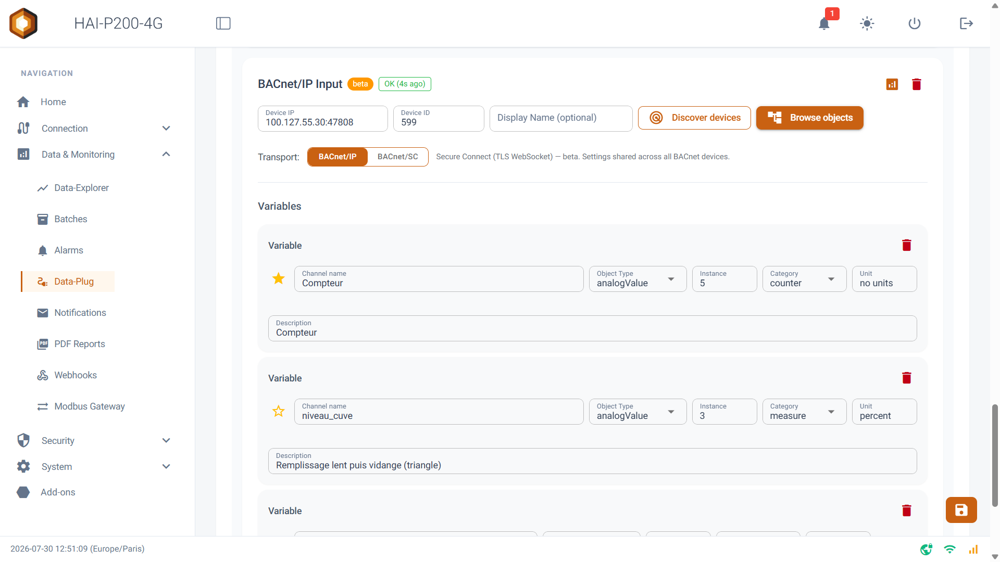

##### Déclarer un équipement

Chaque carte BACnet correspond à un équipement :

- **Device IP** : l'adresse IP de l'équipement.
- **Device ID** : l'identifiant d'équipement BACnet (_Device Object Identifier_).
- **Display Name (optional)** : un nom lisible pour vous repérer.

Un badge d'état en haut de la carte vous indique en continu la situation du collecteur : _Stopped_, _Disconnected_, _OK_ avec l'âge de la dernière lecture, ou le nombre d'erreurs rencontrées.

###### Trouver vos équipements automatiquement (Discover devices)

Plutôt que de saisir l'adresse et l'identifiant à la main, cliquez sur **Discover devices**. Une fenêtre s'ouvre pour lancer une recherche sur le réseau :

- **Network interface to query** : choisissez l'interface réseau sur laquelle chercher. L'interface correspondant à l'adresse déjà saisie est présélectionnée.
- **Target address(es) (optional)** : laissez ce champ **vide** pour une recherche par diffusion (broadcast), la méthode la plus simple. Si vos équipements ne répondent pas (certains pare-feux bloquent la diffusion), renseignez une adresse, une plage CIDR ou une liste séparée par des virgules pour les interroger un par un.
- **Scan this subnet** : remplit automatiquement le champ cible avec le sous-réseau de l'interface choisie, pour interroger chaque hôte individuellement.
- **Fill Tailscale peers** : sur une interface VPN (point à point), la diffusion ne fonctionne pas. Ce bouton remplit la liste des pairs Tailscale connectés, à interroger directement.

Cliquez sur **Search** : les équipements trouvés s'affichent en liste. Cliquez sur l'un d'eux et son adresse, son identifiant et son nom sont recopiés dans la carte.

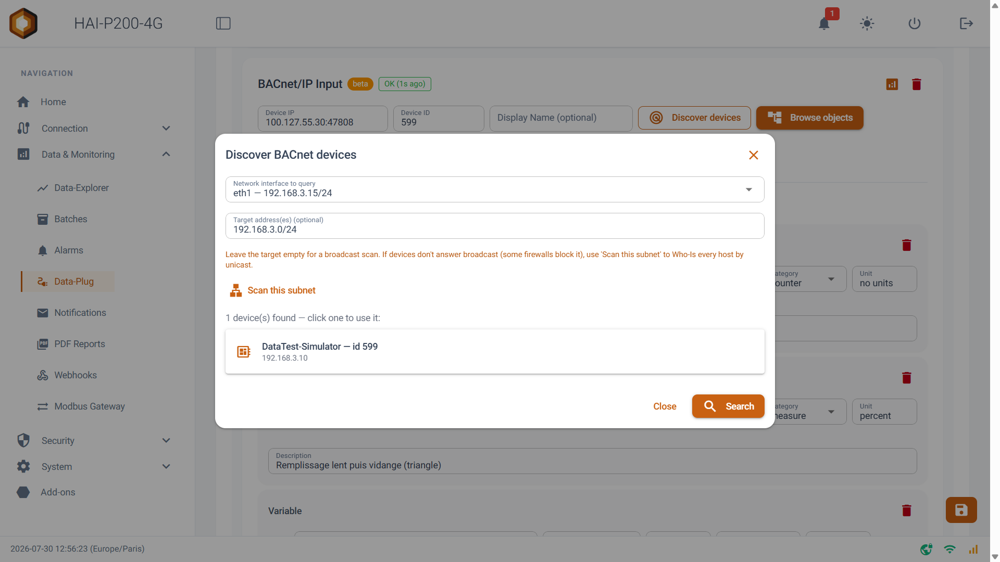

###### Ajouter des variables (Browse objects)

Le bouton **Browse objects** interroge l'équipement et liste ses objets. Cochez ceux qui vous intéressent puis cliquez sur **Add selection** : les variables sont créées avec leur type d'objet, leur instance, leur type de valeur, et lorsque l'équipement les fournit, leur unité et leur description. La catégorie est initialisée à _measure_ : ajustez-la si nécessaire.

Vous pouvez aussi cliquer sur **Add Variable** pour saisir une variable manuellement :

- **Channel name** : le nom de la variable dans HAI-OS.
- **Object Type** : le type d'objet BACnet, parmi _analogInput, analogOutput, analogValue, binaryInput, binaryOutput, binaryValue, multiStateInput, multiStateOutput, multiStateValue_.
- **Instance** : le numéro d'instance de l'objet.
- **Unit** : à noter, sur BACnet ce champ est une saisie libre, sans liste déroulante ni création d'unité comme sur les autres protocoles.

Le type de valeur est déduit automatiquement du type d'objet : les objets _analog_ donnent un nombre décimal, les _binary_ un booléen, les _multiState_ un entier.

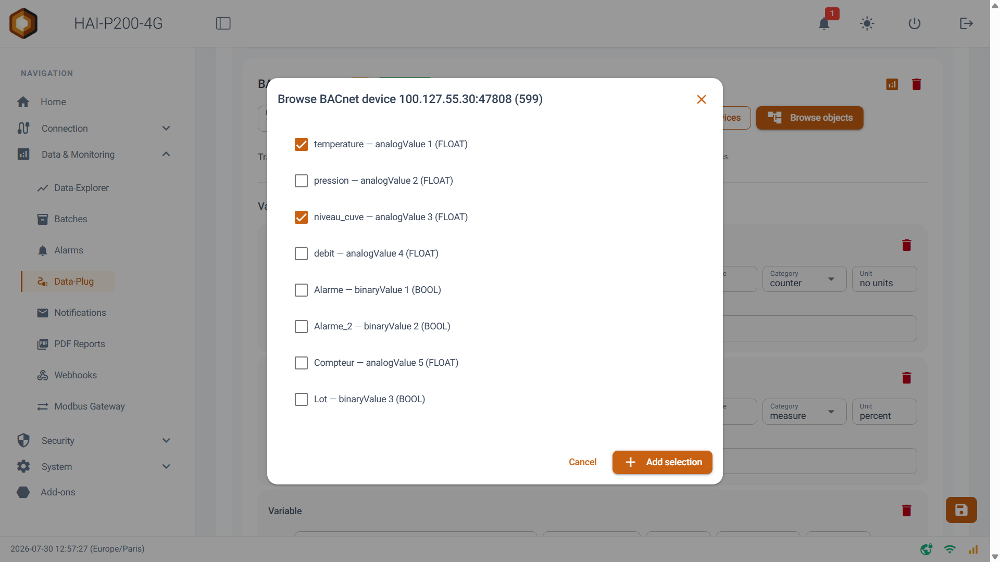

###### Diagnostics par équipement

L'icône de graphique en haut de la carte ouvre la fenêtre **BACnet/IP Diagnostics**, mise à jour toutes les 2 secondes : état de connexion, état du collecteur, date et durée de la dernière interrogation, nombre d'erreurs, intervalle d'interrogation, et un tableau ligne par ligne indiquant pour chaque variable sa dernière valeur, son ancienneté et sa dernière erreur. Les journaux détaillés se trouvent dans /var/log/hai-os/hai\_bacnet\_service.log.

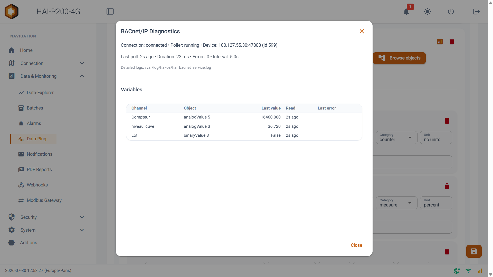

###### BACnet/SC (beta)

Un sélecteur **Transport** propose de basculer de **BACnet/IP** vers **BACnet/SC** (_Secure Connect_), qui fait passer les échanges par un tunnel TLS vers un hub. Ce réglage est **global à tous vos équipements BACnet** et n'apparaît que sur la première carte. En mode Secure Connect, les équipements sont joints par leur Device ID via le hub : le champ Device IP disparaît et les fonctions de découverte et d'exploration ne sont pas disponibles. Les paramètres du tunnel (URL du hub, certificat et clé client, certificat du hub) se saisissent dans la même section.

#### NMEA 0183

Le protocole NMEA 0183 permet de collecter les trames émises par des équipements de navigation et de mesure marine (GPS, sondeur, girouette-anémomètre, centrale de navigation). 

:::caution
Comme BACnet, il est traité par un lecteur intégré à HAI-OS et non par Telegraf : ses variables n'apparaissent donc pas dans le TOML en mode Éditeur.
:::

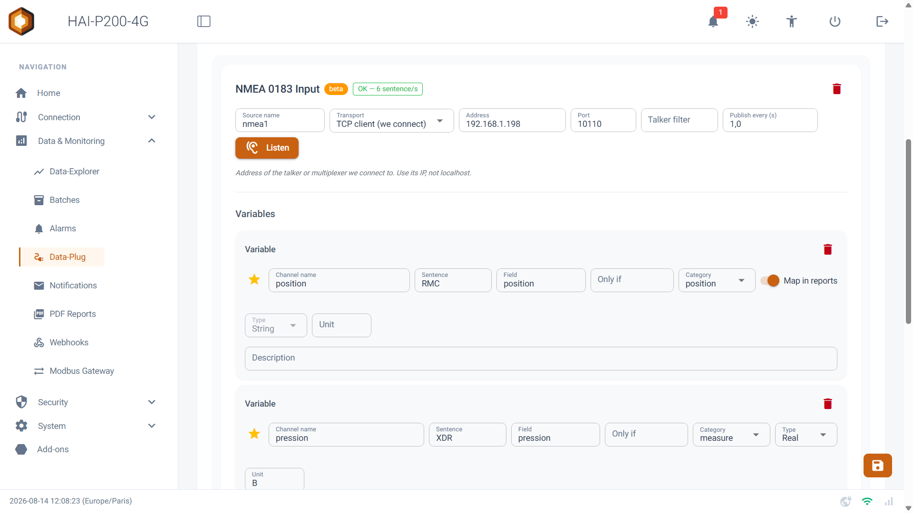

##### Déclarer une source

Chaque carte correspond à un talker ou à un multiplexeur :

- **Source name** : un nom lisible pour vous repérer.
- **Transport** : TCP client (we connect) — le contrôleur se connecte à l'équipement ; TCP server (they connect) — l'équipement se connecte au contrôleur ; UDP (listen) — le contrôleur écoute des datagrammes.
- **Address / Bind address** : en client TCP, l'adresse de l'équipement (son IP, pas localhost). En serveur TCP ou en UDP, l'adresse d'écoute — laissez vide pour accepter sur toutes les interfaces. Le libellé et l'aide sous le champ s'adaptent au transport choisi.
- **Port** : le port de la liaison.
- **Talker filter** : optionnel, pour ne retenir qu'un émetteur (ex. GP, II).
- **Publish every (s)** : un talker émet 1 à 10 trames par seconde. Seule la dernière valeur de chaque variable est publiée, à cette cadence.

Un badge d'état en haut de la carte affiche en continu la situation : Stopped, Disconnected avec le motif, ou OK avec la cadence de réception en trames/seconde. Une source connectée mais muette se repère à une cadence nulle.

**Équipement série** : le NMEA 0183 est à l'origine un protocole série. Un talker en RS232/RS422 se raccorde via un convertisseur série ↔ Ethernet externe, configuré pour présenter le flux en TCP ou en UDP.

##### Ajouter des variables avec le mode écoute (Listen)

Le bouton **Listen** écoute la source pendant quelques secondes et affiche les trames reçues, décodées champ par champ. Chaque champ reconnu s'ajoute en variable d'un clic, avec son unité quand la trame la porte. Les champs que le décodeur ne sait pas nommer restent accessibles sous « Raw positional fields », lus par leur position dans la trame — attention, cette position peut varier d'un constructeur à l'autre.

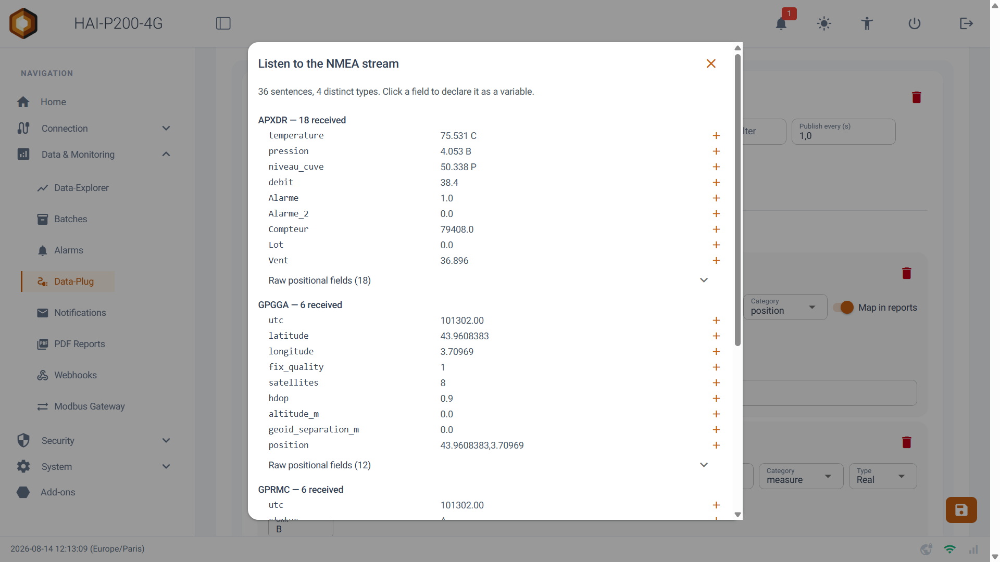

Vous pouvez aussi cliquer sur **Add Variable** et saisir :

- **Channel name** : le nom de la variable dans HAI-OS.
- **Sentence** : le type de trame. Trois lettres correspondent à n'importe quel émetteur (RMC), cinq lettres en épinglent un seul (GPRMC).
- **Field** : le champ à extraire de la trame.
- Puis les paramètres habituels : type de valeur, catégorie, unité, description.

##### Position sur une carte

Le décodeur fabrique, à partir de la latitude et de la longitude d'une même trame à fix (RMC, GGA, GLL), un champ composé position. Une variable déclarée sur ce champ prend automatiquement la catégorie **position** et le type STRING : le Data-Explorer l'affiche alors sous forme de trace sur une carte, et non de courbe, sur la période sélectionnée et en direct.

Si cette variable est mise en favori, un interrupteur **Map in reports** apparaît : il ajoute la trace aux rapports PDF et e-mail. Le fond de carte est téléchargé au moment de la génération ; sans internet, le tracé reste dessiné, sur fond neutre.

#### Internal MQTT (Node-RED)

Cet input ne va pas chercher les données : il les **reçoit**. Il vous permet de déclarer dans le Data-Plug des variables dont les valeurs sont publiées par un client MQTT externe — un flux Node-RED, un script maison, une supervision tierce. Vos données bénéficient alors de tout le reste du Data-Plug : historisation, catégories, favoris, alarmes, rapports et Data-Explorer.

C'est la solution à privilégier pour tout équipement dont le protocole n'est pas géré nativement : vous faites la collecte dans Node-RED, et le Data-Plug prend le relais.

Un seul input de ce type peut exister sur le contrôleur. Déclarez-y autant de variables que nécessaire, en renseignant pour chacune son **Channel name**, son type de valeur, sa catégorie, son unité et sa description.

##### Format de publication

Un bouton d'aide dans la carte rappelle le format attendu. Publiez sur le broker local **localhost:1883** (sans authentification), sur un topic commençant par **data/all/** :

```
{
  "name": "<channel_name>",
  "fields": {
    "value": <valeur>
  },
  "timestamp": <epoch_ms>
}
```

- **name** : doit correspondre exactement au _Channel name_ déclaré dans la carte. C'est ce champ, et non le topic, qui identifie la variable.
- **fields.value** : un nombre, un booléen ou une chaîne de caractères.
- **timestamp** : horodatage Unix en **millisecondes**.

Tout topic correspondant à data/all/# est accepté. Telegraf n'intervient pas dans cette chaîne.

#### Modbus RTU

Pour paramétrer une connexion utilisant le protocole Modbus RTU, vous devez dans un premier temps vous rendre sur la page de configuration dédiée à ce protocole dans l'interface de votre contrôleur. Cette page vous permet de définir les paramètres de communication série de votre équipement (port série, vitesse de transmission ou _baud rate_, parité, bits de données, etc.).

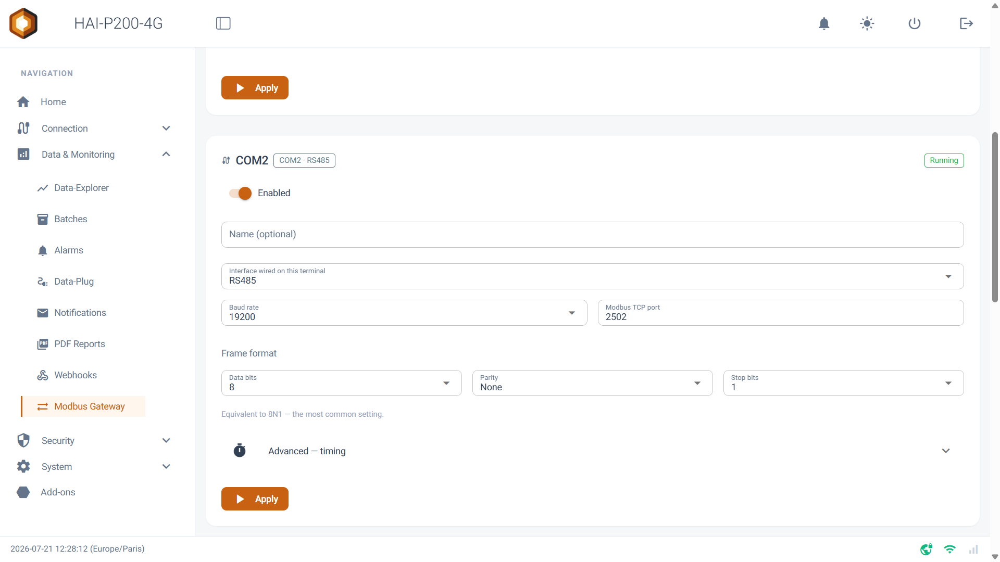

Une fois la liaison série établie sur cette page dédiée, l'ajout de votre appareil et la collecte de ses données s'effectuent de façon identique au **Modbus TCP**. Il vous suffit de l'ajouter dans le configurateur graphique comme une entrée Modbus classique.

Pour configurer vos différentes variables, il faudra donc revenir à l'explication détaillée de la section [**Modbus TCP**](#modbus-tcp). Vous y appliquerez exactement la même méthode pour :

- **Sélectionner le type de champ :** Holding Registers, Input Registers, Coils ou Discrete Inputs.

- **Renseigner les paramètres techniques :** Address, Data Type, Byte Order, Scale ou encore Bit.

- **Appliquer la contextualisation métier :** Nom, catégorie (Measure, State, Alarm, Counter), unité et description de la variable.

### Contextualisation des données

**Anatomie d'une variable** Lorsque vous ajoutez une variable dans le Data-Plug, vous devez configurer deux grands types de paramètres :

1.  **Les paramètres d'adressage (Techniques) :** Ils sont spécifiques au protocole choisi et permettent d'aller lire la donnée brute dans l'équipement (ex: l'_Address_ en Modbus, ou le _Namespace_ en OPC-UA).

2.  **Les paramètres de contextualisation (Métier) :** Ils sont communs à tous les protocoles. Ce sont eux qui donnent du sens à la donnée brute et indiquent au système comment la traiter et l'afficher.

**Les informations générales (Identité de la variable)** Pour chaque variable ajoutée, peu importe son protocole, vous devez renseigner son identité :

- **Name (Nom de la variable) :** Le nom unique qui sera utilisé pour identifier la donnée dans tout le système (ex: Temp\_Moteur, Niveau\_Cuve). Soyez clair et précis, car c'est ce nom qui apparaîtra dans vos graphiques et vos alarmes.

- **Unit (Unité) :** L'unité physique de la mesure (ex: °C, bar, m/s). _Astuce : bien qu'une très longue liste d'unités soit proposée dans le menu déroulant, vous pouvez créer la vôtre en tapant son nom puis en appuyant sur la touche Entrée._

- **Description :** Un champ de texte libre très utile pour documenter le contexte de la variable (ex: "Sonde de température située sur le tuyau de refoulement Nord"). Cette description sera visible dans les e-mails de notification d'alarmes et les rapports pour aider au diagnostic.

Lors de la création d'une variable (qu'elle soit en Modbus, OPC-UA, S7, BACnet, NMEA 0183 ou Internal MQTT), vous devez lui assigner une **Catégorie**. Ce choix est primordial car il indique au système comment traiter, agréger et afficher cette donnée dans les graphiques et les rapports :

- **Measure (Mesure) :** Destiné aux valeurs analogiques qui varient de façon continue (température, pression, niveau, vitesse). Dans le Data-Explorer, cette catégorie de variable s'affiche automatiquement sous forme de courbe.

- **State (État) :** Destiné aux valeurs discrètes ou booléennes (marche/arrêt d'une machine, vanne ouverte/fermée). Les données sont affichées via des graphiques en "escalier" (Step chart) pour visualiser clairement les changements d'états dans le Data-Explorer. Seuls les changements de valeur sont publiés (déduplication).

- **Alarm (Alarme) :** Similaire à la catégorie "State" (valeur binaire 0 ou 1), mais cette catégorie déclenche en plus le système de surveillance d'alarmes et de notifications.

- **Counter (Compteur) :** Destiné aux variables qui ne font que s'incrémenter au fil du temps (compteurs d'énergie kWh, volume d'eau totalisé, compteurs de pièces). Le Data-Explorer affiche ces variables sous formes d'histogrammes de consommation sur une certaine période.

- **Position** _(protocole NMEA 0183 uniquement)_ : destiné aux variables qui portent un point GPS, c'est-à-dire un couple latitude/longitude issu d'une même trame de navigation. Sa valeur est toujours une chaîne de caractères, et le Data-Explorer l'affiche sous forme de trace sur une carte plutôt que sous forme de courbe. Cette catégorie n'est proposée que sur les variables NMEA 0183.

Pour mettre une variable en favoris, cliquez sur l’étoile se situant sur la gauche. Les variables en favoris seront à la fois transmises sur le topic data/all et sur le topic data/favorites. Les variables en favoris peuvent également être retrouvées dans la table hai\_vars de votre base SQLite.

- - 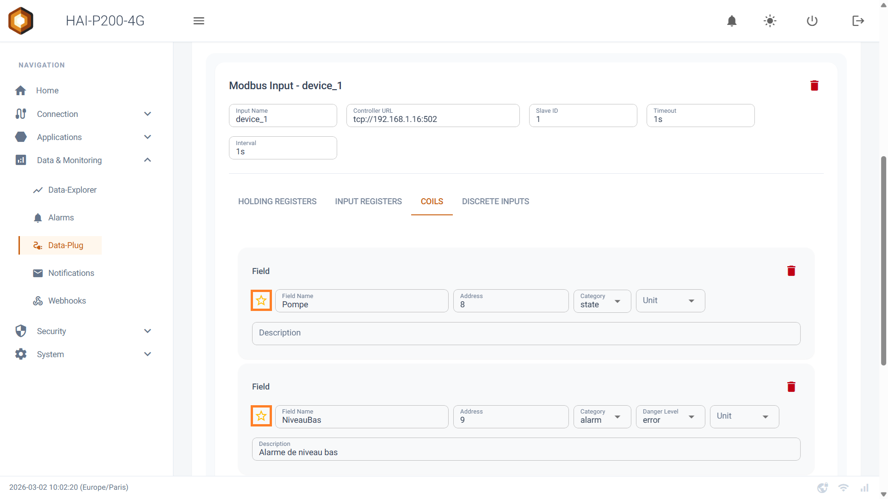

Lorsque vous déclarez une variable en tant qu’alarme, un champ supplémentaire va se créer afin de vous permettre de choisir le type d’alarme. Par défaut, il s’agit d’une info, mais vous pouvez aussi la passer en warning ou error. De plus, vous pouvez créer vos propres catégories en tapant leur nom puis en cliquant sur la touche Entrée.

- - 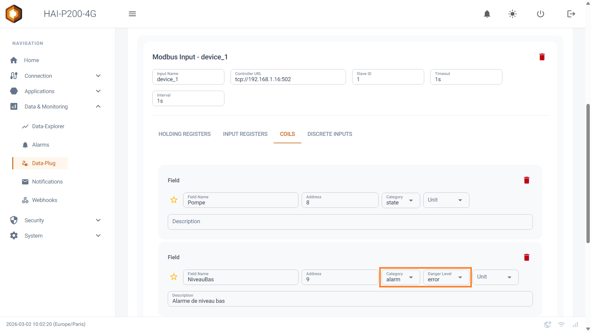

#### Réglages complémentaires

Selon la catégorie choisie, trois réglages supplémentaires peuvent apparaître sur la ligne de la variable.

**Compute RCA** _(variables de catégorie Alarm)_

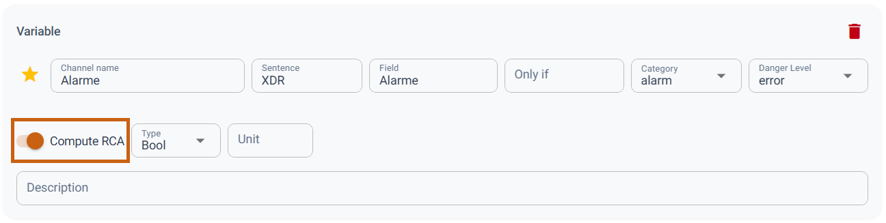

Cet interrupteur, activé par défaut, détermine si l'analyse de cause racine (RCA) est calculée pour cette alarme. Lorsqu'il est désactivé :

- le bouton d'analyse RCA n'apparaît plus en face de cette alarme dans la page Alarmes ;
- l'e-mail de notification envoyé pour cette alarme ne contient plus le classement des variables les plus impactées ni les graphiques associés.

L'alarme continue bien sûr d'être détectée, historisée et notifiée : seule l'analyse est écartée. C'est le réglage à utiliser pour les alarmes dont vous savez déjà que le diagnostic automatique n'apporte rien, ou pour alléger les notifications d'une alarme fréquente.

**Batch** _(identifiant de lot)_

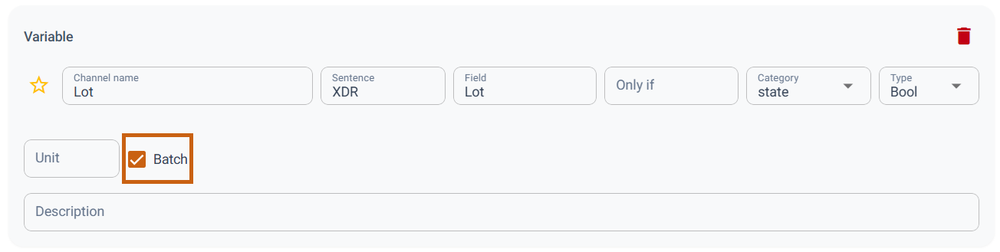

Cette case désigne la variable qui porte l'identifiant de lot (numéro de fabrication, numéro d'OF, ou simplement un booléen « production en cours »). C'est à partir de ses changements de valeur que la page Batches reconstruit vos lots :

- variable **booléenne** : un lot correspond à chaque période pendant laquelle la valeur vaut 1. Les périodes à 0 ne sont pas des lots ;
- variable **entière** ou **texte** : chaque valeur distincte constitue un lot, qui se termine au changement de valeur suivant.

La case n'est proposée que sur les variables de type booléen, entier ou texte — une valeur décimale ne peut pas servir d'identifiant. **Une seule variable à la fois** peut jouer ce rôle : dès que vous en cochez une, la case disparaît de toutes les autres. Décochez-la pour rendre le choix à nouveau disponible. Ce réglage prend effet immédiatement, sans attendre le Save and restart.

**Map in reports** _(variables de catégorie Position mises en favori)_

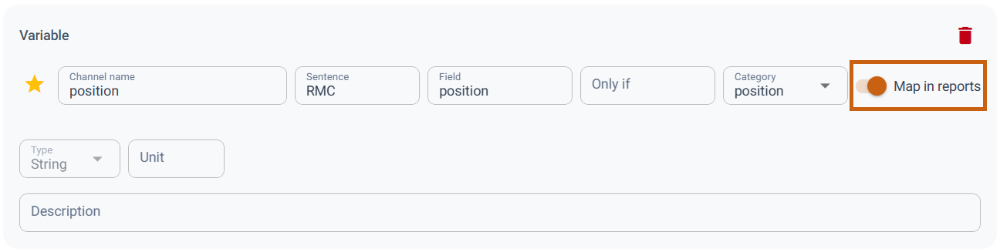

Ajoute la trace GPS de la variable aux rapports PDF et e-mail. L'interrupteur n'apparaît que si la variable est à la fois de catégorie Position et marquée en favori (⭐), les rapports ne reprenant que les favoris. Le fond de carte est téléchargé au moment de la génération du rapport : sans accès internet, le tracé reste dessiné, sur fond neutre.

### Import / Export CSV

Pour vous faire gagner du temps lors de la configuration de nombreuses variables (Modbus, OPC-UA, S7, BACnet, NMEA 0183 ou Internal MQTT), le configurateur intègre une fonctionnalité d'Import/Export CSV. Plutôt que de saisir vos dizaines de variables à la main dans le formulaire :

1.  Configurez une ou deux variables pour l'exemple via l'interface.
2.  Cliquez sur le bouton **Export CSV** (situé en haut de l'onglet _Config_).
3.  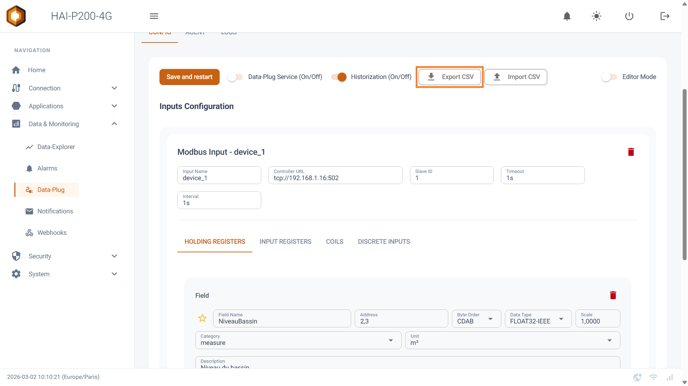
4.  Ouvrez le fichier téléchargé dans Excel ou un tableur, copiez-collez vos lignes et modifiez vos variables rapidement.
5.  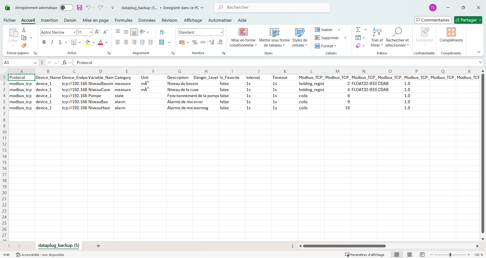
6.  Cliquez sur **Import CSV** pour charger toute votre configuration en un clin d'œil.
7.  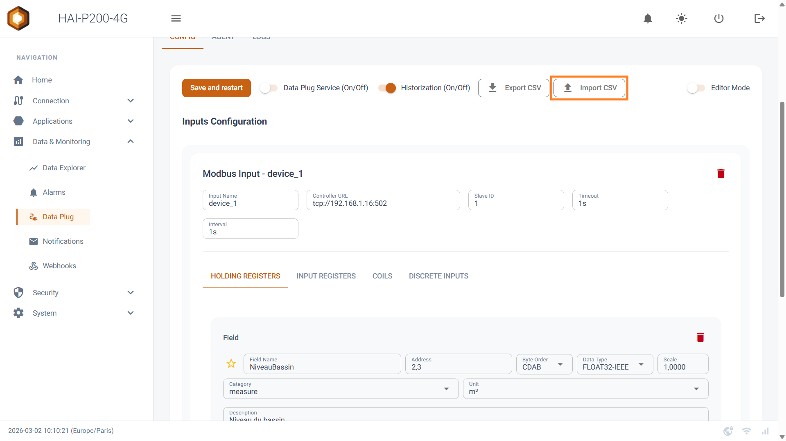

### Export des données historisées (onglet Data Export)

:::caution
Ne confondez pas cet export avec l'Import/Export CSV décrit plus haut : celui-ci exporte **vos mesures**, l'autre exporte **votre configuration de variables**.
:::

L'onglet **Data Export** vous permet de télécharger les données enregistrées sur une période de votre choix :

- **From** / **To** : les dates et heures de début et de fin. Par défaut, les 7 derniers jours.
- **Favorites only** : limite l'export à vos variables favorites (⭐).
- **Export CSV** : génère et télécharge le fichier.

:::tip
Cet export inclut les données encore en tampon, non encore écrites en base : vous récupérez donc bien les mesures les plus récentes, sans attendre le prochain commit.
:::

Si aucune donnée n'existe sur la période demandée, un message vous en informe et aucun fichier n'est téléchargé.

### Paramétrage de l’Agent

Ouvrez la page Data-Plug. La page de paramétrage de l’agent s’affichera directement :

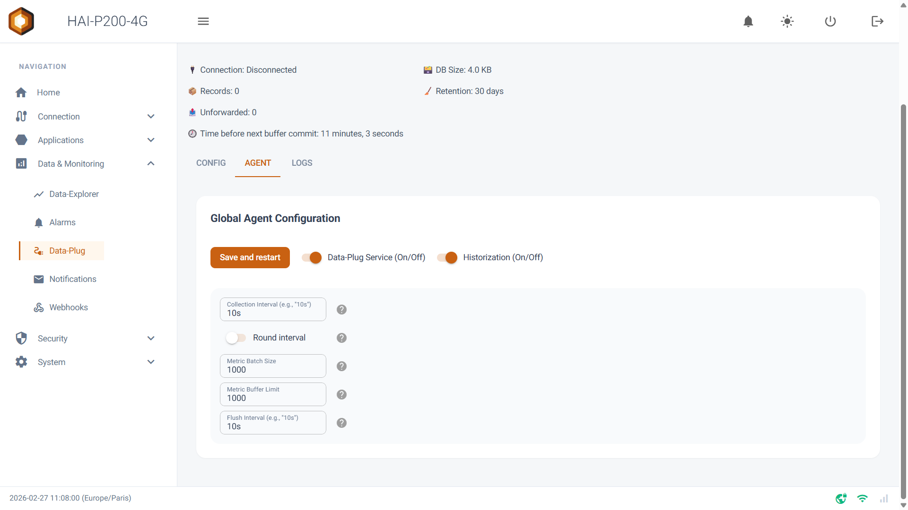

Voici les 5 paramètres clés pour piloter le comportement de l'agent :

- **Collection Interval** : C'est le **rythme de collecte** de Telegraf. Il définit la fréquence (par exemple, toutes les 10 secondes) à laquelle l'agent interroge les sources de données. Un intervalle court offre plus de précision mais augmente la charge.
- **Round Interval** : Une fois activé, il **synchronise les horodatages** sur des intervalles ronds (ex: 10:00:10, 10:00:20). L'objectif est de nettoyer les données et de faciliter l'alignement des graphiques, surtout en comparant plusieurs serveurs.
- **Metric Batch Size** : C'est la taille du **"colis" de données**. Telegraf regroupe les métriques jusqu'à atteindre cette taille avant de tout envoyer en un seul bloc. Augmenter cette valeur optimise le réseau en réduisant le nombre d'envois.
- **Metric Buffer Limit** : C'est la **mémoire tampon de sécurité**. Si la destination est injoignable, Telegraf stocke les métriques ici pour éviter de les perdre. Cette limite protège l'agent d'une consommation excessive de RAM. Si le tampon est plein, les plus anciennes métriques sont supprimées.
- **Flush Interval** : C'est un **délai d'envoi maximum**. Il force l'expédition des données après une certaine durée, même si le "colis" (Metric Batch Size) n'est pas plein. Cela garantit que les données, même peu nombreuses, ne restent pas bloquées trop longtemps dans l'agent.

### Diagnostics

En haut de la page Data-Plug, le bandeau **Data-plug Diagnostics** vous donne en permanence l'état de santé de la collecte. C'est le premier endroit à regarder lorsque des données semblent manquantes. Il se rafraîchit automatiquement toutes les 15 secondes.

- 🔌 **Connection** : état de la connexion du Data-Plug au broker (_Connected_ / _Disconnected_).
- 📦 **Records** : nombre total d'enregistrements présents dans la base locale.
- 📤 **Unforwarded** : nombre d'enregistrements pas encore transmis à la passerelle Cloud. Une valeur qui grimpe indique que la destination distante est injoignable — les données ne sont pas perdues, elles attendent.
- 🕗 **Time before next buffer commit** : temps restant avant la prochaine écriture du tampon en base. Cette ligne disparaît lorsque l'historisation est désactivée.
- 🗃️ **DB Size** : taille du fichier de base de données.
- 🧹 **Retention** : durée de conservation des données configurée, en jours.

:::tip
Un point important : les données les plus récentes se trouvent d'abord dans le tampon mémoire, et ne sont écrites en base qu'à chaque _commit_. Si vous cherchez une mesure de la dernière minute et qu'elle n'apparaît pas encore, regardez le temps restant avant le prochain commit.
:::

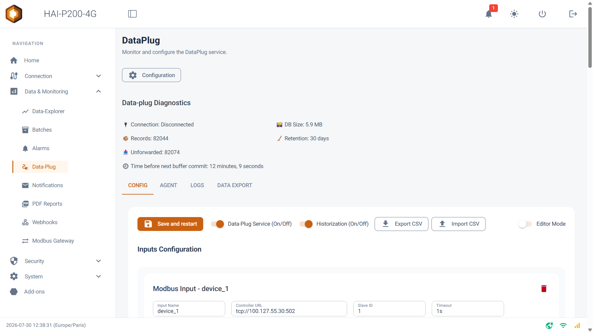

* * *

## Sauvegarder et redémarrer

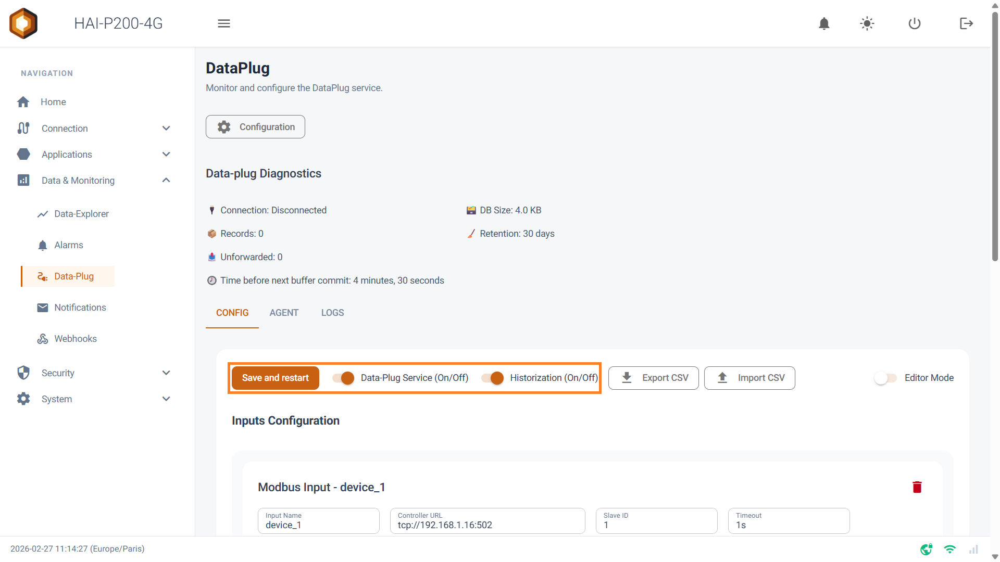

Pour sauvegarder, cliquez sur Save And Restart. Cela va automatiquement redémarrer le Data-Plug. Vous pouvez également l’allumer et l’éteindre en cliquant sur Data-Plug Service (On/Off) ou allumer et éteindre l'historisation en cliquant sur Historization (On/Off) (Plus de détails sont disponibles dans 🔝 Configuration Store & Forward).

N’oubliez pas de sauvegarder quand vous changez de page ou de vue (par exemple entre le formulaire et le mode éditeur).

* * *

## Logs

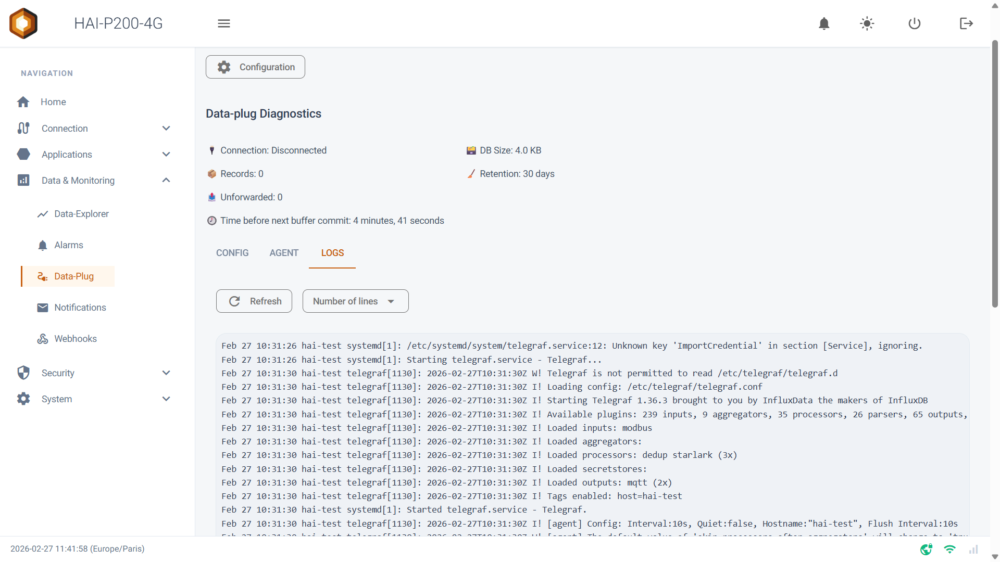

Un onglet est disponible sur la page de Data-Plug pour vous permettre de visualiser les logs de Telegraf. Il vous est possible de choisir le nombre de lignes à afficher et de rafraîchir la page facilement.
