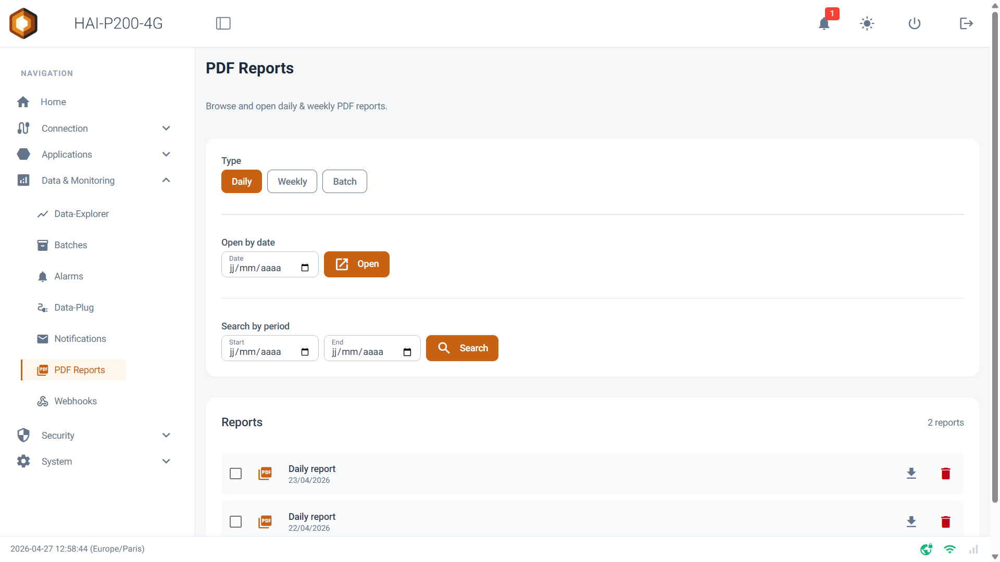
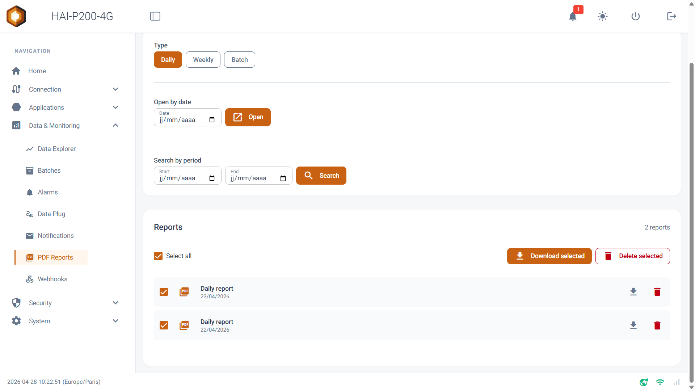
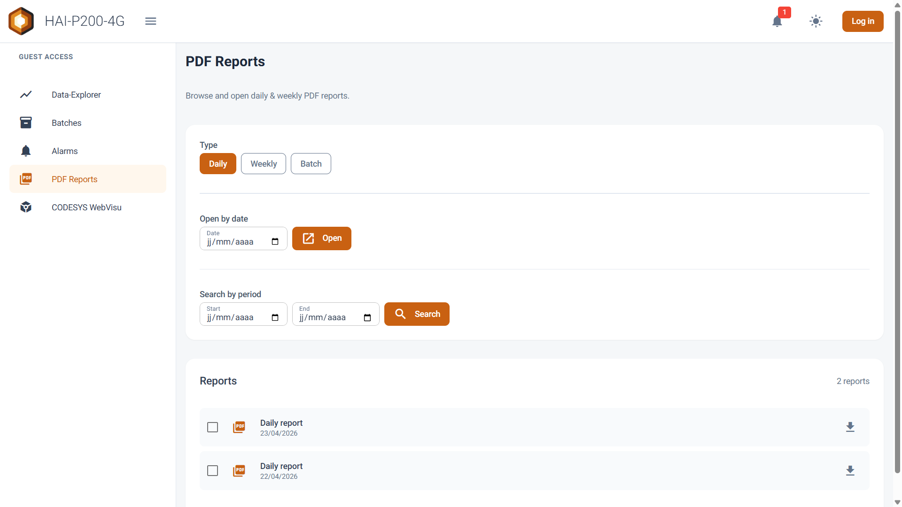

Bienvenue dans ce guide de prise en main de la page **PDF Reports**. Ce module centralise l'ensemble des rapports générés automatiquement par votre système (quotidiens, hebdomadaires ou de fins de lots). Il vous permet de les visualiser directement depuis l'interface, de les télécharger ou de les gérer facilement.

## Prérequis

- Le contrôleur HAI-P200-4G

- HAI-OS

- Avoir activé la génération de rapports dans le menu **Notifications** (Daily, Weekly ou Batch).

## Qu'est-ce que la page PDF Reports ?

La page PDF Reports est l'archive centralisée de votre contrôleur. Plutôt que de chercher vos rapports uniquement dans votre boîte mail, HAI-OS sauvegarde localement une copie PDF de chaque rapport généré. Vous pouvez ainsi les retrouver, les lire sur l'écran de la machine, et les exporter à tout moment.

## Naviguer entre les types de rapports

En haut de la page, un panneau de configuration vous permet de basculer instantanément entre les différentes catégories de rapports disponibles sur votre machine :

- **Daily (Quotidien)** : Les rapports générés chaque jour.

- **Weekly (Hebdomadaire)** : Les bilans de la semaine.

- **Batch (Lot)** : Les rapports spécifiques générés à la fin de chaque cycle de production (liés à la page _Batches_).

Si une catégorie n'a encore généré aucun rapport, son bouton n'apparaîtra pas

## Recherche et Filtrage

Pour retrouver rapidement un document spécifique parmi vos archives, deux outils de recherche s'offrent à vous :

- **Open by date (Ouvrir par date)** : Sélectionnez une date précise dans le calendrier et cliquez sur **Open**. Si un seul rapport correspond à cette journée, il s'ouvrira immédiatement à l'écran. S'il y en a plusieurs, le tableau sera filtré pour vous les montrer.

- **Search by period (Rechercher par période)** : Définissez une date de début (_Start_) et une date de fin (_End_), puis cliquez sur **Search** pour afficher tous les rapports générés dans cet intervalle de temps.

## Consultation et Actions individuelles

Dans le tableau des résultats (_Reports_), chaque ligne représente un fichier. En cliquant sur une ligne, vous pouvez interagir avec le document :

- **Visualisation intégrée** : Cliquez n'importe où sur la ligne du rapport pour ouvrir une fenêtre superposée contenant le lecteur PDF. Vous pouvez lire le document sans quitter l'interface, ou cliquer sur l'icône en haut à droite (↗️) pour l'ouvrir dans un nouvel onglet.

- **Bouton Télécharger (⬇️)** : Situé à droite de la ligne, il permet de télécharger le fichier PDF directement sur votre ordinateur ou tablette.

- **Bouton Supprimer (🗑️)** : Permet d'effacer définitivement le rapport de la mémoire du contrôleur.

## Actions groupées (Bulk actions)

Si vous souhaitez exporter ou nettoyer plusieurs rapports d'un seul coup, utilisez les cases à cocher situées à gauche de chaque ligne (ou la case **Select all** pour tout sélectionner). Une fois votre sélection faite, une barre d'actions apparaît :

- **Download selected** : Télécharge automatiquement tous les rapports sélectionnés regroupés dans un seul dossier compressé (reports.zip).

- **Delete selected** : Supprime l'ensemble des rapports cochés en une seule action (après confirmation).

## Mode Invité (Guest Access)

La page PDF Reports est entièrement compatible avec le mode d'accès libre. Si l'accès invité est activé (via _Security > Password Manager_), un opérateur non authentifié pourra consulter l'archive des rapports et les télécharger. **Sécurité** : En mode invité, tous les boutons de suppression (individuels ou groupés) sont strictement masqués et désactivés pour protéger vos archives.

