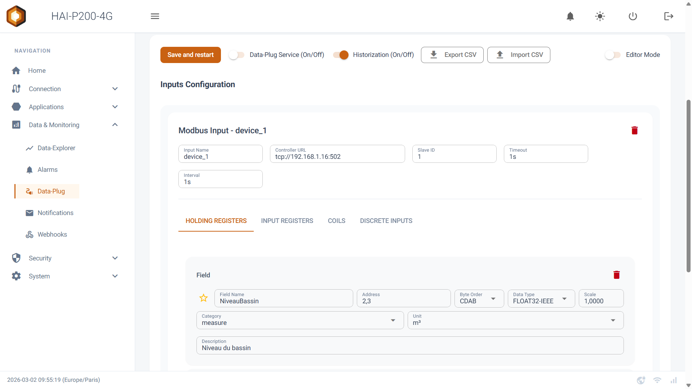
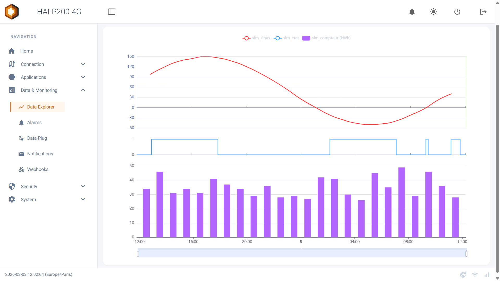

:::caution[Page d'exemple]
Le contenu ci-dessous est un squelette destine a valider la mise en page.
Il doit etre remplace par la procedure reelle lors de la reprise depuis Odoo.
:::

## Ce dont vous avez besoin

- Une box HAI-P200-4G et son bornier d'alimentation
- Un cable Ethernet
- Un poste sur le meme reseau que le port `eth0`

## 1. Alimenter la box

Le raccordement se fait sur le bornier industriel, en respectant la polarite
serigraphiee. La plage d'alimentation admise est indiquee dans les
[specifications materielles](/materiel/specifications/).

Apres mise sous tension, le demarrage complet de HAI-OS prend environ une
minute. La LED de statut passe au vert fixe quand les services sont operationnels.

## 2. Acceder a l'interface web

L'interface d'administration est servie en HTTPS sur le port 443 du port
Ethernet `eth0`.

Une image en syntaxe Markdown simple, comme celle ci-dessus, est
automatiquement plafonnee a 720 px de large : plein ecran sur mobile, sans
etirement inutile sur un 27 pouces.

## 3. Declarer un premier equipement

Rendez-vous dans **Acquisition → Sources**, puis choisissez le protocole de
votre automate. La configuration d'une source Modbus TCP est detaillee dans
[la page Modbus](/protocoles/modbus-tcp/).

<figure class="wide">

<figcaption>Capture large : la classe <code>wide</code> autorise 1100 px, pour les vues qui perdent leur sens une fois retrecies.</figcaption>
</figure>

## Verifier que tout tourne

| Service | Role | Verification |
| --- | --- | --- |
| Acquisition | Interrogation des equipements | Les variables remontent une valeur datee |
| Historisation | Ecriture en base locale | La courbe se remplit dans l'explorateur |
| Lien distant | Tunnel Tailscale | La box apparait dans votre tailnet |
