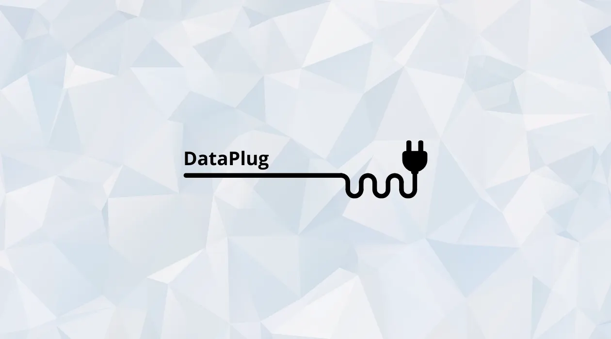

## What is the Data-Plug?

The Data-Plug is the data acquisition and management engine built into your HAI-P200-4G controller (running HAI-OS).

It acts as a universal hub between your industrial equipment (OT) and your IT or cloud applications. Its role is to collect raw data, standardise it, historise it and make it available to the whole ecosystem.

## The 3 key functions

### 1. Multi-protocol acquisition

The Data-Plug polls several types of equipment at once through its native connectors. It supports:

- **Modbus TCP** (PLCs, drives, meters…), and serial **Modbus RTU** through the controller's built-in gateway
- **OPC-UA** (secure, structured communication, with a built-in server browser)
- **Siemens S7** (native communication with Siemens PLCs)
- **BACnet/IP** (building management equipment — beta)
- **NMEA 0183** (beta): reading marine sentences over the network, as a TCP client, TCP server or UDP. A listen mode displays the incoming stream and turns any received field into a tag in one click. Serial equipment connects through an external serial-to-Ethernet converter.
- **Internal MQTT (Node-RED)**: declare tags fed by your own Node-RED flows, scripts or third-party SCADA, and give them the benefit of the whole Data-Plug chain

The Modbus, OPC-UA and S7 connectors rely on the Telegraf agent. BACnet/IP and NMEA 0183 each have their own built-in collector, and Internal MQTT receives data published on the broker directly.

**Position on a map**: an NMEA tag can be declared as a position — a single channel carrying the GPS point of a sentence. The Data-Explorer then displays the track on a map instead of a chart, over the selected period and live.

### 2. Unification through MQTT (the internal broker)

Once collected, the Data-Plug converts the data and publishes it on the controller's internal MQTT broker.

This means that whatever the source — S7, Modbus, OPC-UA, BACnet or NMEA — the output is always in the same standardised format.

That architecture makes the data immediately usable by:

- **The Data-Explorer** (charts, period comparisons, maps) and **alarm reports and notifications**, natively.
- **Node-RED** (to build logic and data flows).
- **Grafana** (for local visualisation, once you have configured your own data source).
- **Your own applications** (MQTT client).

### 3. Forwarding to the cloud

Beyond local use, the Data-Plug embeds a _Cloud Gateway_ that pushes data to a remote platform over MQTT, in either of two formats:

- **MQTT (Scorp-IO JSON Format)**
- **MQTT (Reflex-report JSON Format)** — one message per tag, on its own topic, with configurable QoS

This is the output that Store & Forward feeds and protects against network outages.

### 4. System services & SMS

The Data-Plug also acts as a control interface for the controller over MQTT:

- **SMS handling**: sending and receiving SMS messages through MQTT topics, which lets Node-RED raise alerts easily. Incoming SMS messages also serve to acknowledge alarms, by replying "OK" to the alert.
- **System control**: the controller can be rebooted or shut down through a simple MQTT command.
- **Historisation**: data recording can be started and stopped by MQTT command, in addition to the switch in the interface.

## Why use the Data-Plug?

**Centralisation**: a single interface to manage all your data sources.

**The database (SQLite) plays two roles**:

- **Local historian**: it stores data so history can be consulted on site immediately, from the Data-Explorer, with no Internet connection.
- **Store & Forward**: it acts as a safe buffer. If the link to the cloud goes down, it keeps the data and retransmits it automatically once the connection is back.

**Interoperability & native tooling**: it breaks the silos between the plant floor (PLCs, sensors, BMS) and IT (Node-RED, cloud). And from version 1.3.0 onwards, it natively feeds the tools built into HAI-OS: the Data-Explorer (to view your historical charts and positions) and the alarm reports and notifications system.
