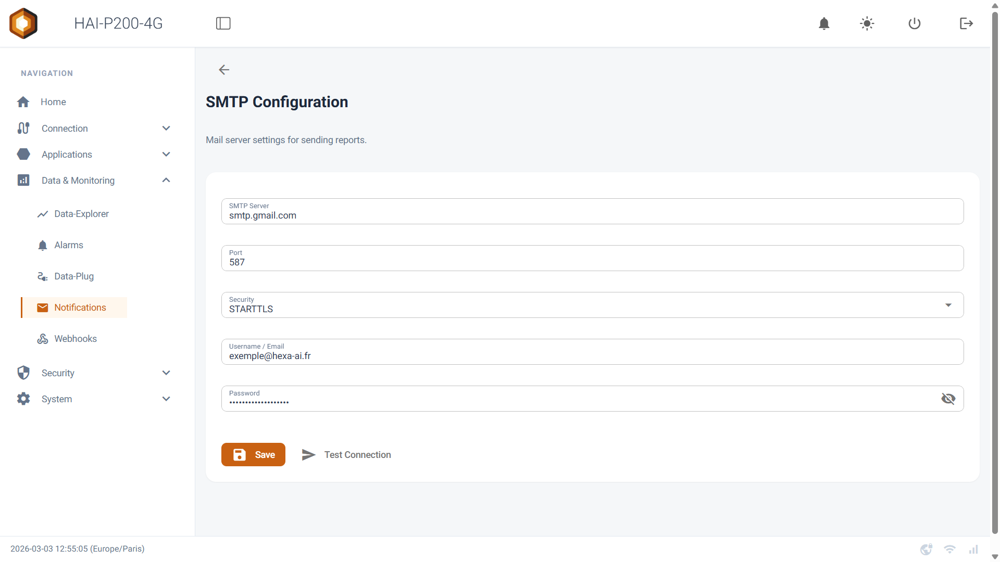
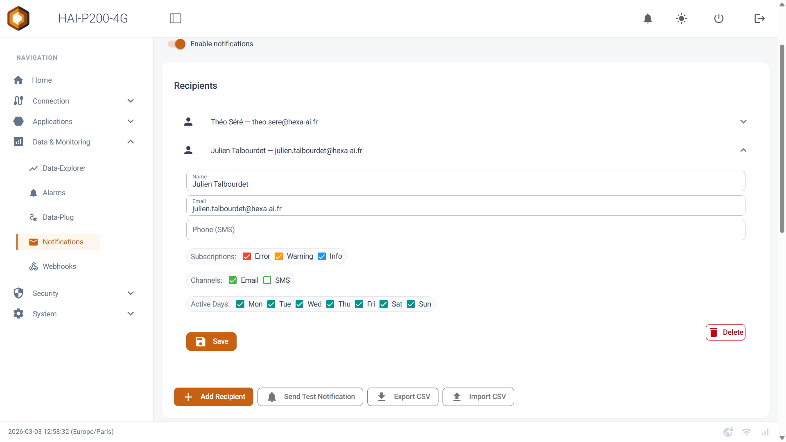
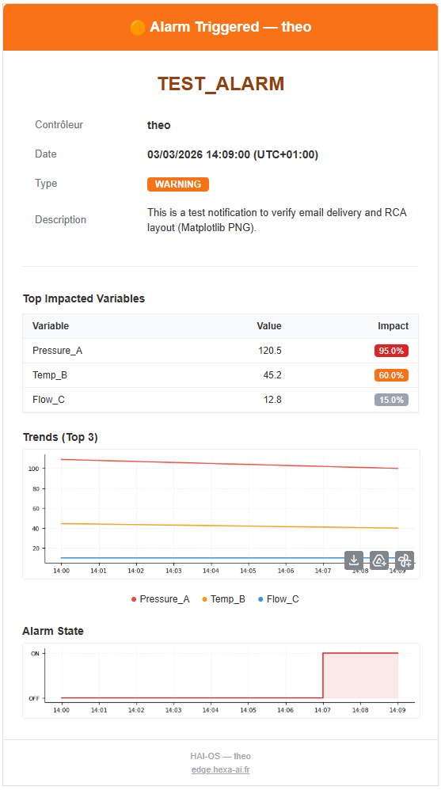
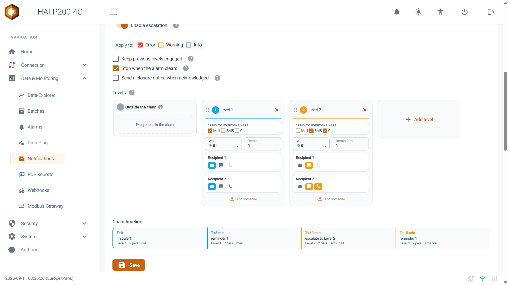
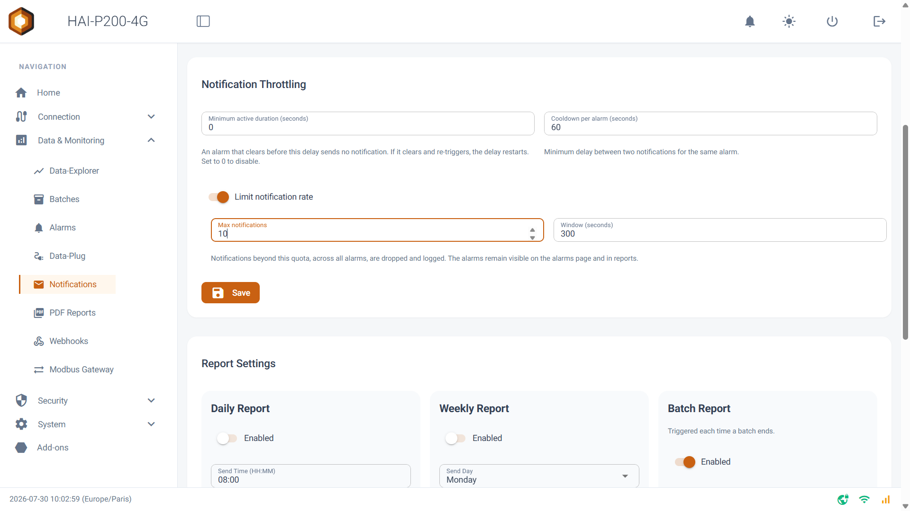
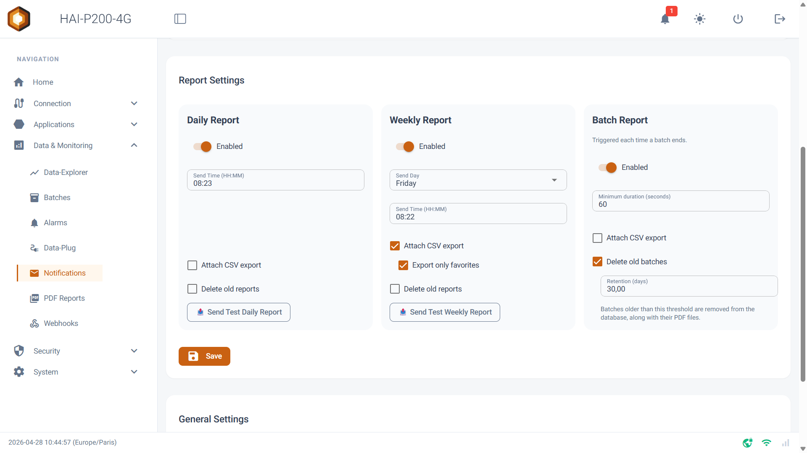
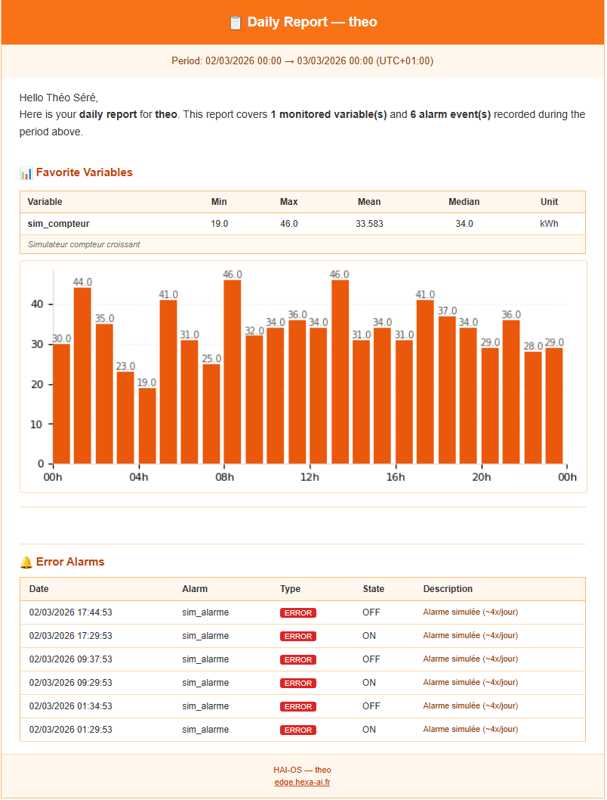
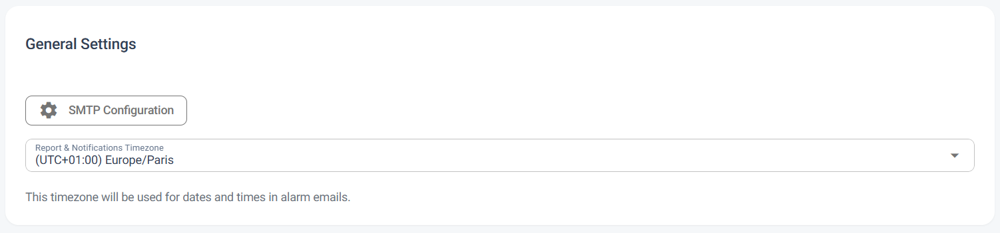

<!-- VIDEO A VENIR — notifications and alerts.
     Quand le lien YouTube sera connu, remplacer ce commentaire par la
     ligne ci-dessous, ID et titre renseignes. Le style vient de la
     classe hai-video, dans src/styles/hexa.css.

<iframe class="hai-video" src="https://www.youtube-nocookie.com/embed/IDENTIFIANT" title="HAI-P200-4G notifications and alerts" loading="lazy" allow="accelerometer; clipboard-write; encrypted-media; gyroscope; picture-in-picture; web-share" allowfullscreen></iframe>
-->

The **Notifications and Reports** system turns the raw data collected by the Data-Plug into usable information. It alerts operators in real time when something goes wrong, and generates automatic periodic reports (by e-mail) about your installations.

## Prerequisites

- The HAI-P200-4G controller

- HAI-OS

- Variables configured in the Data-Plug (variables of the **Alarm** category for the alerts, and variables marked as **Favourites (⭐)** for the reports).

## Enabling and configuring sending (SMTP)

To use this module, you first have to turn on the global **Enable notifications** switch at the top of the page. Then you have to configure the mail server (SMTP) the controller will use to send the e-mails.

Click the **SMTP Configuration** button to reach the settings:

- **SMTP Server & Port**: your mail server's address (smtp.gmail.com, for example) and its port (usually 587 for STARTTLS or 465 for SSL).

- **Security**: select the security mode (STARTTLS, SSL or NONE).

- **Username, From Email Address & Password**: the SMTP account's user name, the sending e-mail address (which may differ from the user name depending on the provider), and the matching password.

:::tip
**Tip**: use the **Test Connection** button to check the connection to the mail server and validate your settings before leaving the page.
:::

## Managing recipients

The **Recipients** section builds the list of contacts (individuals or groups) who will receive the alerts and the reports. Click **Add Recipient** to create a new entry.

For each contact, you can configure:

- **Name & Email / Phone**: the contact's identity and their details (for e-mail and SMS).

- **Subscriptions**: tick the alarm levels (Error, Warning, Info) this contact is allowed to receive.

- ****Channels**:** choose how the contact can be reached — E-mail, SMS and/or Call. The Call box is a permission: a call is only placed when an escalation tier asks for one, never on a simple notification.

- **Active Days**: select the days of the week on which this contact will receive notifications (handy for managing on-call rotas).

:::tip
**A time-saver**: as with the Data-Plug, you can use the **Export CSV** and **Import CSV** buttons to manage a long list of recipients straight from Excel.
:::

## How alarm notifications work

Unlike other systems, you do not have to create complicated alarm rules on this page. The system relies **natively on the Data-Plug**.

1.  As soon as a variable configured in the **Alarm** category in the Data-Plug goes Active (1), the system detects it instantly.

2.  It matches that alarm's severity (Error, Warning or Info) against your recipients' **Subscriptions**.

3.  It sends the alert!

**Built-in Root Cause Analysis (RCA)**: when an alarm fires, the e-mail sent does not just warn you. It automatically includes a smart analysis (RCA) showing, in a table, the top 5 variables (measurements) that varied the most just before the alarm fired, together with a trend chart centred on the three main ones — to help you diagnose the problem before you even log in to the controller.

The RCA computation can be disabled individually for a given alarm variable (the "Compute RCA" option in the variable's configuration, at the Data-Plug level). If it is disabled, the alarm e-mail is sent as usual but without the root cause analysis table or charts.

That is how immediate notification works. If you enable escalation for a given alarm level, alarms of that level are no longer sent that way: they follow the chain of tiers (see _**Escalation**_).

Example of a notification

## Escalation (tiers)

By default, an alarm is notified immediately to every recipient whose subscription matches its level. Escalation replaces that behaviour with a chain: a first group is contacted, and if nobody responds, the next one takes over.

Turn on the **Enable escalation** switch to reveal the configuration.

**An important point**: escalation _replaces_ immediate notification, it does not add to it. An alarm handled by the chain only goes out through the chain — a recipient who is on no tier is not contacted at all. The alarm levels you leave unticked in **Apply to**, on the other hand, are still sent immediately to everyone.

### The chain's scope and options

- **Apply to**: the alarm levels entrusted to the chain (Error, Warning, Info). By default, Error only.
- **Keep previous levels engaged**: once tier 2 is reached, tier 1 keeps receiving the reminder messages.
- **Stop when the alarm clears**: the chain stops by itself if the alarm goes back to inactive before anyone has acknowledged it.
- **Send a closure notice when acknowledged**: everyone already contacted is told who took the incident on.

#### Building the tiers

Tiers are configured on a table of columns, using drag and drop:

- **Add someone** places a person on a tier. The same person can appear on several tiers — that is how you reach them by SMS on the first one, then by call on the third.
- Drag a card from one column to another to move someone, and click the card's ✕ (or drag it out of the table) to remove them from the chain. The ⠿ handle at the head of a column reorders the tiers.
- The ✉ / 💬 / 📞 icons on each card choose the channels used _for that person on that tier_. The boxes at the top of a column are a bulk action: they enable or disable a channel for every card on the tier, and each card can still be adjusted afterwards.
- **Wait**: the delay before moving to the next tier (300 seconds by default, 10 minimum). **Reminders**: the number of reminders sent within the tier before escalating.
- The **Outside the chain** area lists the recipients who are on no tier. They will not receive the alarms covered by escalation.

A **Chain timeline** strip below the table sums up how things unfold over time (T+0, T+5 min, …), so you can check at a glance that an unhandled incident does eventually escalate, and how long that takes.

#### Acknowledging

A recipient acknowledges in one of three ways:

- by replying **OK** to the alert SMS (the sender's number is enough to identify them, with no code to type);
- by pressing **key 1** during the voice call;
- from the acknowledgement button on the **Alarms** page.

The chain stops immediately. **Acknowledging only means "I have seen the alert": it does not acknowledge the alarm itself**, which stays active in the interface and in the reports.

Note: chains in progress are held in RAM. Restarting the application cancels any pending escalations.

#### The voice call channel

A tier can ring a phone and read the alarm out loud. Two rules of good practice: calls are placed **one at a time** (the modem only holds one line), so it is better to keep them for the last tiers, once the quieter channels have already gone out; and a recipient's **Call** box is only a permission — a call is never placed on a simple notification, only when a tier asks for one. If the call service is not available on the controller, the box is greyed out and the reason is shown.

## Rate limiting notifications (throttling)

To avoid being swamped with notifications during an unstable ("flapping") alarm or a major incident affecting several variables at once, three limiting mechanisms are available, and they can be combined:

- **Minimum active duration (seconds)**: how long an alarm has to stay active before a notification is sent. If the alarm goes inactive again before that delay is over, no notification is sent. Disabled by default (0 seconds).
- **Cooldown per alarm (seconds)**: the minimum delay between two successive notifications for the same alarm. Default: 60 seconds.
- **Limit notification rate**: a switch enabling a global limit, across all alarms, on the number of notifications sent over a rolling time window (**Max notifications** and **Window (seconds)**, 10 notifications / 300 seconds by default). Disabled by default. Beyond the quota, the notification is not sent, but the alarm stays visible on the alarms page and in the reports.

## Generating periodic reports

The **Report Settings** section lets you automate the sending of summary reports about your data. Those reports are based exclusively on the variables you have marked as **Favorites** (⭐) in the Data-Plug.

The interface is split into three columns:

- **Daily Report**: to receive a summary every day at a set time.

- **Weekly Report**: to receive a summary once a week.

- **Batch Report**: automatically generates and sends a full report each time a batch ends (as defined by an identifying variable in the Data-Plug). You can set a "Minimum duration (seconds)" there to avoid generating reports for batches that are too short.

For each report type, you can configure:

- **Enabled**: turns the sending of this report on or off.

- **Send Time**: the sending time.

- **Attach CSV export**: if enabled, the controller attaches a CSV file containing the raw data history for the period (handy for archiving it or reworking it in Excel).

- **Export only favorites**: if ticked, the CSV file only contains your favourite variables. If unticked, the CSV file contains every variable the controller recorded over the period.

- **Delete old reports / Delete old batches**: if enabled, the controller automatically deletes the old reports stored locally.
- **Retention (days):** sets how long they are kept (in days). For Daily/Weekly reports, this only deletes the old PDF files. For Batch reports, it deletes the batch's identification history along with its PDF, **but the raw measured data stays intact** (its retention is managed separately, by the Data-Plug configuration).

The report e-mail (in HTML format) contains a summary table with the statistics (Min, Max, Average) and the charts of your first 5 favourite variables in alphabetical order, along with a history of the alarms that fired over the period.

A favourite variable in the Position category whose _Map in reports_ option is enabled in the Data-Plug appears as a map with the track travelled over the period, instead of a curve. The map background is downloaded at generation time; with no Internet, the track is still drawn, on a neutral background.

Example of a report

The generated reports are archived on the controller and can be consulted from the **PDF Reports** page: filtering by type and by date, viewing in the browser, downloading and deleting, including in bulk.

## General configuration (time zone)

The **General Settings** section holds one crucial parameter: the time zone.

Make sure you select the right one (Europe/Paris, for example). This setting guarantees that your reports' sending time and the timestamps shown in the alarm e-mails match your local time.

