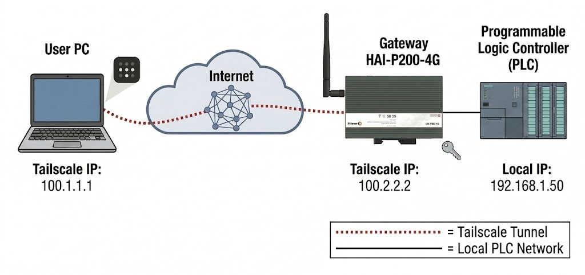

:::caution[Sample page]
Layout skeleton — to be replaced by the real procedure.
:::

## How it works

The gateway opens the tunnel itself, outbound. There is therefore **no port to
open** on the site firewall, and no inbound rule for the customer's IT team to
approve.

<figure class="plain wide">

<figcaption>The diagram carries the <code>plain</code> class: no frame, no background, since it already sits on a transparent one.</figcaption>
</figure>

## Redundant link

The HAI-P200-4G has both a wired link and a 4G LTE link. If the primary link
drops, failover is automatic — remote maintenance stays available during the
network incident, which is exactly when it is needed.

## Guest access

Temporary access can be granted to a third-party integrator without exposing
the whole fleet.
