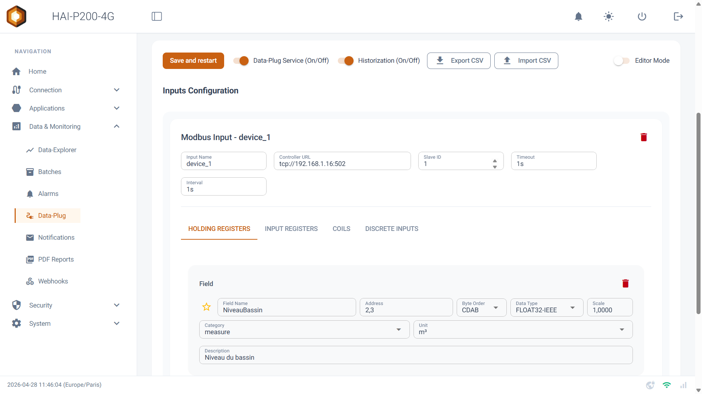

<iframe class="hai-video" src="https://www.youtube-nocookie.com/embed/tltGissKEcY" title="De l'automate au dashboard en 5 minutes" loading="lazy" allow="accelerometer; clipboard-write; encrypted-media; gyroscope; picture-in-picture; web-share" allowfullscreen></iframe>

Welcome to your **HAI-P200-4G** controller, powered by **HAI-OS**. This guide walks you through configuring the gateway, collecting your first industrial data point and visualising it — in a matter of minutes.

## Step 1: First connection

Once your HAI-P200-4G controller is connected to power, you need to reach it.

By default, the controller's **Ethernet 1 (eth1)** port is preconfigured with the static IP address **192.168.1.16** and the subnet mask **255.255.255.0**.

1.  Connect your PC directly to the controller's **Ethernet 1** port with a network cable _(make sure your PC's network adapter is set to the same subnet — for example IP 192.168.1.5)_.

2.  Open a web browser and enter the address **https://192.168.1.16**.

3.  On the login page, enter the default credentials:

    - **Username**: admin

    - **Password**: hai1@

4.  The gateway opens a configuration screen and asks you to set your administrator password.

## Step 2: Network connectivity

For your gateway to send e-mails, synchronise its clock over NTP or push data to the cloud, it needs an Internet connection.

Expand the **Connection** menu in the left sidebar:

- **Ethernet**: configure your ports (eth0, or a change to eth1) in DHCP mode or with a new static IP, to fit them into the plant network.

- **WiFi**: turn on the WiFi radio, scan for nearby networks and connect.

- **4G Modem**: if you have a SIM card, enter the APN and PIN code to bring up the cellular link.

- **Tailscale VPN**: connect your gateway to your secure private network for remote access.

:::tip[Tip]
The interface footer shows live status icons for WiFi, the 4G modem and the VPN. A green icon — or orange for 4G — means the link is up.
:::

## Step 3: Collecting your first tag (Data-Plug)

This is the heart of the system. We are going to read a value from a PLC or a sensor.

1.  Go to **Data & Monitoring > Data-Plug**.

2.  In the **Inputs Configuration** card, pick your device's protocol (Modbus, OPC-UA, S7, BACnet/IP (beta), NMEA 0183 (beta) or Internal MQTT through Node-RED) from the dropdown, then click **Add Input**.

3.  Enter your PLC's address (e.g. `tcp://192.168.1.50:502` for Modbus).

4.  Add a tag (Field / Node):

    - Give it a name (e.g. NiveauBassin).

    - Enter its memory address (e.g. register 2,3).

    - Set its category to **Measure**.

    - Specify its unit (e.g. m³).

5.  Click **Save and restart** at the top of the card. The acquisition engine restarts and immediately begins recording the tag.

## Step 4: Visualisation (Data-Explorer)

Now that the data is being collected, let's watch it live.

1.  Navigate to **Data & Monitoring > Data-Explorer**.

2.  On the chart configuration row, open the **Variable** dropdown: your NiveauBassin is there. Select it.

3.  At the top of the screen, flip the switch to **Live** mode.

4.  The chart updates in real time, every few seconds, tracing your sensor's evolution.

## Congratulations

Your HAI-P200-4G controller is up and running. To go further, see the dedicated documentation on how to:

- **declare alarms** and receive instant alerts by e-mail or SMS;

- **generate automated reports** by e-mail, including your charts and a CSV export of your data;

- **configure webhooks** to connect your gateway to your own IT systems.
