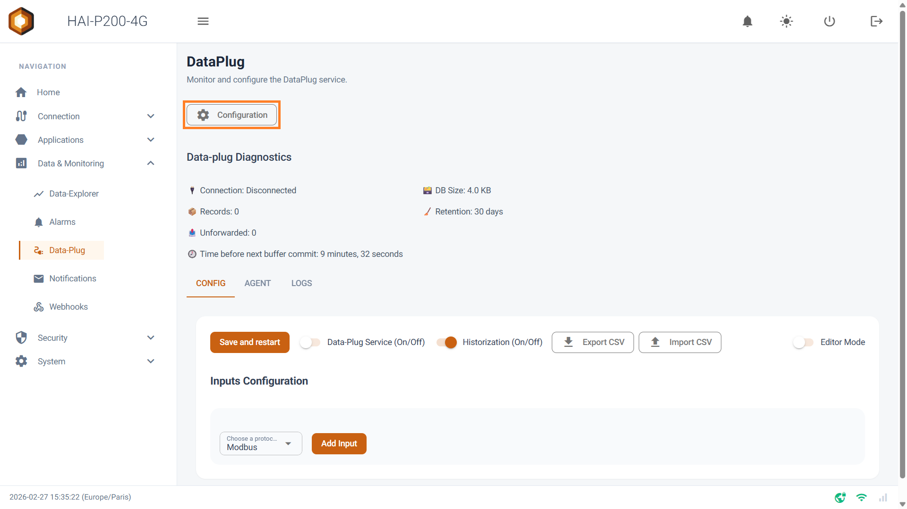

The Data-Plug embeds a robust **Store & Forward** architecture. This twin capability guarantees data continuity: it **historises** the incoming information locally while being able to **relay** it to the cloud or to a central system.

Clicking the **Configuration** button at the top of the Data-Plug page opens the management interface for both mechanisms.



## 1. Local storage (Store): SQLite database

The Data-Plug does not merely pass data through; it saves it locally in an embedded **SQLite** database. That guarantees no data is lost during a network outage.

In the **Store & Forward Configuration** section, you can manage the archiving strategy:

- **DB Path**: filled in automatically, not editable.

- **Retention Days**: this setting defines how long data is kept. Archives older than the specified number of days are purged automatically to free up space.

- **Pausing historisation on the fly _(from version 1.3.0)_:** a **Historization (On/Off)** switch is available at the top of the interface. It lets you temporarily pause the recording of local data into the SQLite database (during maintenance on your equipment, for example), without having to stop the whole acquisition service.

### Protecting the flash memory (commit interval)

An important specificity of the _Store & Forward_ section concerns the **Commit Interval** setting.

**Why this setting?**

The Data-Plug records data on flash memory. That kind of memory has a finite number of write cycles before it wears out.

- If the system wrote to disk on every piece of data received (every second, say), the memory would wear out very quickly.

- **The protection mechanism**: the system keeps data in RAM and only performs the physical write to disk (the "commit") at regular intervals. That delay is **set to 15 minutes by default**, but **it can be changed** to suit your needs. A shorter value protects the data better against a power cut, but puts more strain on your storage medium.

### Using and visualising the data

The history stored locally by the Data-Plug can be used through the tools available on our **HAI-Edge PCs** (reachable from the "Add-ons" menu):

- **Data-Explorer (built in)** — the controller's Data & Monitoring > Data-Explorer page plots historised variables directly, live or over a chosen period, with nothing to install. It is the normal way to consult your curves.
- **Node-RED (processing)** — available from the Add-ons menu, Node-RED allows deeper processing. The Hexa-AI module @hexa-ai/node-red-contrib-hexa-ai-edge adds a _DataPlug History_ node that queries the Data-Plug's SQLite database and returns ready-to-use statistics (averages, min, max, counter differences), enriched with the units and descriptions declared in the Data-Plug.
- **Grafana** is also offered in the Add-ons, but it ships as-is: no dashboard and no data source are pre-configured, and it has no access to the Data-Plug's database. It is aimed at users who feed a third-party database themselves (the PostgreSQL add-on through Node-RED, for example). Its credentials — admin and a password specific to each box — are shown on the add-on's card.

## 2. Relaying to the cloud (Forward): MQTT output connector

The Data-Plug acts as a gateway able to push historised data to an external MQTT broker. In the **Cloud Gateway Configuration** section, you first choose the output format, then fill in the connection parameters.

**The Store & Forward principle:** every historised value is flagged "to be transmitted". As long as the broker is reachable, values leave as they come, roughly once a second. During a network outage they stay pending in the local database and are transmitted in chronological order as soon as the connection returns. No value is lost, within the limits of the retention period. The **Unforwarded** counter, at the top of the Data-Plug page, shows the number of values waiting to be sent.

### Two output formats

The first field, **Driver**, determines the message format and the fields shown below it:

- **MQTT (Scorp-IO JSON Format)**: the format the Scorp-IO platform expects. Values are grouped into batches within a single message, whose topic is built from three identifiers (see section 3).
- **MQTT (Reflex-report JSON Format)**: the format Reflex-report expects. Each variable is published on its own topic, under a base topic of your choosing (see section 4).
- **None**: no relaying. The Data-Plug simply historises locally.

### Common connection parameters

Whatever the format chosen:

- **Host** and **Port**: the MQTT broker's address. The default port is 1883 (usually 8883 with TLS).
- **Client ID**: the identifier presented to the broker. Each box must use a distinct Client ID, otherwise the broker disconnects one in favour of the other.
- **Username** and **Password**: authentication credentials. They are only used if both fields are filled in.
- **Use TLS**: encrypts the exchanges with the broker. Enabled by default. The broker's certificate must be issued by a recognised certificate authority; a self-signed certificate is not accepted.

Click **Save** to apply. The output format, the host, the port, the Scorp-IO identifiers, the base topic and the QoS are taken into account immediately. A change of Client ID, Username, Password or the Use TLS option, as well as switching to None, only take effect after the box is restarted. The connection state is visible at the top of the Data-Plug page.

## 3. Scorp-IO format

### Identifiers

Three fields identify the data's source to Scorp-IO:

- **Project ID**: the Scorp-IO project identifier.
- **Edge Node ID**: the node identifier, that is, the gateway box.
- **Device ID**: the identifier of the end device the variables come from.

Those three values must match what is declared on the Scorp-IO side: they are what make up the publication topics.

### Topics

Topics are generated automatically from the identifiers:

```
mqtts/{PROJECT_ID}/{MESSAGE_TYPE}/{EDGE_NODE_ID}/{DEVICE_ID}
```

The `mqtts` prefix is fixed. `MESSAGE_TYPE` is `DBIRTH` for the connection message and `DDATA` for the data.

### Connection message (DBIRTH)

Published on every connection or reconnection to the broker, with the **Retained** flag, on the topic `mqtts/{PROJECT_ID}/DBIRTH/{EDGE_NODE_ID}/{DEVICE_ID}`.

In the current version, this message's `metrics` array is empty: the list of variables is not declared in it.

```json
{
  "metrics": []
}
```

### Data message (DDATA)

Published at **QoS 1**, without the Retained flag, on the topic `mqtts/{PROJECT_ID}/DDATA/{EDGE_NODE_ID}/{DEVICE_ID}`. One message groups up to 1,000 values. Messages leave roughly every second as long as values remain to be transmitted.

```json
{
  "metrics": [
    {
      "name": "pump-1/states",
      "timestamp": 1486144502122,
      "dataType": "Integer",
      "value": 0
    },
    {
      "name": "pump-1/fault",
      "timestamp": 1486144502122,
      "dataType": "Boolean",
      "value": false
    }
  ]
}
```

- `name`: the variable's name, as declared in the Data-Plug configuration.
- `timestamp`: the measurement's timestamp, in milliseconds (Epoch).
- `dataType`: the value's type, deduced automatically from the data received. Four types are produced: `Integer`, `Float`, `Boolean` and `String`.
- `value`: the value.

## 4. Reflex-report format

### Parameters

- **Base topic**: the prefix common to every publication topic, chosen freely — `plant-A/line-2`, for example. A trailing `/` on the base topic is tolerated.
- **QoS**: the MQTT quality of service of the publications, 0, 1 or 2. Default value: 1.

### Topics

Each variable is published on its own topic, made of the base topic followed by the variable's name:

```
{BASE_TOPIC}/{VARIABLE_NAME}
```

With the base topic `plant-A/line-2` and the variable `pump-1/states`, the topic is `plant-A/line-2/pump-1/states`. If the base topic is empty, the topic is the variable's name alone.

### Message format

One message per value, without the Retained flag:

```json
{"ts": 1486144502122, "v": 0}
```

- `ts`: the measurement's timestamp, in milliseconds (Epoch).
- `v`: the value. Booleans are transmitted as `0` or `1`, integers and reals as numbers, strings as they are.

There is no connection message in the Reflex-report format.
