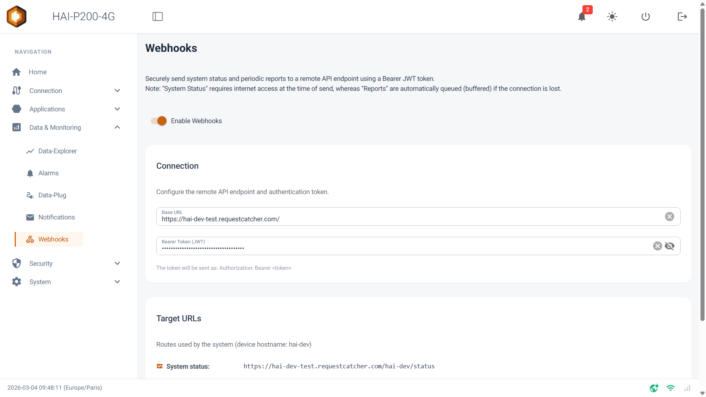
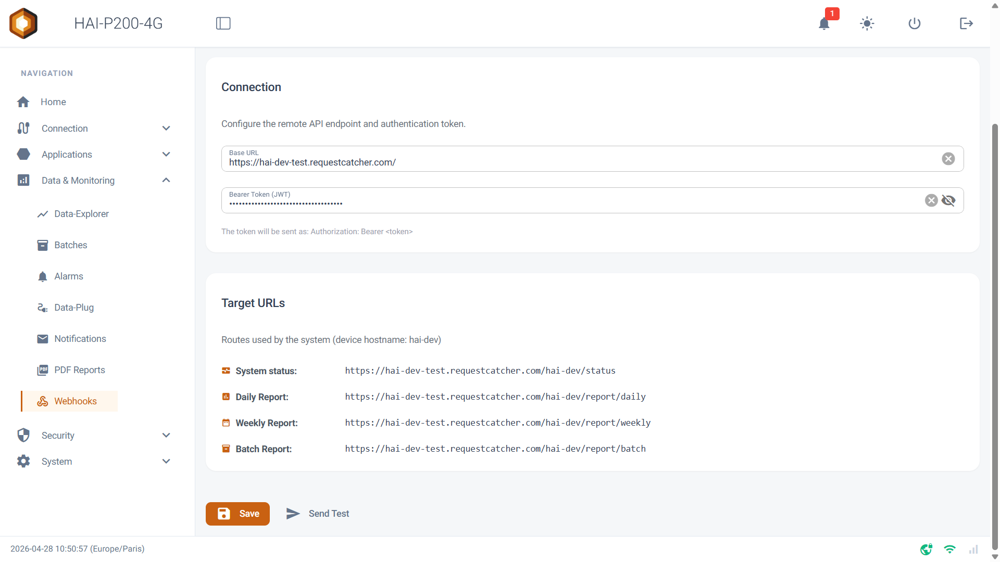

The **Webhooks** module connects your HAI-P200-4G controller to your own IT servers or cloud platforms. Instead of waiting for you to log in to the box to read the data, the controller actively and securely **pushes** its health status and its periodic reports to the API of your choice.

## Prerequisites

- The HAI-P200-4G controller

- HAI-OS

- A remote server (API endpoint) able to receive HTTP POST requests in JSON format.

## What gets sent by webhook?

The controller uses webhooks to transmit two major kinds of information, automatically and on a schedule:

1.  **System Status:** sent automatically every 30 minutes. It contains a complete, standardised snapshot of the controller's state: device information (hostname, version, uptime), the detailed state of each network interface (eth0, eth1, WiFi, 4G, Tailscale), the status of the internal services (Data-Plug, Notifications, Node-RED, Grafana and so on), and the latest known values of every sensor.

2.  **Periodic reports (Daily, Weekly & Batch Reports)**: sent every day (around midnight) and every week. They contain exactly the same data (statistics and alarms) as the ones sent by e-mail through the _Notifications and reports_ module, but in pure JSON.

## Connection settings

To enable the feature, switch **Enable Webhooks** to ON at the top of the page. In the _Connection_ card, you can either configure your own server's credentials or use our default infrastructure:

- **Automatic mode (myHexa servers):** leave the "Base URL" and "Bearer Token" fields **empty**. The controller connects automatically to the default myHexa servers and assigns itself a security token, entirely transparently.

- **Custom mode:**

    - **Base URL:** the root address of your API (for example https://api.my-server.com). Use the https:// protocol to keep the data confidential.

    - **Bearer Token (JWT):** a security token slipped into the HTTP header of every request (Authorization: Bearer <token>). It lets your server check that the request really comes from a trusted device.

## Understanding the target URLs (routes)

The controller builds the full URLs it pushes data to dynamically. Their structure depends on the connection mode you chose (automatic or custom).

The _Target URLs_ panel shows a live preview of the routes the controller will call:

**1\. With a custom API:** the structure is \[Base URL\] / \[Hostname\] / \[Data type\]:

- System status: https://api.my-server.com/hai-a1b2c3/status

- Daily Report: https://api.my-server.com/hai-a1b2c3/report/daily

- Weekly Report: https://api.my-server.com/hai-a1b2c3/report/weekly

- Batch Report: https://api.my-server.com/hai-a1b2c3/report/batch

**2\. With the default servers (myHexa auto-provisioning):** the structure includes the /ingress/ segment (\[Base URL\] / ingress / \[Hostname\] / \[Data type\]):

- System status: https://srv.../ingress/hai-a1b2c3/status

- Daily Report: https://srv.../ingress/hai-a1b2c3/report/daily

_(Here, hai-a1b2c3 stands for the unique name of your controller.)_

## Handling connection losses (buffering)

This is a strong, industrial specificity of the module: it distinguishes "real-time" data from "historical" data when the network goes down (loss of WiFi or 4G).

- **For the "System Status"**: if the controller has no Internet access when it is due to send its state (every 30 min), the last snapshot is kept and replayed. Queued reports expire after the retention period set on the _Notifications_ page.

- **For the "Reports"**: end-of-day and end-of-week reports contain valuable accounting data. If they cannot be sent (server error or network outage), **the controller places them in a secure queue (buffer)**. As soon as the connection is back, the pending reports are shipped to your server automatically.

## Testing the configuration

Once your configuration is ready:

1.  Click **Save** to store the configuration.

2.  Click **Send Test**.

3.  The controller immediately generates a "Status" and a "Daily Report" and tries to POST them. Visual notifications at the bottom of the screen confirm success, or tell you if an error occurred.

:::caution
In automatic myHexa mode, a red "Provisioning error" banner may appear. It usually means the device is already registered on the server side but the local token has been lost. In that case, contact technical support.
:::
