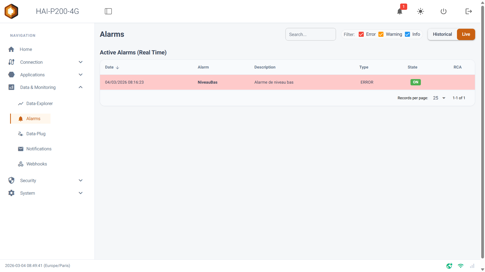
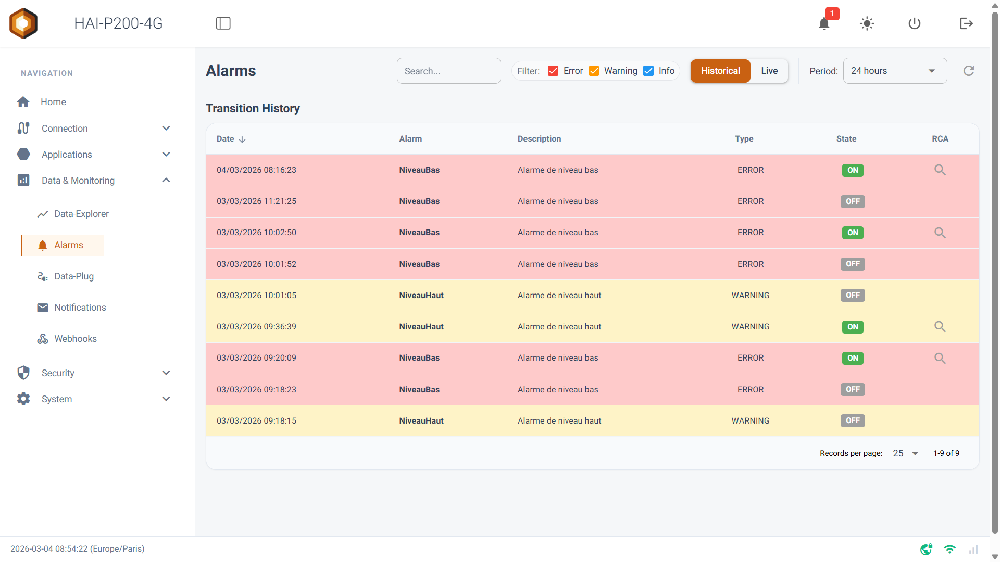
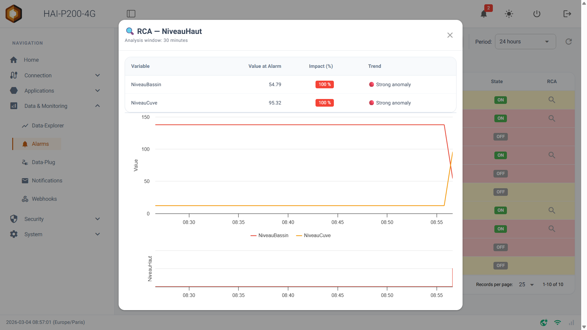

Welcome to this guide to the **Alarms** page. This module centralises the monitoring of your installation: it shows the state of your alerts and their trigger history, and includes a powerful Root Cause Analysis (RCA) tool to help you understand quickly where a fault came from.

## Prerequisites

- The HAI-P200-4G controller

- HAI-OS

- Tags already configured with the **Alarm** category in the Data-Plug.

## Two viewing modes: Live & Historical

The alarm monitoring interface has two main modes, reachable through the switch at the top of the page.

### 1. Live mode (real time)

This mode shows the alarms **currently active** on your system, as they happen.

- It connects to the data stream (MQTT) in real time, for maximum responsiveness.

- Only alarms in the ON state are listed. As soon as an alarm returns to normal (OFF), it disappears from this screen.

### 2. Historical mode (state transitions)

This mode queries the controller's database to retrace the history of state changes — OFF to ON, and back.

- **Period**: a dropdown lets you select the time window to analyse, from the last 10 minutes up to the previous month.

- **Custom**: selecting _Custom_ lets you set a start and end date and time by hand.

- Click the refresh button (🔄) to update the list for the chosen period.

## Filtering and searching

To help you navigate your data — especially during critical episodes that generate many alerts — the page offers quick filters:

- **Search bar**: type a keyword to filter the table instantly on the alarm's name or description.

- **Severity filters**: tick or untick **Error** (red), **Warning** (orange) and **Info** (blue) to hide the events you are not interested in right now.

:::tip
**Visual cue**: in the table, rows are fully coloured according to their severity, so "Error" faults catch your eye first.
:::

## Built-in Root Cause Analysis (RCA)

This is the page's flagship feature. When an alarm fires, it is often hard to tell which physical parameter — pressure, temperature, flow — caused it. The RCA tool automates that search.

In **Historical** mode, every event corresponding to an alarm trigger (a transition to ON) carries a **magnifier button (🔍)** in the _RCA_ column.

Clicking it opens an analysis window that computes the variations over the 30 minutes preceding the fault:

1.  **Top Impacted Variables**: a table lists the **top 5 tags** of your system (Measure category) that showed the strongest abnormal variation just before the trigger. _(Note: the system filters out background noise and only shows tags with an impact of 5% or more.)_ A trend is indicated for each (🔴 strong anomaly, 🟠 moderate anomaly, and so on).

2.  **Trend charts**: an interactive chart plots the three most affected tags over that 30-minute window.

3.  **State chart**: a step chart just below shows the exact moment the alarm switched to ON, letting you connect the behaviour of the measurements to the failure visually.

## Guest access

The Alarms page is one of those that can be exposed in open access, without authentication. A guest gets every viewing feature described above: Live and Historical modes, filters, period selection and Root Cause Analysis.

To enable it, see [Guest access](/en/network/guest-access/).
