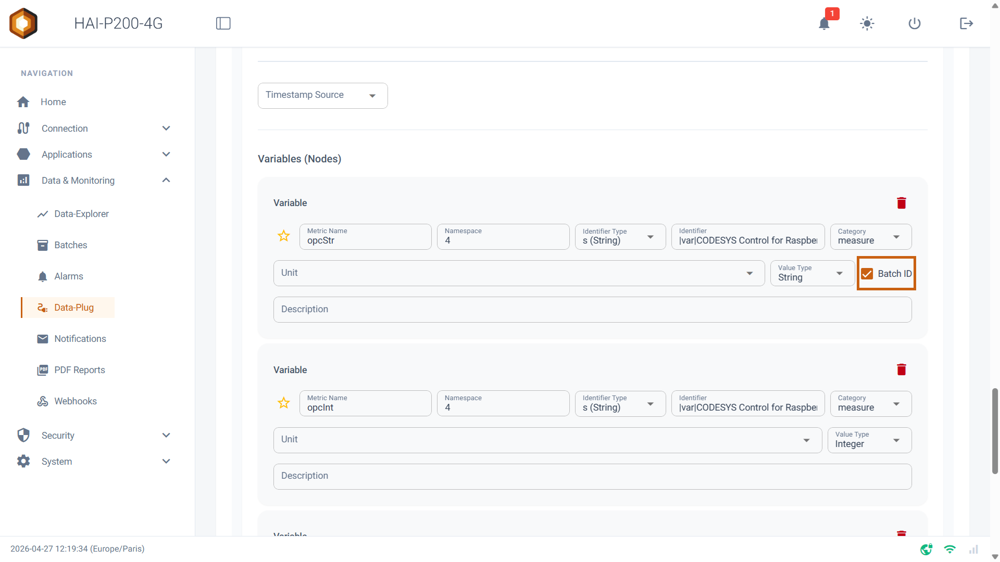
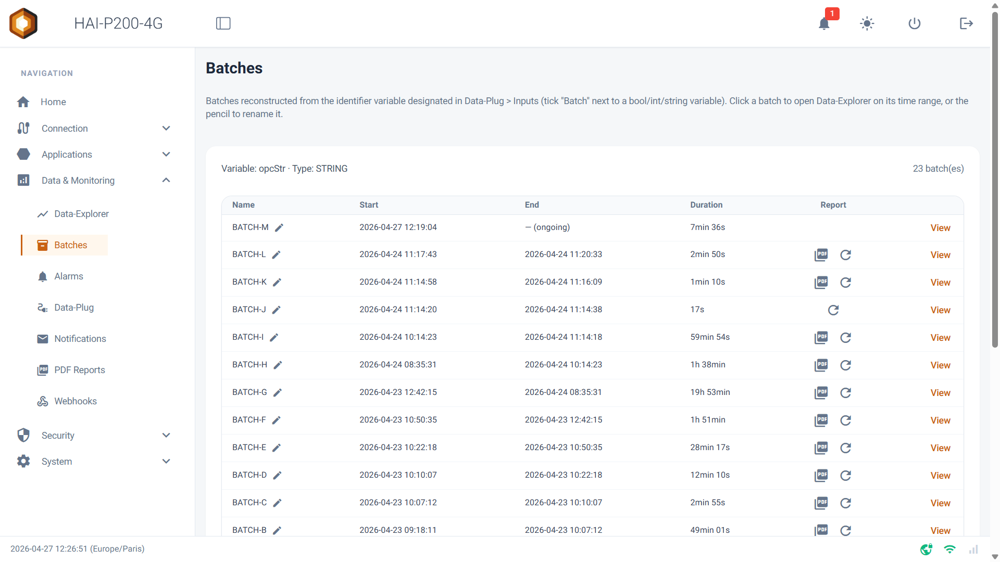
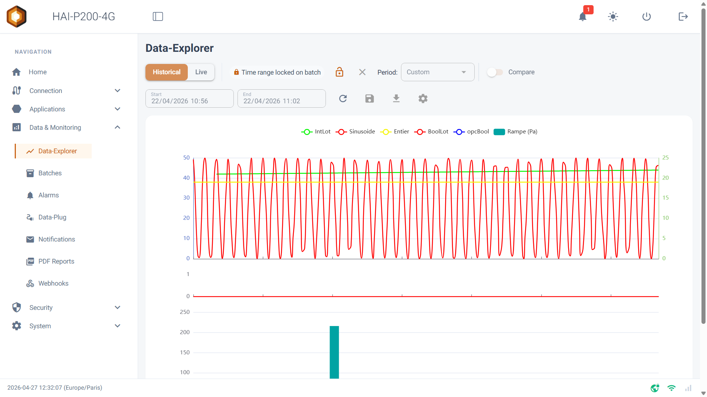
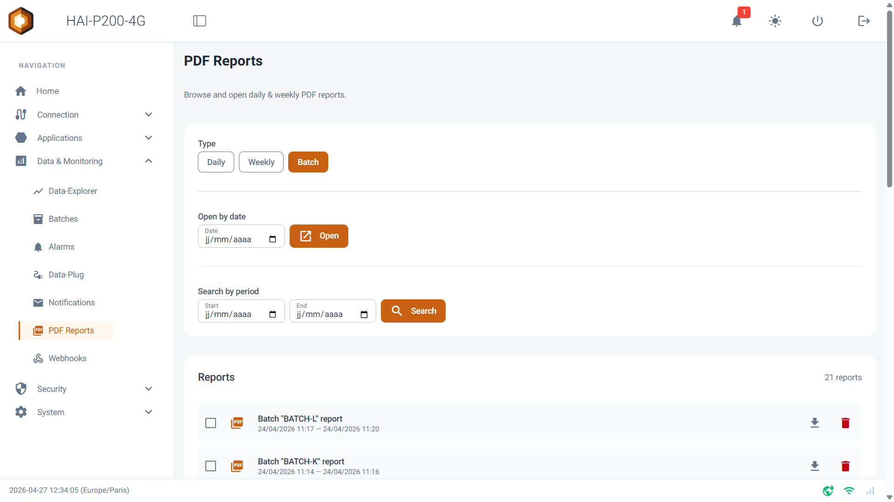
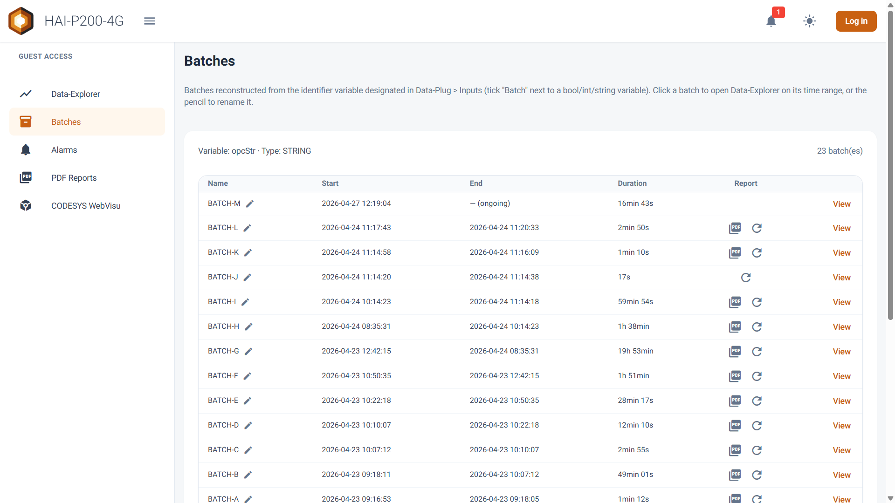

Welcome to this guide to the **Batches** page. This module isolates, tracks and documents your production cycles (batches). It centralises your batch history, lets you analyse each one individually in the Data-Explorer, and handles the generation of end-of-batch reports (PDF).

## Prerequisites

- The HAI-P200-4G controller

- HAI-OS

- A variable specifically designated as the batch identifier in the **Data-Plug**.

## What is the Batches module?

The Batches module automatically rebuilds the history of your production batches from the value changes of a **key variable** (the batch identifier). The system adapts its behaviour to the type of that variable:

- **Boolean (0/1)**: a batch is the period during which the machine is running (value 1 or True). Periods at 0 are not treated as batches.

- **Integer (INT) or Text (STRING)**: every new, different value marks the start of a new batch (for example, recipe number "120" becoming "121", or barcode "LOT-A" becoming "LOT-B").

## Defining the batch variable (Batch ID)

Before the Batches page can fill up, you have to tell the system which variable to listen to:

1.  Go to the **Data-Plug > Configuration** menu.

2.  In your equipment's settings (Modbus, S7 or OPC-UA), find the variable that will serve as the reference for your batches.

3.  Tick the **Batch ID** box on that variable's row. _(Note: only one variable can be defined as the Batch ID on the whole controller. Ticking this box on a new variable clears it on the previous one.)_

## Interface and batch tracking

Once configured, the Batches page shows a dashboard listing the batches of the last 30 days, from the most recent to the oldest. It contains:

- **Name**: the value of the batch identifier. If the variable is a boolean, the name is empty by default.

- **Start & End**: the exact start and end dates and times of the batch. If production is still running, _(ongoing)_ is shown.

- **Duration**: the exact duration of the batch, computed automatically.

- **The edit button (✏️)**: next to the batch name, a small pencil lets you rename a batch by hand to make it easier to identify later (for example, naming a boolean cycle "Morning production").

## Analysing a batch in the Data-Explorer

The strength of the Batches module lies in how tightly it integrates with the charting tool:

- In the right-hand column, click a batch's **View** button.

- You are taken straight to the **Data-Explorer**, which opens **locked on the exact period of the batch** (from its start to its end).

- A "🔒 Time range locked on batch" indicator confirms that you are looking at the data for that specific production cycle.

## Generating and consulting reports (PDF)

If you have enabled batch reports in the system configuration (through the _Notifications_ page), a PDF report is generated at the end of each cycle. In the **Report** column of the table:

- **PDF button (📄)**: opens the end-of-batch report directly in a new tab.

- **Refresh button (🔄)**: if the report has not been generated, or if you want to recreate it after adding new curves to your configuration, click this button to force a manual (re)generation.

## Guest access

Like the Alarms and Data-Explorer pages, the Batches page works in open-access mode. If you want an operator to consult the batch list or open their PDF reports without holding configuration rights:

1.  Go to the **Security > Password Manager** menu.

2.  Turn on the **Enable Guest Access** switch.

3.  From the login page, the **← Guest Access** button then gives safe access to the Batches module.

