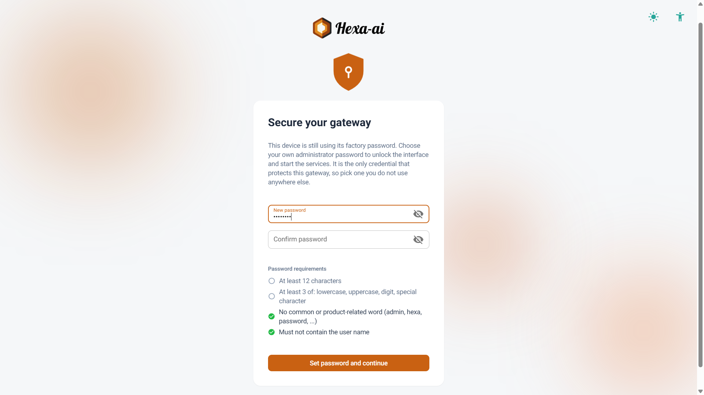
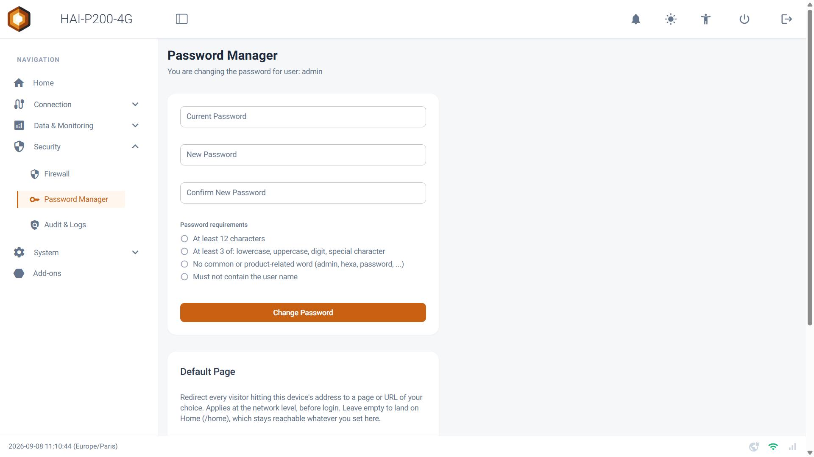
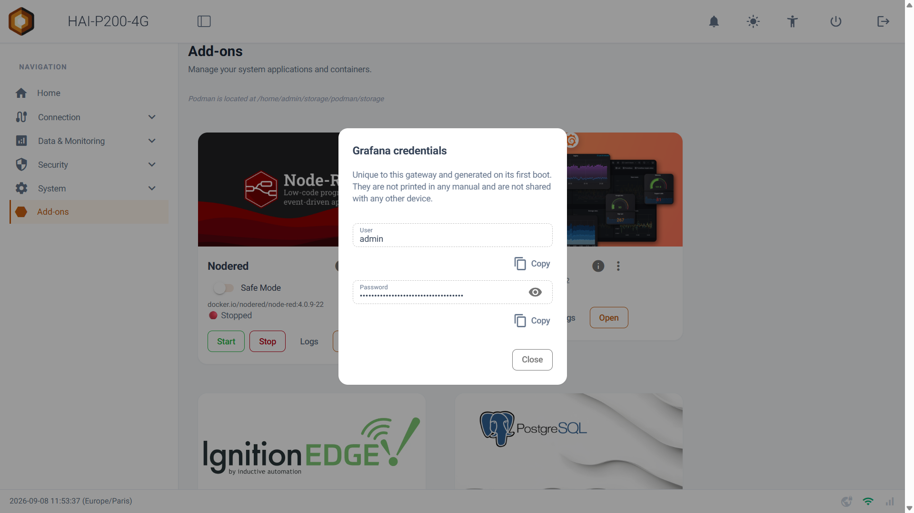
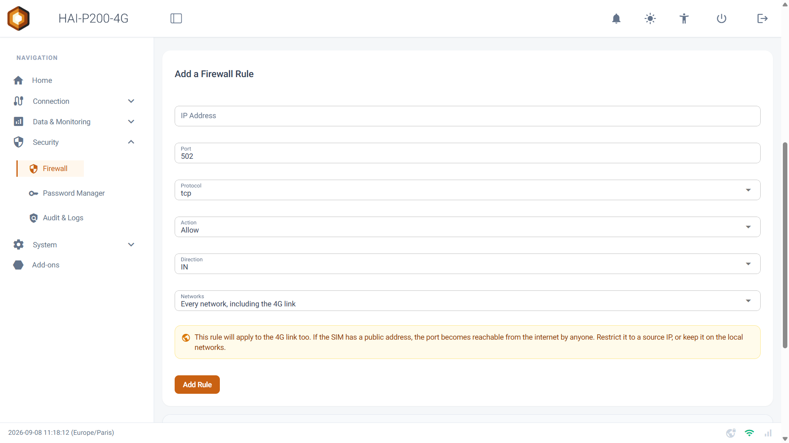
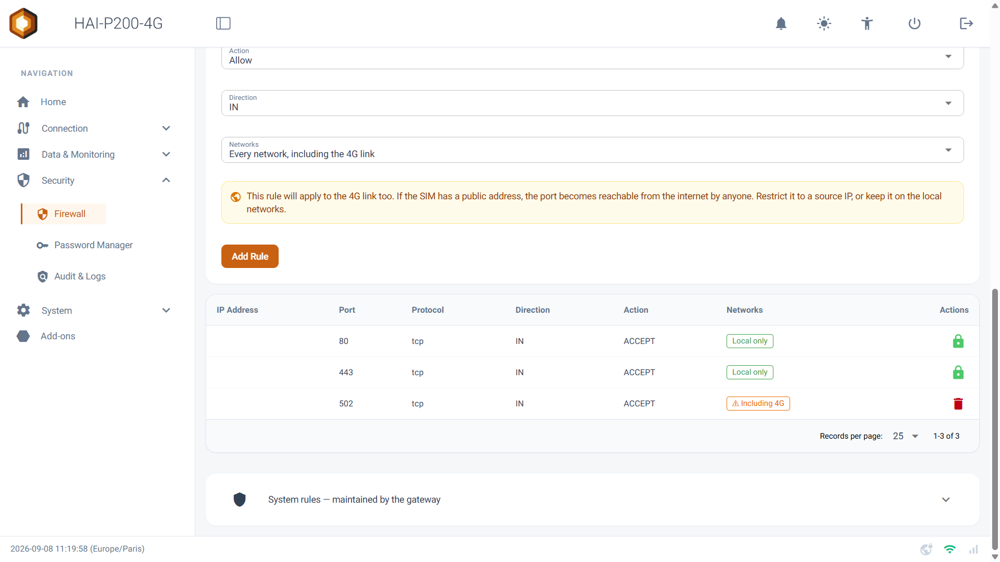
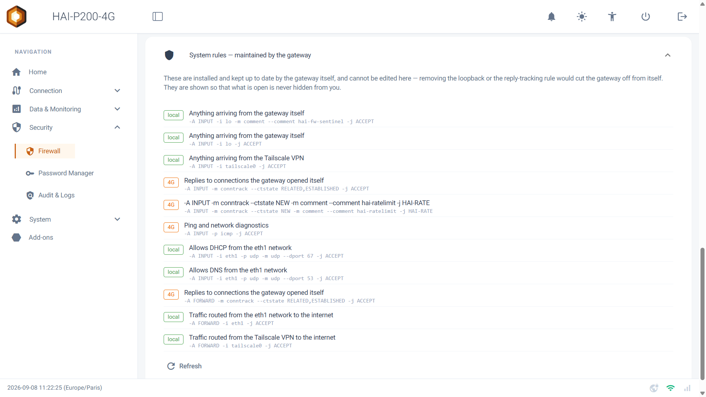
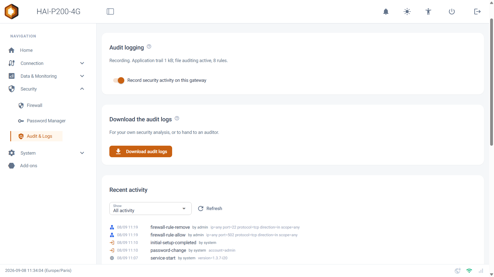
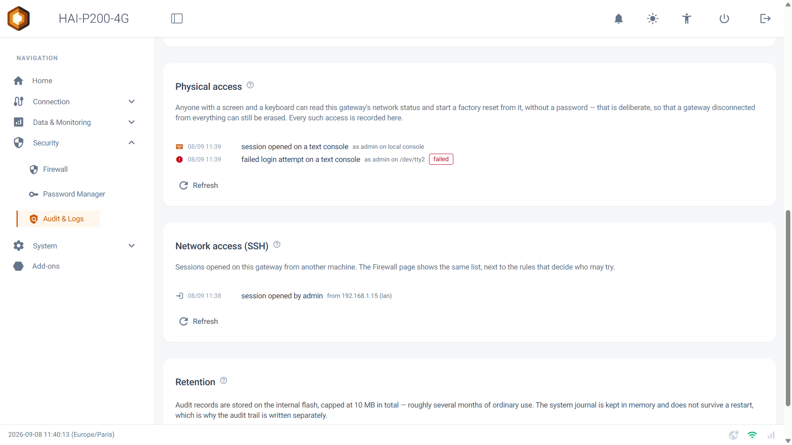
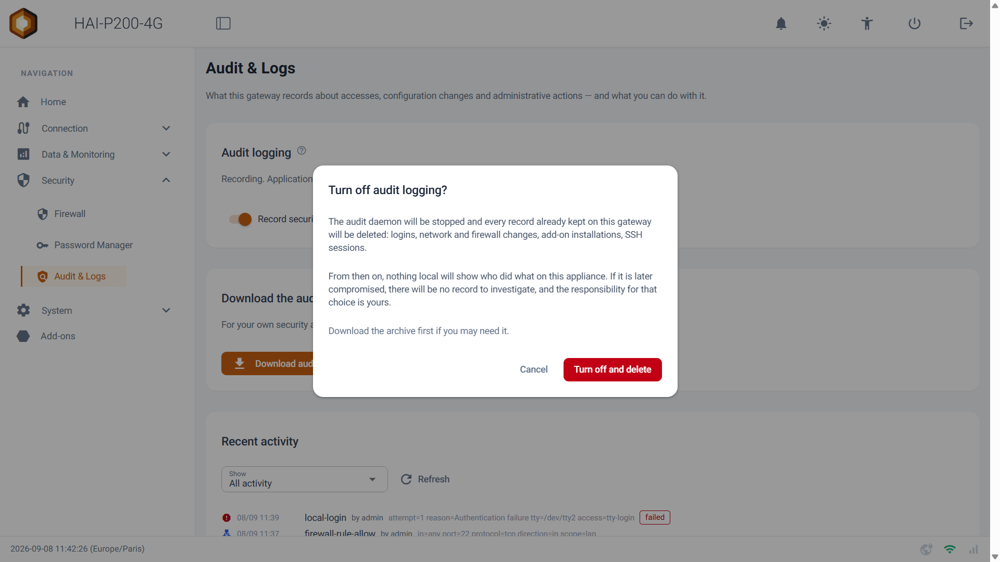
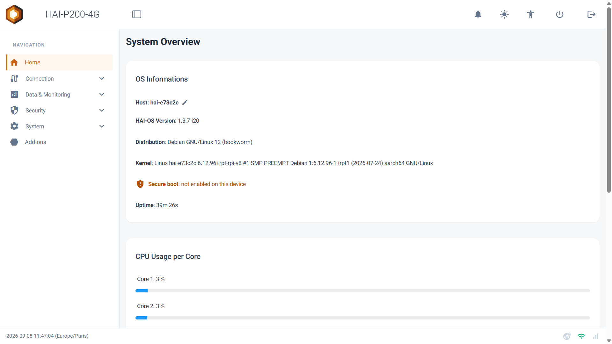

Welcome to this guide to the **Security** menu. This module gathers everything that protects your controller: the password that guards access to it, the firewall that filters what can reach it, and the audit log that keeps a record of what happens on it. Version 1.3.8 brings important new features here, presented one by one below.

## Prerequisites

- The HAI-P200-4G controller
- An administrator account (the admin user)

## 1. The administrator password

### At first setup

A new controller does not show you a login page. It opens a **configuration screen** straight away, asking you to choose your administrator password. Until that is done, no page and no setting is reachable.

The password requested has to obey two rules:

- **At least 12 characters.**
- **At least three character families** among: lower case, upper case, digits, special characters.

Words that are too obvious (related to the product, or classics such as _admin_ and _azerty_) are refused. The rules are shown on screen and are ticked off as you type.

:::tip
**Why this change?** Up to the previous version, every controller left the factory with the same password. A credential shared by a whole fleet is not really one any more: European cyber-resilience regulation now forbids it. Each controller now has its own, chosen by you.
:::

### Changing it later

The password can be changed at any time:

1.  Go to the **Security > Password Manager** menu.
2.  Fill in your **Current Password**.
3.  Type the new one in **New Password**, then again in **Confirm New Password**.
4.  Click **Change Password**.

The same strength rules apply as at first setup.

:::tip
**Tip:** this page is also where **guest access** is configured, if you want an operator to be able to consult the Data-Explorer, the batches, the alarms or the PDF reports without needing that password.
:::

### What happens after repeated mistakes?

After **five consecutive failures**, the controller slows the following attempts down: 5 seconds' wait, then 10, then 20, and so on up to a maximum of **5 minutes**. The counter clears after a quarter of an hour with no new attempt, and a correct entry resets it.

:::caution
The account is **never permanently locked**. Nobody can shut you out of your own controller by deliberately typing the wrong password. Every attempt, successful or not, is written to the audit log.
:::

## 2. Add-on passwords

Some add-ons have their own account, independent of the controller's: **Grafana**, **Ignition**, **PostgreSQL** and **pgAdmin**. Node-RED does not.

Up to the previous version, those passwords were identical on every controller and printed in our manuals. They are now **generated when your device first boots**, and belong to it alone. Since they can no longer appear in documentation, the controller shows them to you directly.

### Where do you find them?

1.  Go to the **Add-ons** menu.
2.  On the relevant add-on's card, open the **⋮** menu (the three dots).
3.  Click **Credentials**.

A window then shows two fields:

- **User:** the user name, in plain text.
- **Password:** the password, **masked by default**. The eye icon reveals it, and the **Copy** button puts it in your clipboard without you having to display it.

:::tip
**Why masked by default?** This screen is often open during commissioning, on a display other people can see. The **Copy** button saves you from having to reveal the password in order to use it.
:::

:::caution
**Add-ons installed before version 1.3.8.** An add-on keeps in its data the password created at its first installation. Grafana and PostgreSQL are corrected automatically by the update; **Ignition and pgAdmin keep the old password** until they are reinstalled with the data deletion option. If the **Credentials** screen shows you a password that does not work, this is the situation you are in.
:::

:::tip
If the window says the password has not been generated yet, restart the controller — generation happens at boot.
:::

## 3. The firewall

The **Security > Firewall** page shows you what is allowed to reach your controller, and lets you adjust it. As delivered, the web interface only answers on your local networks and on the VPN — never on the 4G link — and SSH access is closed.

### Adding a rule

In the **Add a Firewall Rule** card, fill in the following fields:

- **IP Address:** the address concerned. Type nothing for "from anywhere".
- **Port:** the port targeted (502 for Modbus/TCP, for example).
- **Protocol:** tcp or udp.
- **Action:** **Allow** to permit, **Block** to block.
- **Direction:** **IN** for what comes into the controller, **OUT** for what leaves it.
- **Networks:** the networks the rule applies to.

Then click **Add Rule**.

### The Networks field: local or 4G?

This field offers two values:

- **Local networks only (recommended)** — the default value. The rule only applies to your local networks and to the VPN. This is what you want in order to open a port for a technician who is on site.
- **Every network, including the 4G link** — the rule also applies to the mobile link. An orange banner then appears to warn you.

:::caution
**Beware of the second option.** If your SIM card has a public address, the port becomes reachable from the Internet by anyone. In that case, restrict the rule to a specific source address, or stay on the local networks.
:::

### Reading your rules back

The rules table repeats that scope for every row, in a **Networks** column: Local only or ⚠ Including 4G. A single glance therefore tells you what is exposed beyond your workshop.

### The rules the controller maintains

The expandable **System rules — maintained by the gateway** section shows the rules the controller installs and updates by itself. They cannot be modified: deleting the loopback or the tracking of replies would cut the controller off from itself.

They are **shown** to you nonetheless, with a plain-language translation alongside. A page that presents itself as the view of your firewall has to show you everything, including what it does not let you change.

### Monitoring SSH access

The **SSH access monitoring** card lists the most recent SSH connections opened on the controller, with their source address and the network used: local network, VPN or Internet. It is on this page because this is where port 22 is opened, or not.

### The RESET ALL RULES button

At the top of the page, this button restores the base rule set after a simple confirmation.

- **IPv6** is disabled at kernel level: nothing goes through any more, neither inbound nor in transit.
- **IPv4** returns to a _DROP_ policy: anything not explicitly allowed is rejected.
- Ports **80 and 443** stay reachable from your local networks and through Tailscale, **never from the 4G link**.
- Ports **53 and 67** stay open on the local interfaces, eth1 and the WiFi access point.
- Ping, traffic arriving over Tailscale and the replies to connections the box opened itself keep going through.

:::caution
**All your custom rules are deleted.** Keep this button for the case where the firewall configuration has become unintelligible and you want to start again from a clean base.
:::

Those openings are not a leftover: they are the ones without which the reset would cut you off from the box.

- **443 and 80** — the web administration interface. Closing them would amount to locking the door of the very page you have just clicked from. Port 80 also serves the [captive portal](/en/network/wifi-hotspot/): a device joining a WiFi network queries an address over plain HTTP to find out whether it should show a login page. Over HTTPS alone, it would see nothing.
- **67 and 53** — address distribution and name resolution for the devices the box hosts on its local networks. Closed, no phone could join the [WiFi access point](/en/network/wifi-hotspot/) any more: neither receive an address, nor be redirected to the portal.

These rules do not depend on the state of connection sharing: they are laid down at every reset, unconditionally.

:::note[DNS resolution on eth1]
An address translation rule, laid down at the same moment, redirects every DNS request coming from the eth1 port to **8.8.8.8**. Port 53 is therefore genuinely open as far as the firewall is concerned, but it is Google that answers, not the box. Worth taking into account if your internal policy requires a resolver you control.
:::

None of those openings exposes your equipment: they serve the box and the devices it hosts on its own networks. Your PLCs stay behind the _DROP_ policy as long as you do not explicitly open a port for them.

The configured connection sharing is reapplied right afterwards: the WiFi access point immediately, the wired sharing some twenty seconds later.

## 4. Audit & Logs

The **Security > Audit & Logs** page gathers everything your controller keeps about itself: accesses, configuration changes and administration actions.

### What is recorded?

Every event carries a date, an action and a category. The **Recent activity** list can be filtered by category using the **Show** menu:

| Category | What you will find there |
| --- | --- |
| Authentication | Logins to the interface, successful and failed, and the slowdown triggered by a run of failures. |
| Network and firewall | Firewall rules added or deleted, network changes, VPN port forwarding. |
| Administration | Add-on installations and removals, updates, setting changes. |
| System | Service start-ups and events specific to the device. |

### Physical access

A separate card lists what happens **in front of the machine**: a screen and a keyboard plugged into the controller, a session opened on a text console or on the serial port, and the opening of the reset screen.

:::caution
Anyone with a screen and a keyboard can read the controller's network state and start a factory reset, with no password. That is deliberate: a box cut off from everything must remain erasable. In exchange, each of those accesses leaves a trace here.
:::

### Network access (SSH)

The next card does the same for sessions opened from another machine, keeping their origin. Repeated failures are recorded **once per run** rather than one line per attempt: an automated scan therefore cannot drown your real sessions in noise.

### Downloading the archive

The **Download audit logs** button produces a .tar.gz file containing the application's audit trail, the system audit daemon's log, the list of SSH sessions, an extract of the system log, and a **manifest with the SHA-256 fingerprint of every file**.

That fingerprint lets you demonstrate that the archive has not been altered after the fact. This is the format to hand to an auditor, or to keep before an intervention.

### How long are the logs kept?

The audit trail is written to the controller's internal memory, so it survives a power cut. It is capped at **10 MB in total**, which is several months of ordinary use; beyond that, the oldest records are dropped, so that a log can never fill the storage and block the controller.

The system log, for its part, stays in RAM and disappears at every restart — which is precisely why the audit trail is written separately.

### Turning recording off

A single switch, **Record security activity on this gateway**, governs the whole thing: the audit trail, the system daemon and SSH monitoring.

:::caution
**Turning it off deletes everything already recorded** on the controller: logins, network and firewall changes, add-on installations, SSH sessions. A window reminds you of this before you confirm. After that, nothing local will be able to say who did what. **Download the archive first** if it might be of use to you.
:::

## 5. Starting again from a clean base

Two pages in the **System** menu complete this set-up. They have a detailed guide of their own; here is the essence of it.

### Factory Reset

Two levels of erasure are offered: everything the controller holds, or only the application settings — in which case the networks, the VPN, the password and the recorded measurements are kept. After a full wipe, the controller asks you for an administrator password again at first access, and returns to the as-delivered firewall, SSH closed.

### Configuration (export / import)

This page exports your controller's settings into an **encrypted file**, which you can import onto another one — to replace a box, or to restore it after a reset. What is specific to a device does not travel: the network configuration, the VPN identity, the password and the measurements stay on their original controller.

## 6. Secure boot

Secure boot seals the device: the processor checks the software's signature before launching it, and refuses to boot a system that is not ours. A sealed controller therefore cannot be reprogrammed by someone with physical access to the board.

**This protection is coming on our next devices.** Controllers already in service do not have it: it is a property burned in at manufacturing time, and it cannot be added by an update.

### How do I know whether my controller has it?

Open the **Home** page. The information is shown along with the HAI-OS version and the kernel, in one of these three forms:

✅**Secure boot: sealed device** Your device is sealed. Only software signed by Hexa-AI can boot on it.

⚠️**Secure boot: not enabled on this device** Your device is not sealed: this is the case for the current generation.

**No line shown** The controller could not read the information. It then prefers to show nothing rather than wrongly announce an absence of sealing.

The value is read once at boot, from permanently burned fuses: it can neither change while the machine is running, nor be modified by software.

## 7. The other protections

These protections require nothing of you. They are mentioned here so that you know what has changed:

- **The web interface is now only reachable from your local networks and the VPN.** It used to answer on every interface, including 4G, which put it on the Internet with a SIM card holding a public address.
- **Each controller now signs its sessions with its own key.** That key was identical on every device manufactured since April 2025.
- **Updates are verified before installation.** The web interface no longer installs anything itself: it files the request, and an isolated service checks the Hexa-AI signature. Downloads go exclusively over HTTPS.
- **Node-RED no longer runs as administrator**, which prevents a flow from taking over the controller. Two consequences: a flow acting as a _server_ on a port below 1024 has to move above it (a Modbus/TCP server on 502 moves to 1502; querying a device on port 502 is unaffected), and exec nodes no longer run as administrator.
- **Services restart indefinitely** instead of giving up after a few attempts, and a hardware watchdog restarts the controller if the system freezes.
