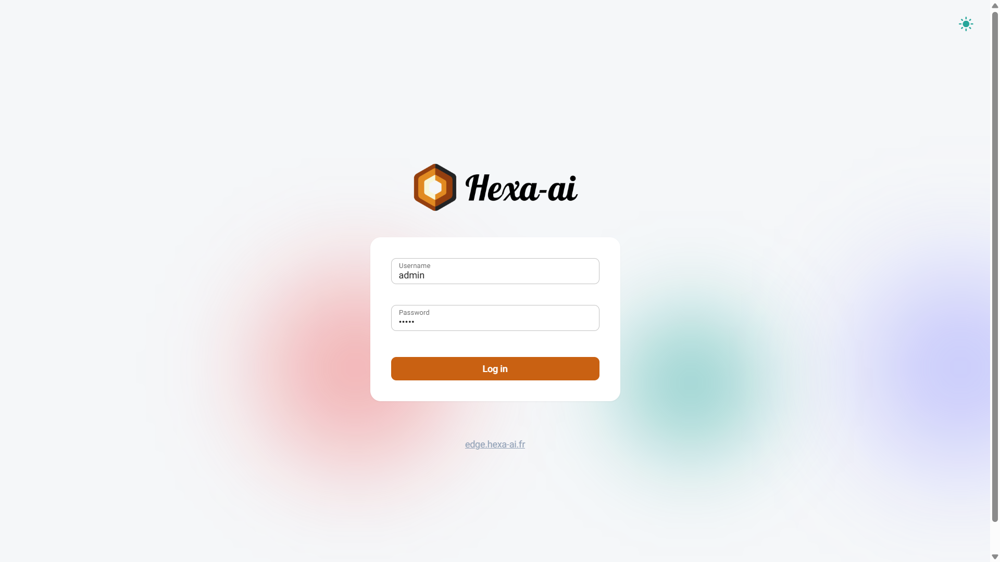
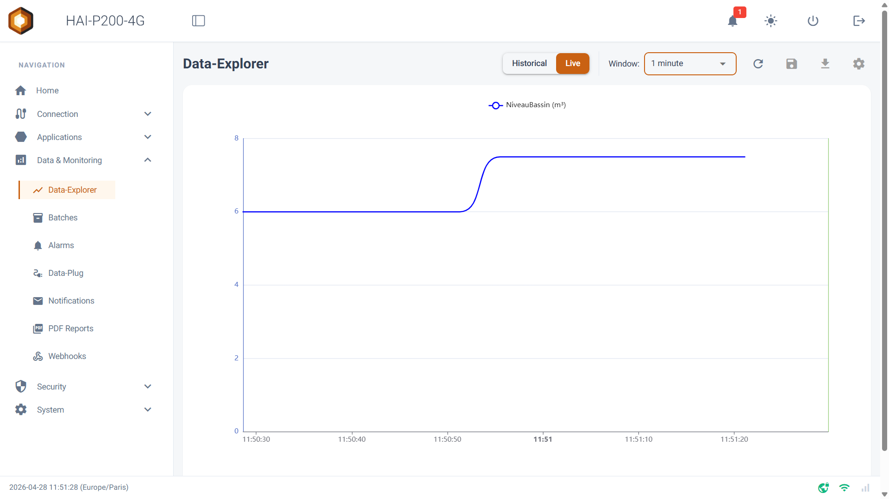

🚀

Bienvenue sur votre contrôleur **HAI-P200-4G** propulsé par **HAI-OS**. Ce guide a pour but de vous accompagner pas à pas pour configurer votre boîtier, collecter votre première donnée industrielle et la visualiser en quelques minutes seulement.

## Étape 1 : Première connexion

Une fois votre contrôleur HAI-P200-4G raccordé à l'alimentation, vous devez vous y connecter.

Par défaut, le port **Ethernet 1 (eth1)** du contrôleur est préconfiguré avec l'adresse IP statique **192.168.1.16** et le masque de sous-réseau **255.255.255.0**.

1.  Connectez votre PC directement au port **Ethernet 1** du contrôleur à l'aide d'un câble réseau _(assurez-vous que la carte réseau de votre PC est configurée sur le même sous-réseau, par exemple avec l'IP 192.168.1.5)_.

2.  Ouvrez un navigateur web et saisissez l'adresse **https://192.168.1.16** dans la barre d'adresse.

3.  Sur la page de connexion, entrez les identifiants par défaut :

    - **Username** : admin

    - **Password** : hai1@

4.  Le boîtier ouvre un écran de configuration et vous demande de définir votre mot de passe administrateur.

## Étape 2 : Connectivité Réseau

Pour que votre boîtier puisse envoyer des e-mails, se synchroniser à l'heure mondiale (NTP) ou pousser des données vers le Cloud, il doit être connecté à Internet.

Dépliez le menu **Connection** dans la barre latérale gauche :

- **Ethernet** : Configurez vos ports (dont le port eth0 ou la modification du eth1) en mode DHCP (automatique) ou avec une nouvelle IP Statique pour l'intégrer au réseau de l'usine.

- **WiFi** : Activez la radio WiFi, scannez les réseaux environnants et connectez-vous.

- **4G Modem** : Si vous disposez d'une carte SIM, renseignez l'APN et le code PIN pour activer la liaison cellulaire.

- **VPN Tailscale** : Connectez votre boîtier à votre réseau privé virtuel sécurisé pour une prise en main à distance.

_💡_

**Astuce** : Le pied de page (Footer) de l'interface affiche des icônes d'état en temps réel pour le WiFi, le Modem 4G et le VPN. Si l'icône est verte (ou orange pour la 4G), la connexion est opérationnelle !

## Étape 3 : Collecte de votre première donnée (Data-Plug)

C'est le cœur du système. Nous allons lire une donnée depuis un automate ou un capteur.

1.  Allez dans le menu **Data & Monitoring > Data-Plug**.

2.  Dans la carte **Inputs Configuration**, choisissez le protocole de votre équipement (Modbus, OPC-UA,S7, BACnet/IP (beta), NMEA 0183 (beta) ou Internal MQTT (Node-RED)) dans le menu déroulant, puis cliquez sur **Add Input**.

3.  Renseignez l'adresse IP de votre automate (ex: tcp://192.168.1.50:502 pour du Modbus).

4.  Ajoutez une variable (Field / Node) :

    - Nommez-la (ex: NiveauBassin).

    - Renseignez son adresse mémoire (ex: Registre 2,3).

    - Définissez sa Catégorie sur **Measure** (Mesure).

    - Précisez son unité (ex: m³).

5.  Cliquez sur le bouton bleu **Save and restart** en haut de la carte. Le moteur d'acquisition redémarre et commence immédiatement à enregistrer la donnée !

## Étape 4 : Visualisation (Data-Explorer)

Maintenant que la donnée est collectée, allons la regarder vivre.

1.  Naviguez vers **Data & Monitoring > Data-Explorer**.

2.  Sur la ligne de configuration des graphiques, ouvrez le menu déroulant **Variable** : votre NiveauBassin y apparaît ! Sélectionnez-la.

3.  En haut de l'écran, basculez l'interrupteur sur le mode **Live**.

4.  Le graphique se met à jour en temps réel (au rythme de quelques secondes) et trace l'évolution de votre capteur.

## 🎉 Félicitations !

Votre contrôleur HAI-P200-4G est opérationnel. Pour aller plus loin, n'hésitez pas à consulter les documentations dédiées pour :

- **Déclarer des Alarmes** et recevoir des alertes instantanées par e-mail ou SMS.

- **Générer des Rapports automatisés** par e-mail, incluant vos graphiques et l'export CSV de vos données.

- **Configurer les Webhooks** pour connecter votre boîtier à vos propres serveurs informatiques.
