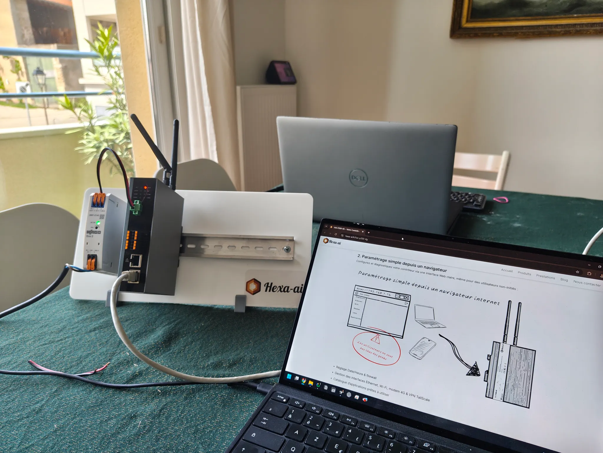
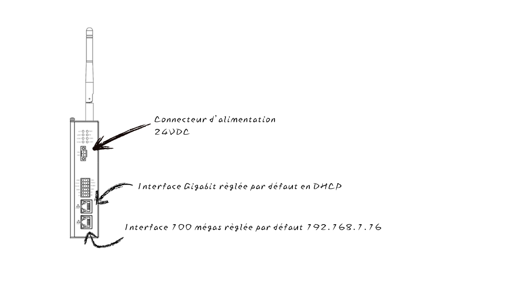

Voici un tour d’horizon pour une première connexion au HAI-P200-4G. Alimentez votre contrôleur en 24 VDC, dans notre cas nous avons utilisé une alimentation Eco 2 de notre partenaire historique WAGO Contact (Référence: 2687-2142). Branchez votre PC sur le port Ethernet du bas et configurez le en adresse IP statique par exemple en 192.168.1.5.

Les deux interfaces Ethernet du HAI-P200-4G sont réglées par défaut en DHCP pour le port du haut et en IP statique pour le port du bas (Adresse: 192.168.1.16).

Pour se connecter, saisissez l’adresse IP, 192.168.1.16 dans la barre d’adresse de votre navigateur et identifiez vous (utilisateur admin et mot de passe hai1@). La connexion étant en HTTPS lors du premier accès un message de sécurité (certificat) devrait apparaitre dans votre navigateur, confirmez pour vous connecter.

:::caution[Ce mot de passe ne survit pas à la première mise en service]
Dès le premier démarrage, le boîtier ouvre un écran de configuration et **vous demande de définir votre propre mot de passe administrateur**. Tant que ce n'est pas fait, aucun réglage n'est accessible.

Le mot de passe d'usine ne sert donc qu'à ce premier accès : il ne sera jamais celui avec lequel vous administrerez le contrôleur. Prévoyez-en un avant de commencer, et conservez-le — voir [Sécurité](/system/security/) pour les règles qu'il doit respecter.
:::

[Voir la vidéo de mise en route](https://www.youtube.com/watch?v=arMbBaHQpJU)
