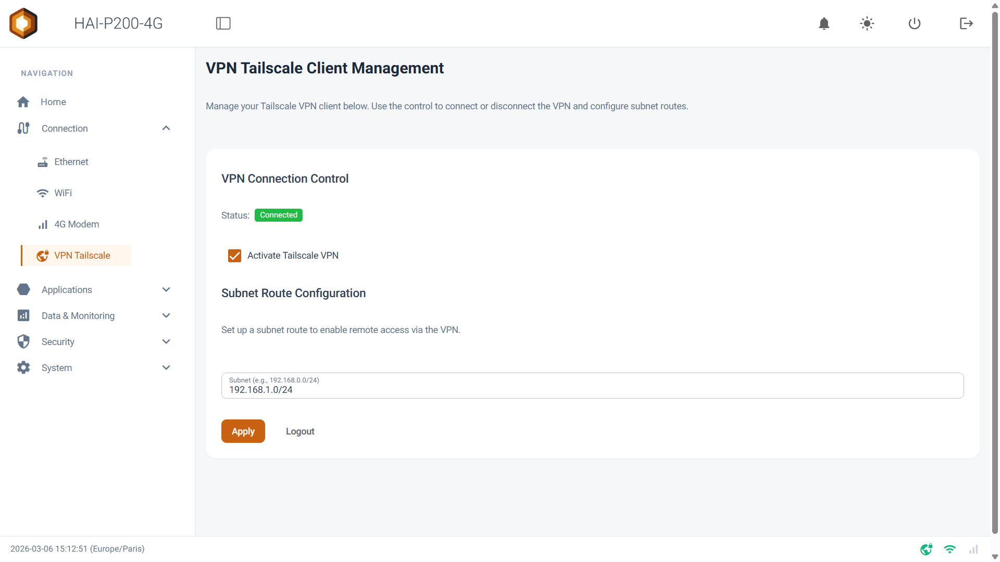

<!-- VIDEO A VENIR — mise en route en telemaintenance.
     Quand le lien YouTube sera connu, remplacer ce commentaire par la
     ligne ci-dessous, ID et titre renseignes. Le style vient de la
     classe hai-video, dans src/styles/hexa.css.

<iframe class="hai-video" src="https://www.youtube-nocookie.com/embed/IDENTIFIANT" title="Mise en route du HAI-P200-4G : telemaintenance" loading="lazy" allow="accelerometer; clipboard-write; encrypted-media; gyroscope; picture-in-picture; web-share" allowfullscreen></iframe>
-->

Bienvenue sur votre contrôleur **HAI-P200-4G** propulsé par **HAI-OS**. Ce guide a pour but de vous accompagner pas à pas pour transformer votre boîtier en une passerelle d'accès distant sécurisée (VPN). En quelques minutes, vous pourrez vous connecter à distance à vos équipements industriels (automates, IHM) comme si vous étiez sur place avec un câble.

## Étape 1 : Première connexion

Une fois votre contrôleur HAI-P200-4G raccordé à l'alimentation, vous devez vous y connecter.

Par défaut, le port **Ethernet 1 (eth1)** du contrôleur, côté réseau machine, est préconfiguré avec l'adresse IP statique **192.168.1.16** et le masque de sous-réseau **255.255.255.0**.

1.  Connectez votre PC de configuration directement au port **Ethernet 1** du contrôleur à l'aide d'un câble réseau _(assurez-vous que la carte réseau de votre PC est configurée sur le même sous-réseau, par exemple avec l'IP 192.168.1.5)_.

2.  Ouvrez un navigateur web et saisissez l'adresse **https://192.168.1.16** dans la barre d'adresse.

3.  Sur la page de connexion, entrez les identifiants par défaut :

    - **Username** : admin

    - **Password** : hai1@

4.  Le boîtier ouvre un écran de configuration et vous demande de définir votre mot de passe administrateur.

## Étape 2 : Fournir un accès Internet au boîtier

Pour que le contrôleur puisse établir le tunnel VPN vers l'extérieur, il a impérativement besoin d'une connexion à Internet.

Dépliez le menu **Connection** dans la barre latérale gauche et choisissez votre moyen de communication vers l'extérieur :

- **Ethernet (eth0)** : configurez ce port, côté usine ou entreprise, en mode DHCP ou avec une IP statique fournie par le service informatique.

- **WiFi** : activez la radio WiFi, scannez les réseaux environnants et connectez-vous au point d'accès de l'usine.

- **4G Modem** : si vous disposez d'une carte SIM, renseignez l'APN et le code PIN pour activer la liaison cellulaire indépendante.

:::tip[Astuce]
Le pied de page de l'interface affiche des icônes d'état en temps réel pour le WiFi, le modem 4G et le VPN. Si l'icône du réseau que vous avez configuré devient verte — ou orange pour la 4G — l'accès à Internet est opérationnel.
:::

## Étape 3 : Configuration du tunnel VPN (Tailscale)

Maintenant que le boîtier a accès à Internet, nous allons le relier à votre réseau privé virtuel pour y accéder à distance.

1.  Allez dans le menu **Connection > VPN Tailscale**.

2.  Cochez la case **Activate Tailscale VPN**.

3.  **Key** : renseignez la clé d'authentification générée depuis votre console d'administration Tailscale — elle commence généralement par `tskey-auth-` — puis cliquez sur **Apply**. Le statut passe à **Connected** et le champ _Key_ disparaît : le boîtier est enrôlé.

4.  Le sélecteur **Mode** apparaît alors, positionné sur **Subnet Route**. C'est le mode à conserver pour la télémaintenance. _(L'autre mode, Port Forwarding, n'expose qu'un équipement sur un port précis ; voir [l'article VPN Tailscale](/network/tailscale-vpn/).)_

5.  **Subnet Route Configuration** : saisissez le réseau de vos machines, celui du port **eth1**, que vous souhaitez rendre accessible à distance. Indiquez **l'adresse du réseau**, pas celle d'un équipement : si votre automate est en 192.168.1.50, saisissez `192.168.1.0/24`.

6.  Cliquez de nouveau sur **Apply**. C'est ce second clic qui annonce la route.

:::caution[Le réseau annoncé doit être approuvé côté Tailscale]
Dans votre console d'administration, ouvrez la machine, section **Subnets**, cliquez **Edit**, cochez le réseau et enregistrez.

Tant que l'approbation n'est pas faite, le boîtier affiche **Connected** mais aucun trafic ne passe vers vos machines.
:::

Le statut passe à **Connected**, en vert. Le routeur du boîtier propage désormais les communications de votre réseau distant directement vers le réseau de votre machine.

## Étape 4 : Prise en main de vos équipements

La configuration côté machine est terminée. Désormais, depuis votre bureau ou en déplacement :

1.  Assurez-vous que l'application client Tailscale est active sur votre PC de travail, et connectée au même compte.

2.  Ouvrez votre logiciel de programmation habituel (TIA Portal, CODESYS, SoMachine…) ou un navigateur web.

3.  Entrez **directement l'adresse IP locale** de votre automate ou IHM (ex. 192.168.1.50).

La communication s'établit de manière transparente et chiffrée, de bout en bout.

## Félicitations

Votre contrôleur HAI-P200-4G est opérationnel et sécurisé. Pour aller plus loin, consultez les documentations dédiées pour :

- **déclarer des règles de pare-feu** afin de limiter strictement qui peut communiquer avec la machine ;

- **activer le partage de connexion** si votre automate a lui-même besoin d'accéder à Internet, pour se mettre à l'heure ou communiquer avec un service cloud.
