## 1 Guide matériel

Ce chapitre présente un aperçu du produit, la liste d’emballage, l’apparence, les boutons, les indicateurs et les interfaces.

## 1.1 Aperçu

La référence **HAI-P200-4G** est un PC industriel basé sur le **Raspberry Pi CM4**., il dispose de 4 Go de RAM et 32 Go de stockage eMMC.

L’**HAI-P200-4G** intègre des interfaces courantes (**HDMI**, **USB**, **Ethernet**, **RS232**, **RS485**) et prend en charge les connexions réseau via **Wi-Fi**, **Ethernet** et **4G**. L’ajout d’un **super condensateur**  (alimentation de secours, optionnel), d’une **RTC** (horloge temps réel), d’un **Watch Dog**, d’une **EEPROM** et d’une puce de chiffrement garantit une facilité d’utilisation et une fiabilité élevée, adaptées aux applications de **contrôle industriel** et d’**IoT**.

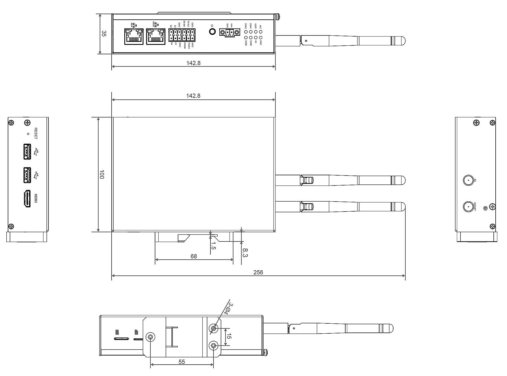

## 1.2 Liste d'emballage

- 1x Unité **HAI-P200-4G**
- 1x Antenne 4G
- 1x Antenne Wi-Fi
- 1x Bornier d’alimentation débrochable à 2 contacts (borne à vis)
- 2x Borniers RS232/RS485 débrochables à 6 contacts (bornes à ressort)

## 1.3 Apparence

Description des fonctions et définitions des interfaces sur chaque face.

### 1.3.1 Face Avant

| **N°** | **Fonction** |
| --- | --- |
| **1** | 1 indicateur de statut système (vert) pour vérifier l’état de fonctionnement. |
| **2** | 1 indicateur utilisateur (vert) personnalisable selon l’application. |
| **3** | 1 indicateur d’alimentation (rouge) pour vérifier l’état marche/arrêt. |
| **4** | 1 indicateur 4G (vert) pour vérifier le statut du signal 4G. |
| **5** | 4 indicateurs UART (verts) pour vérifier le statut de communication des ports UART. |
| **6** | Entrée DC (9–36 V) : borniers 2 broches (espacement 3,5 mm). Broches définies comme VIN+/GND. |
| **7** | 2 ports RS232 (borniers 6 broches) |
| **8** | 2 ports RS485 (borniers 6 broches). |
| **9** | 1 port Ethernet 10/100/1000 M (RJ45) avec indicateur LED |
| **10** | 1 port Ethernet 10/100 M (RJ45) avec indicateur LED |

### 1.3.2 Face arrière

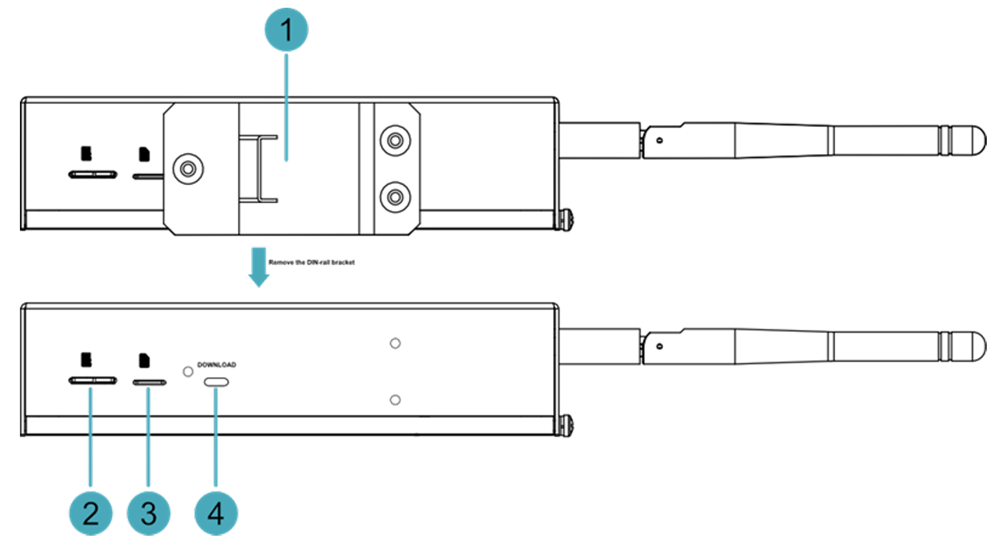

| **N°** | **Fonction** |
| --- | --- |
| **1** | 1 support Rail-DIN pour fixer l’unité **HAI-P200-4G** sur un rail. |
| **2** | 1 slot Micro-SD pour installer une carte SD (stockage de données utilisateur). |
| **3** | 1 slot Nano SIM pour installer une carte SIM (réception du signal 4G). |
| **4** | 1 port Micro USB pour flasher le système sur l’eMMC. |

### 1.3.3 Face latérale

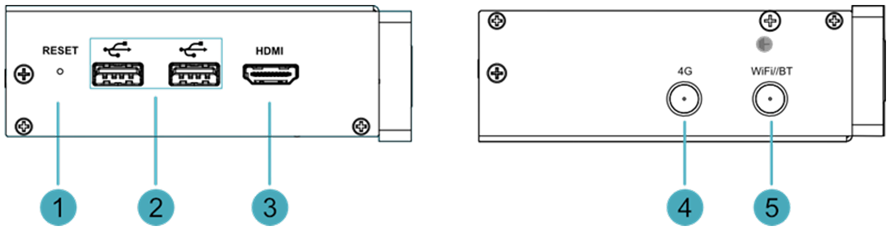

| **N°** | **Fonction** |
| --- | --- |
| **1** | 1 bouton de réinitialisation . Appuyer pour redémarrer l’appareil. |
| **2** | 2 ports USB 2.0 (Type A) avec débit jusqu’à 480 Mbps. |
| **3** | 1 port HDMI (Type A) compatible HDMI 2.1, supportant 4K à 60 Hz. |
| **4** | 1 port antenne 4G (connecteur SMA). |
| **5** | 1 port antenne Wi-Fi/BT (connecteur SMA). |

## 1.4 Bouton

Le dispositif **HAI-P200-4G** inclut un bouton **RESET**, marqué "RESET" sous le boîtier. Appuyer sur ce bouton réalise un redémarrage électrique.

## 1.5 Indicateurs

Présentation des différents états et significations des indicateurs de l’appareil **HAI-P200-4G**.

| **Indicateur** | **Statut** | **Description** |
| --- | --- | --- |
| **PWR** (Alimentation) | Allumé | L’appareil est sous tension. |
| | Clignote | Alimentation anormale. Débranchez immédiatement. |
| | Éteint | L’appareil n’est pas alimenté. |
| **ACT** (Activité) | Clignote | Le système a démarré et lit/écrit des données. |
| | Éteint | L’appareil est éteint ou inactif. |
| **USER** (Utilisateur) | Allumé | Statut personnalisable par l’utilisateur. |
| | Éteint | Non défini ou appareil éteint. |
| **4G** | Allumé | Connexion 4G active. |
| | Éteint | Pas de signal 4G ou appareil éteint. |
| **Ethernet (Jaune)** | Allumé | Transmission de données anormale. |
| | Clignote | Données en cours de transmission. |
| | Éteint | Pas de connexion Ethernet. |
| **Ethernet (Vert)** | Allumé | Connexion Ethernet normale. |
| | Clignote | Connexion Ethernet anormale. |
| | Éteint | Pas de connexion Ethernet. |
| **COM1~COM4** | Allumé/Clignote | Données en transmission. |
| | Éteint | Aucune transmission ou appareil éteint. |

## 1.6 Interfaces

Présentation de la définition et de la fonction de chaque interface du produit.

### 1.6.1 Emplacements de Cartes

L’appareil **HAI-P200-4G** inclut :

- Un **slot de carte SD** (Micro SD) pour le stockage de données.
- Un **slot de carte Nano SIM** pour la connexion 4G.

#### 1.6.1.1 Slot de Carte SD

Le slot Micro SD, permet d’installer une carte SD pour stocker les données utilisateur.

#### 1.6.1.2 Slot de Carte SIM

Le slot Nano SIM, permet d’installer une carte SIM pour recevoir le signal 4G.

### 1.6.2 Interface d’Alimentation

L’appareil **HAI-P200-4G** inclut une entrée d’alimentation en courant continu (9–36 V) via des borniers Phoenix 2 broches (espacement 3,5 mm). Les broches sont définies comme suit :

<figure class="detail">

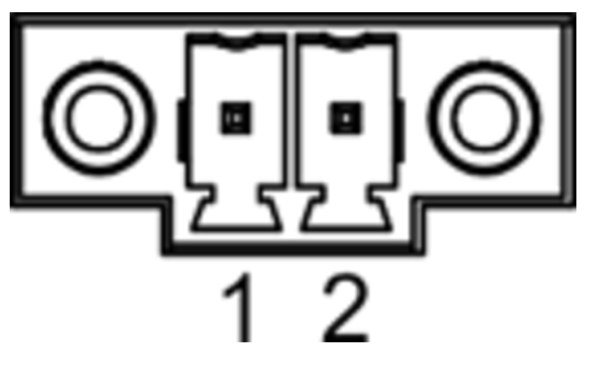

</figure>

| **Broche** | **Nom** |
| --- | --- |
| 1 | GND |
| 2 | 9 V à 36 V |

### 1.6.4 Interface RS485/RS232

L’appareil inclut 2 ports RS485 et 2 ports RS232 (borniers 6 broches). Configuration par modèle : 2x RS485 + 2x RS232

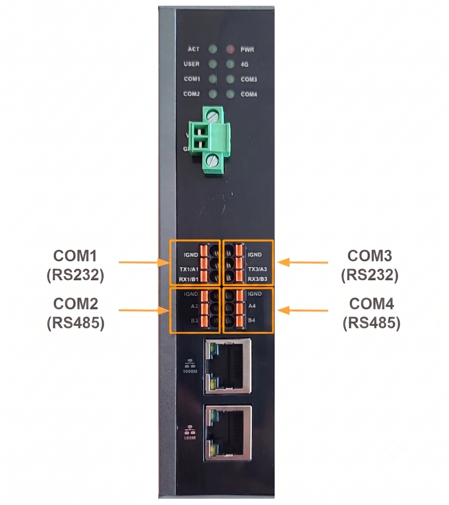

<figure class="detail">

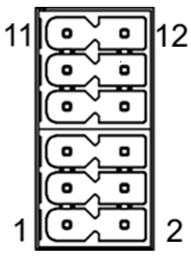

</figure>

| **N°** | **Fonction** |
| --- | --- |
| 1 | RS485-B2 |
| 2 | RS485-B4 |
| 3 | RS485-A2 |
| 4 | RS485-A4 |
| 5 | GND |
| 6 | GND |
| 7 | RS232-RX1 |
| 8 | RS232-RX3 |
| 9 | RS232-TX1 |
| 10 | RS232-TX3 |
| 11 | GND |
| 12 | GND |

**Connexion des câbles**

Le schéma de câblage du RS485 est le suivant :

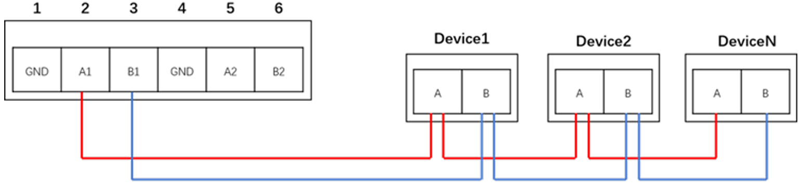

Le schéma de câblage du RS232 est le suivant :

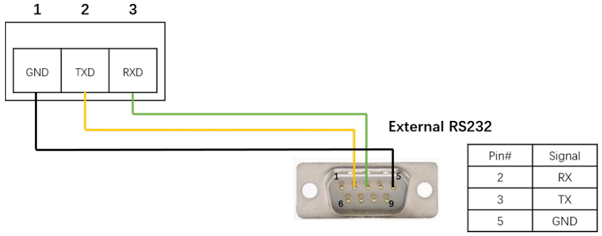

### 1.6.5 Port Ethernet 1000M

L’appareil **HAI-P200-4G** inclut un port Ethernet 10/100/1000M adaptatif. Le connecteur est de type **RJ45** et prend en charge le **PoE** avec module d’extension. Utilisez un câble réseau **Cat6** ou supérieur.

<figure class="detail">

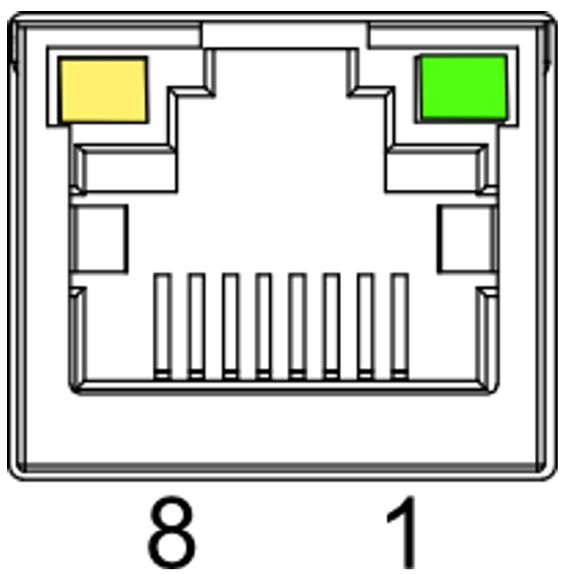

</figure>

| **Broche** | **Nom** |
| --- | --- |
| 1 | TX1+ |
| 2 | TX1- |
| 3 | TX2+ |
| 4 | TX2- |
| 5 | TX3+ |
| 6 | TX3- |
| 7 | TX4+ |
| 8 | TX4- |

#### 1.6.6 Port Ethernet 100M

Port Ethernet 10/100M adaptatif (connecteur **RJ45**). Utilisez un câble réseau **Cat6** ou supérieur.

<figure class="detail">

</figure>

| **Broche** | **Nom** |
| --- | --- |
| 1 | TX+ |
| 2 | TX- |
| 3 | RX+ |
| 4 | – |
| 5 | – |
| 6 | RX- |
| 7 | – |
| 8 | – |

### 1.6.7 Port HDMI

Port HDMI de type **A**, marquage **HDMI**, supportant une résolution jusqu’à **4Kp60**.

### 1.6.8 Ports USB 2.0

2 ports USB 2.0 de type **A**, débit maximal de **480 Mbps**.

### 1.6.9 Port Micro USB

Port Micro USB marqué pour connecter l’appareil à un PC et flasher le système sur l’eMMC.

### 1.6.10 Ports Antenne

2 ports antenne **SMA** :

- Marquage **4G** : pour antenne 4G.
- Marquage **Wi-Fi/BT** : pour antenne Wi-Fi/Bluetooth.

### 1.6.11 Support de Pile RTC

La carte mère intègre une **RTC** (horloge temps réel).

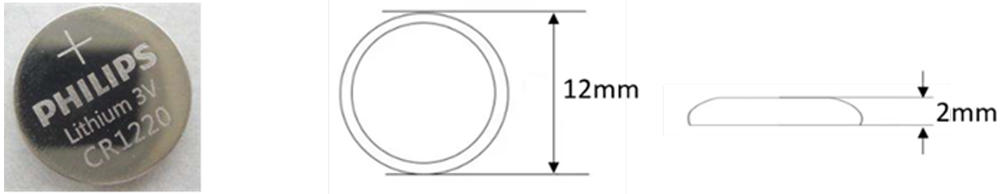

La **RTC** garantit une horloge fiable et ininterrompue, même en cas de coupure de courant.

## 2 Installation de l’Appareil

Ce chapitre explique comment installer l’appareil.

## 2.1 Installation sur Rail DIN

L’appareil **HAI-P200-4G** est livré avec un **support Rail-DIN** préinstallé par défaut.

**Étapes** :

1.  Positionnez le côté du support Rail-DIN face au rail à installer. Glissez la partie supérieure du support sur le bord supérieur du rail.

    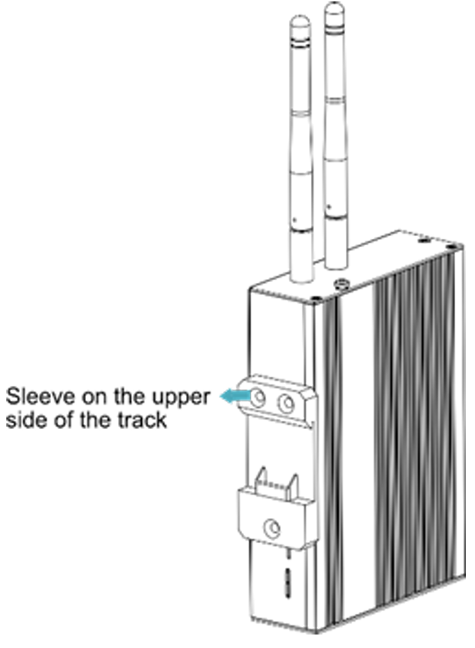

2.  Appuyez sur la **languette de verrouillage** située sur la partie inférieure du support jusqu’à ce qu’elle s’enclenche sur le rail.
    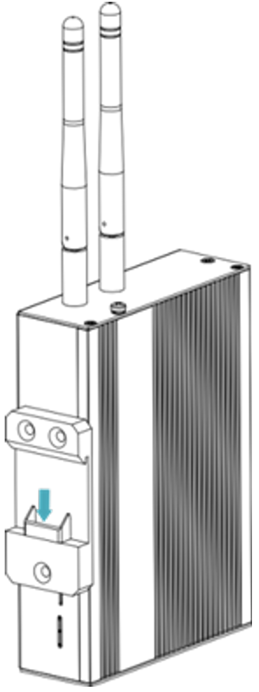

**Remarque** :

- Aucun outil supplémentaire n’est requis pour cette installation.
- La fixation Rail-DIN garantit une stabilité optimale en environnement industriel.

## 4 Démarrage de l’Appareil

## 4.1 Premier Démarrage du Système

L’**HAI-P200-4G** **n’a pas d’interrupteur d’alimentation**. Le système démarre automatiquement après la mise sous tension.

**Indicateurs** :

- **PWR (rouge)** : Allumé = Alimentation normale.
- **ACT (vert)** : Clignote = Démarrage réussi.
