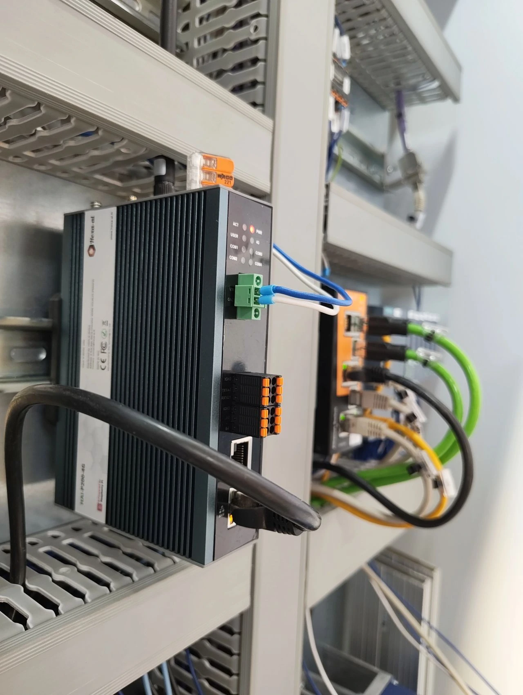

## Cœur & puissance

| | |
| --- | --- |
| Module | Raspberry Pi CM4 quad-core, 4 Go RAM |
| Stockage | eMMC 32 Go soudée, micro-SD industrielle 128 Go en option (bascule automatique de l'historisation) |
| Système | Debian 12 · HAI-OS, interface web d'administration |

## Connectivité

| | |
| --- | --- |
| Réseau filaire | Deux ports Ethernet, configurables séparément, aucun routage entre eux par défaut |
| Ports série | 4 sur bornier — 2× RS232 + 2× RS485 |
| Sans-fil & distant | 4G LTE + Wi-Fi, Tailscale intégré, bascule automatique de lien |

## Robustesse

| | |
| --- | --- |
| Format | Boîtier aluminium, montage rail DIN |
| Alimentation | Bornier industriel, plage large DC |
| Fiabilité | Horloge temps réel, surveillance et relance automatique des services |

## Encombrement

<figure class="narrow">

<figcaption>Photo produit avec la classe <code>narrow</code> : plafonnée à 380 px, elle ne mange pas la page.</figcaption>
</figure>
