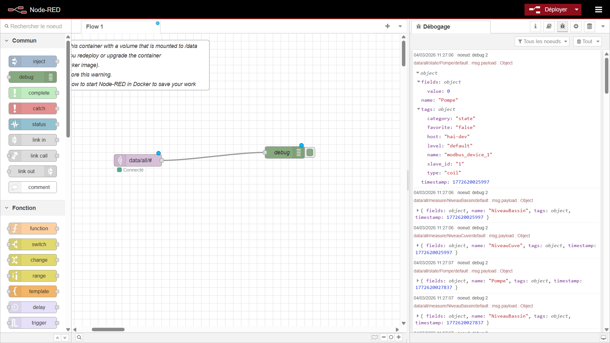

Le courtier (broker) MQTT interne de votre contrôleur HAI-P200-4G ne sert pas uniquement à faire transiter les données de vos équipements. Il agit également comme une véritable **API locale** vous permettant de piloter les fonctions systèmes du boîtier directement depuis vos applications (comme Node-RED, le runtime CODESYS, ou tout autre client MQTT local).

Ce guide recense l'ensemble des "Topics Commande" (sujets) auxquels le système HAI-OS est abonné, ainsi que les formats de messages (Payloads) attendus.

## Prérequis

- Le contrôleur HAI-P200-4G

- HAI-OS

## 1. Contrôle de l'alimentation (Reboot & Shutdown)

Il est possible de déclencher un redémarrage ou un arrêt complet et propre du contrôleur via de simples requêtes MQTT.

- **Redémarrer le système (Reboot)**

    - **Topic** : service/reboot

    - **Payload** : _(Le contenu du message n'a pas d'importance, vous pouvez envoyer "1", "true" ou un texte vide)._

    - **Action** : Le système HAI-OS intercepte le message et lance immédiatement la commande système sudo reboot.

- **Éteindre le système (Shutdown)**

    - **Topic** : service/shutdown

    - **Payload** : _(Contenu ignoré)._

    - **Action** : Le système lance la procédure d'arrêt (sudo shutdown -h now), ce qui coupe les services et fige le système de fichiers avant l'extinction électrique.

## 2. Pilotage de l'historisation (Data-Plug)

Par défaut, le Data-Plug enregistre (historise) les données en continu dans sa base SQLite locale (le mécanisme de Store & Forward). Vous pouvez mettre cet enregistrement en pause de manière programmatique, par exemple pour éviter de remplir la base de données de valeurs aberrantes lors d'une phase de maintenance d'une machine.

- **Mettre en pause l'historisation**

    - **Topic** : service/dataplug/record/stop

    - **Payload** : _(Contenu ignoré)._

    - **Action** : Force un "Commit" (sauvegarde) immédiat des données en mémoire vers le disque, puis suspend l'enregistrement des nouvelles données entrantes. (Le bouton "Historization (On/Off)" de l'interface basculera visuellement sur "Off").

- **Reprendre l'historisation**

    - **Topic** : service/dataplug/record/start

    - **Payload** : _(Contenu ignoré)._

    - **Action** : Réactive l'enregistrement des données en base de données.

:::caution
Cet état est persistant : il survit à un redémarrage du contrôleur. Si vous suspendez l'historisation pour une maintenance, n'oubliez pas de la réactiver — un reboot ne la rétablira pas.
:::

## 3. Communication SMS (Envoi & Réception)

Si votre boîtier HAI-P200-4G est équipé d'une carte SIM valide et que le modem est configuré, vous pouvez utiliser MQTT pour envoyer et recevoir des SMS. C'est particulièrement utile depuis Node-RED pour créer des alertes personnalisées.

### Envoyer un SMS

Pour expédier un message texte vers un téléphone portable :

- **Topic** : service/sms/send

- **Payload attendu (Format JSON strict)** :

    JSON

    ```
    {  "number": "+33612345678",  "message": "Alerte : Niveau cuve bas !"
    ```

    _(Remarque : Assurez-vous d'utiliser le format international pour le numéro de téléphone, par exemple +33 pour la France)_.

### Écouter les SMS entrants

À l'inverse, si quelqu'un envoie un SMS au numéro de la carte SIM du contrôleur, le système va le lire, l'effacer de la mémoire du modem, et le publier sur le broker MQTT.

- **Topic (à écouter)** : service/sms/received

- **Payload généré (Format JSON)** :

    JSON

    ```
    {  "number": "+33612345678",  "message": "Texte du SMS reçu"
    ```

    _(Dans Node-RED, vous pouvez utiliser un nœud mqtt in abonné à ce topic pour déclencher des actions, comme par exemple : si le message contient le mot "STATUS", répondre par un SMS donnant l'état de la machine)_.

## 4. Écouter les données des capteurs (Télémétrie)

Le Data-Plug unifie toutes les données collectées (peu importe le protocole d'origine : Modbus, OPC-UA, S7, BACnet/IP et Internal MQTT (Node-RED)) et les publie en temps réel sur le broker MQTT interne via le moteur Telegraf pour certains protocoles. Cela vous permet d'intercepter n'importe quelle valeur pour créer vos propres logiques de traitement.

**Structure des Topics** Le système organise les données de manière hiérarchique pour vous permettre de filtrer facilement ce que vous souhaitez écouter :

- **Écouter absolument toutes les données** : data/all/#

- **Écouter uniquement les variables favorites** : data/favorites/#

- **Structure détaillée d'un topic** : data/all/<catégorie>/<nom\_de\_la\_variable>/<niveau\_alarme> _(Exemples : data/all/measure/Temperature\_Moteur/default ou data/all/alarm/Defaut\_Pompe/error)_

**Format du message (Payload)** Les données sont publiées au format JSON standardisé. La valeur brute lue sur votre équipement se trouve toujours dans l'objet fields sous la clé value.

Exemple de payload MQTT généré :

JSON

```
{
  "fields": {
    "value": 42.5
  },
  "name": "Temperature_Moteur",
  "tags": {
    "category": "measure",
    "unit": "°C",
    "favorite": "true"
  },
  "timestamp": 1710425000000
}
```

**Intégration dans Node-RED** Dans l'application Node-RED incluse sur le contrôleur, il vous suffit de glisser un nœud mqtt in, de le connecter au broker local (localhost sur le port 1883), et de vous abonner au topic souhaité (ex: data/all/#).

Si vous paramétrez le nœud MQTT pour parser automatiquement le JSON (Output: a parsed JSON object), vous pourrez extraire directement la valeur de votre capteur dans les nœuds suivants en utilisant le chemin : msg.payload.fields.value.



## 5. Surveiller l'état du stockage (Mémoire interne & externe)

Le contrôleur surveille en arrière-plan l'espace disque disponible sur sa mémoire interne ainsi que sur les éventuels supports de stockage externes (comme une carte SD secondaire ou une clé USB). Ces statistiques sont publiées automatiquement toutes les 5 minutes sur le broker MQTT.

**Topic (à écouter) :** service/storage/status

**Payload généré (Format JSON) :**

JSON

```
{
  "internal": {
    "used": 5495607296,
    "total": 30158270464,
    "free": 23380758528,
    "percent": 19.0
  },
  "external": {
    "used": 1073741824,
    "total": 31914983424,
    "free": 30841241600,
    "percent": 3.4
  }
}
```

:::tip
Les tailles used, total et free sont exprimées en octets. La clé "external" renverra null si aucun support de stockage secondaire monté et valide n'est détecté.
:::

## 6. Connaître la position du contrôleur

Le contrôleur estime sa position géographique à partir des informations du réseau mobile et publie le résultat **toutes les heures** sur le broker interne. Le message est **retained** : un client qui se connecte reçoit immédiatement la dernière position connue.

**Topic (à écouter)** : service/location

```
{
  "latitude": 48.8566,
  "longitude": 2.3522,
  "accuracy": 1969,
  "source": "cell",
  "resolved_at": "2026-07-30T14:05:12+0200",
  "provider": "https://..."
}
```

- **accuracy** : précision estimée, en **mètres**. Peut être null.
- **source** : cell lorsque la cellule du réseau a été résolue précisément, cell-neighbours lorsque la position est le barycentre de plusieurs cellules voisines — donc moins précise.
- **resolved\_at** : date et heure de la résolution, dans le fuseau local du contrôleur.
- **provider** : le service de géolocalisation interrogé.

:::caution
Cette position est déduite du réseau mobile, pas d'un GPS : comptez une précision de l'ordre de la centaine de mètres à plusieurs kilomètres selon la densité du réseau. Elle sert à localiser une installation, pas à suivre un véhicule.
:::

Si la fonction de géolocalisation est désactivée, le contrôleur efface le message retained et ne publie plus rien.
