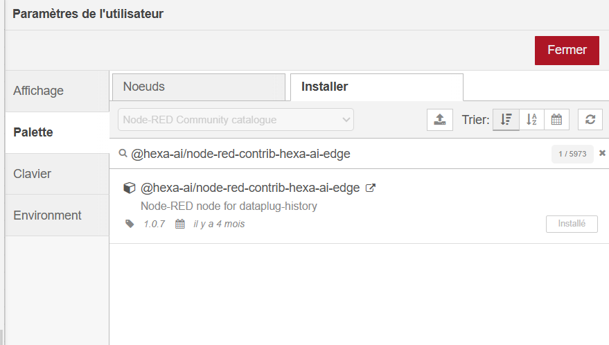
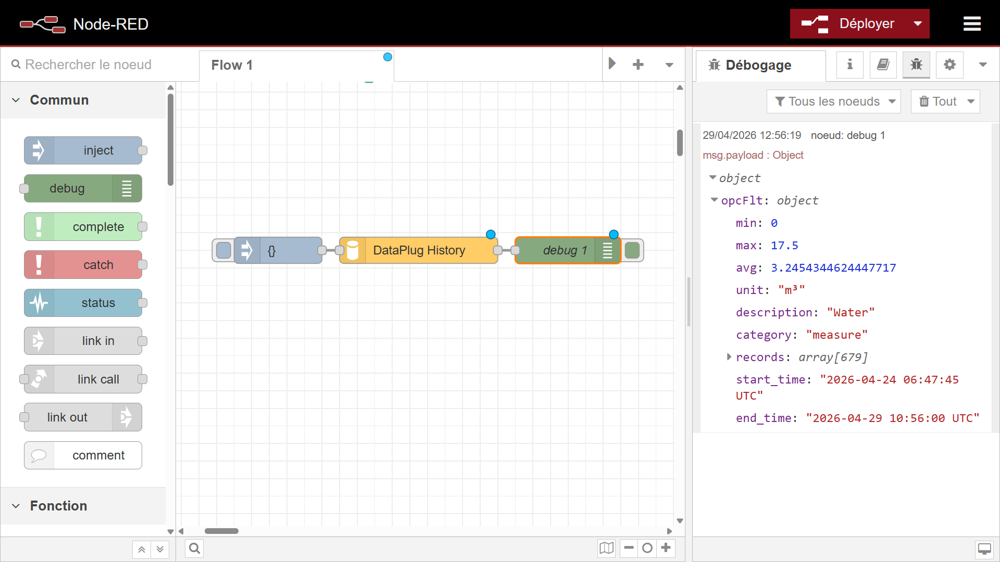

Si vous utilisez **Node-RED** (l'outil de programmation visuelle intégré à votre contrôleur) pour créer des automatismes, vous pourriez avoir besoin de consulter des données enregistrées dans le passé.

Par défaut, Node-RED ne voit que les données "en temps réel". Ce module officiel Hexa-AI rajoute un nouveau composant (un _nœud_) dans Node-RED, appelé **DataPlug History**, qui permet d'aller interroger directement la base de données historique du contrôleur et d'en extraire des statistiques toutes prêtes (moyennes, minimum, maximum, etc.).

## Prérequis

- Le contrôleur **HAI-P200-4G** avec HAI-OS.

- L'application **Node-RED** activée (depuis la page _Add-ons_ du contrôleur).

- L'enregistrement des données activé dans le Data-Plug (Historization ON).

## Installation du module

Pour ajouter ce module à votre environnement Node-RED, c'est très simple :

1.  Ouvrez l'interface de **Node-RED** (depuis le menu _Add-__ons_ ou en tapant https://<ip-du-controleur>/nodered dans votre navigateur).

2.  Cliquez sur le **Menu principal** (les trois barres horizontales en haut à droite).

3.  Cliquez sur **Manage palette** (Gérer la palette).

4.  Allez dans l'onglet **Install** (Installer).

5.  Dans la barre de recherche, tapez : @hexa-ai/node-red-contrib-hexa-ai-edge

6.  Cliquez sur le bouton **Install** à côté du résultat.

:::tip
**Ce que devient le module ensuite.** Il est enregistré dans les données de l'add-on Node-RED : changer la version de Node-RED depuis sa carte le conserve, vos flux et vos modules sont retrouvés au redémarrage. En revanche, désinstaller l'add-on **en cochant la suppression des données** efface le module comme le reste — il faudra le réinstaller.
:::



:::tip
**Astuce :** Une fois installé, vous verrez apparaître un nouveau nœud jaune nommé DataPlug History (avec une petite icône de base de données) dans le panneau de gauche de Node-RED, sous la catégorie _Analysis_.
:::

## À quoi sert le nœud DataPlug History ?

Ce nœud va chercher les données dans les archives du contrôleur de façon intelligente :

- **Transparence des partitions :** Les données étant classées par mois dans la mémoire, le nœud cherche tout seul dans les bons "tiroirs" selon la date demandée.

- **Enrichissement automatique :** Il ne ramène pas juste des chiffres bruts. Il rattache automatiquement les métadonnées (unités de mesure, description, catégorie) depuis la configuration de votre Data-Plug.

- **Calculs intégrés :** Vous pouvez lui demander de calculer directement des moyennes par heure, des minimums par minute, ou des différences (très utile pour des compteurs d'énergie !).

## Configurer le nœud

Faites glisser le nœud DataPlug History dans votre espace de travail et double-cliquez dessus pour le configurer. Voici les réglages disponibles :

- **Name (Nom)** : Pour donner un nom clair à votre nœud sur le schéma.

- **Channels (Canaux)** : Le ou les noms exacts des variables que vous voulez interroger (ex: Temperature\_Cuve). Pour en demander plusieurs, séparez-les par des virgules.

- **Time Range (Période)** : la fenêtre à analyser — Last 15 minutes, Last hour, Last 6 hours, Last 12 hours, Last 24 hours, Last 2 days, Last 7 days, Last 30 days. La première entrée de la liste, **Use input message (msg.payload.from/to)**, laisse le flux décider (voir _Entrée dynamique_).
- **Aggregation (Calcul)** : l'opération appliquée à l'intérieur de chaque intervalle — Average, Minimum, Maximum, ou Difference (Counters). Ce réglage **n'a d'effet que si Interval vaut Per Minute, Per Hour ou Per Day**. Il est ignoré pour None (Raw Data) et Last Value Only. Difference (Counters) calcule l'écart entre la plus grande et la plus petite valeur de l'intervalle. C'est exactement la consommation d'un compteur qui ne fait que monter ; si le compteur est remis à zéro ou repasse à 0 en cours d'intervalle, le résultat est l'amplitude, pas la consommation.
- **Interval (Intervalle)** : le pas de regroupement — Per Minute, Per Hour, Per Day. Les groupes sont découpés en **UTC** : une journée va de 00:00 à 24:00 UTC, ce qui décale d'une ou deux heures par rapport à l'heure locale. L'horodatage renvoyé pour un groupe est celui de son premier point. Choisissez None (Raw Data) pour obtenir tous les points enregistrés, sans regroupement, ou Last Value Only pour la seule dernière valeur connue de chaque variable dans la période.
- **Category** : restreint la recherche à un type de variable — Measure, State, Counter ou Alarm. Combinée au champ _Channels_, elle agit comme un **filtre** : une variable listée dans _Channels_ mais qui n'appartient pas à la catégorie choisie ne remonte pas. Laissée sur None, seul _Channels_ compte. À l'inverse, _Category_ seule, _Channels_ vide, interroge toutes les variables de cette catégorie. Si les deux sont vides, le nœud n'émet aucun message et signale « Aucun channel ou catégorie spécifié ».

## Entrées et Sorties

Le nœud s'active dès qu'il reçoit un message (un "tic") sur son entrée, et recrache le résultat sur sa sortie.

### Entrée dynamique (Optionnel)

Si vous souhaitez que Node-RED décide lui-même de la période à interroger (plutôt que d'utiliser la configuration fixe du nœud), vous pouvez lui envoyer un objet msg.payload structuré ainsi :

- msg.payload.channels : Un tableau avec les noms des variables (ex: \["Temp1", "Pression2"\]).

- msg.payload.from : La date de début (en millisecondes depuis 1970 - _timestamp_).

- msg.payload.to : La date de fin (en millisecondes).

:::tip
**Deux précisions :**

- Envoyer msg.payload.from et msg.payload.to l'emporte sur la période configurée, quelle qu'elle soit — il n'est pas obligatoire de choisir « Use input message ». En revanche, choisir « Use input message » sans fournir les deux dates fait retomber le nœud sur **la dernière heure**, sans avertissement.
- Le champ _Channels_ et msg.payload.channels s'additionnent : les variables des deux sources sont interrogées. Pour piloter entièrement la liste depuis le flux, laissez le champ _Channels_ vide.
:::

### Comment lire min, max et avg

Ces trois valeurs sont calculées sur les points que le nœud renvoie, c'est-à-dire **après agrégation**. Avec Interval = Per Hour et Aggregation = Average, min est la plus petite des moyennes horaires, et avg la moyenne de ces moyennes — pas le minimum ni la moyenne de la donnée brute.

Pour obtenir les vrais extrêmes de la période, réglez Interval sur None (Raw Data) : le nœud parcourt alors tous les points enregistrés, et min / max sont ceux de la mesure elle-même.

### Structure de la Sortie

Une fois la recherche terminée en base de données, le nœud sort un message. Le msg.payload contiendra un objet JavaScript où chaque variable demandée possède son propre résumé :

JSON

```
{
  "Temperature_Cuve": {
    "min": 15.2,
    "max": 24.8,
    "avg": 19.5,
    "unit": "°C",
    "description": "Température principale de la cuve de brassage",
    "category": "measure",
    "start_time": "2026-04-27 08:00:00 UTC",
    "end_time": "2026-04-28 08:00:00 UTC",
    "records": [
      { "ts": 1745678000000, "value": 15.2 },
      { "ts": 1745681600000, "value": 16.1 }
      // ... suite des points générés selon l'intervalle choisi
    ]
  }
}
```

Le nœud émet toujours un message, même sans résultat : msg.payload vaut alors un objet vide {}. Prévoyez ce cas dans votre flux plutôt que d'attendre une erreur.

Seules les valeurs **numériques** sont remontées : une variable de type texte apparaît sans valeur exploitable.

Vous pouvez ensuite utiliser facilement ce résultat dans le reste de votre flux Node-RED (pour l'afficher dans un dashboard, l'envoyer sur un autre système, déclencher une alerte, etc.).



## Le passage de Node-RED en non-root

La 1.3.8 fait tourner Node-RED en utilisateur ordinaire, ce qui casse deux usages : un flux ne peut plus **écouter** sur un port inférieur à 1024 (un serveur Modbus/TCP sur 502 doit passer en 1502. Interroger un équipement sur le port 502 n'est pas concerné), et les nœuds exec ne sont plus administrateur.
