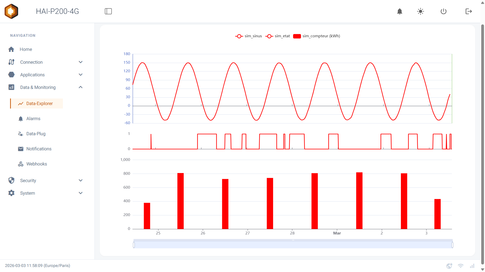
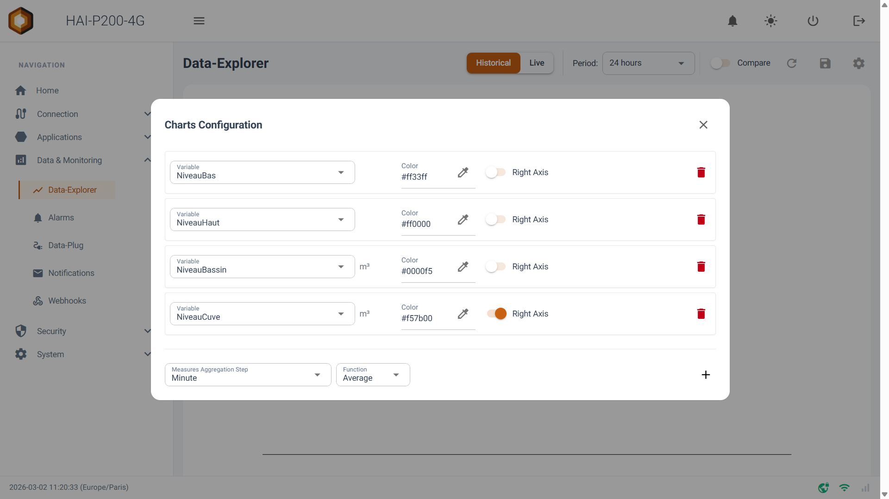
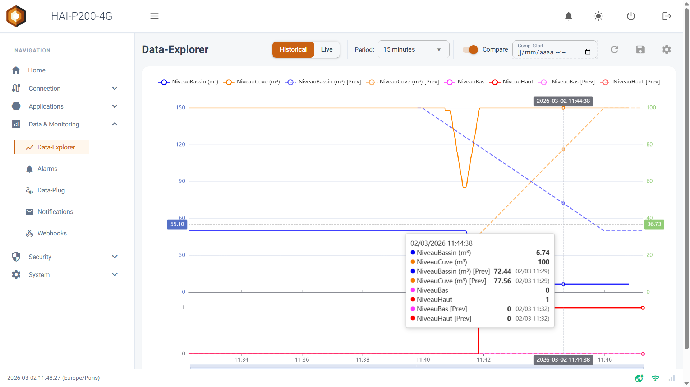
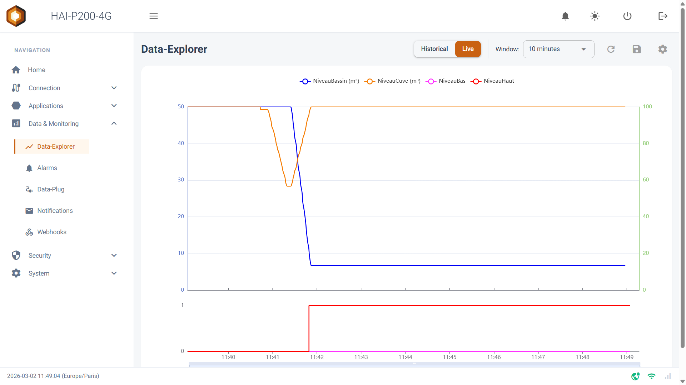
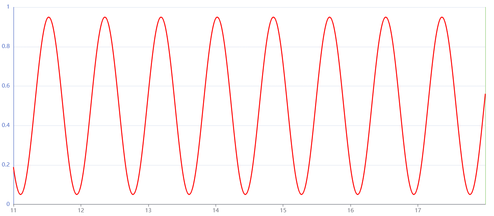
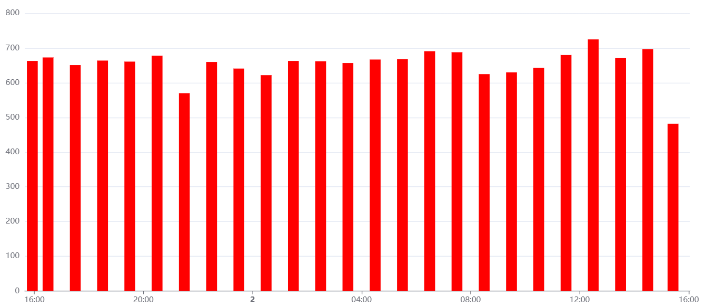
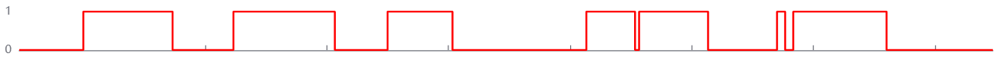
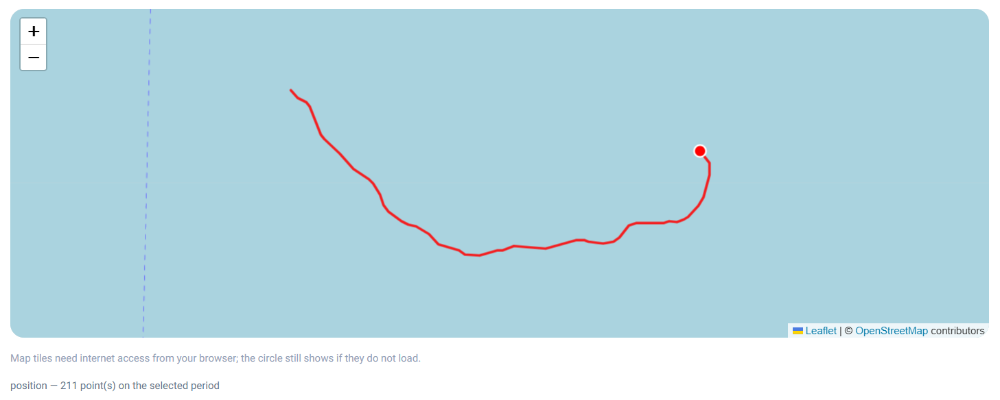
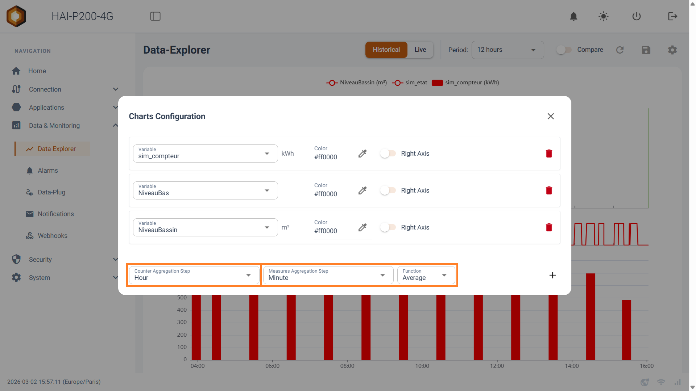

Bienvenue dans ce guide de prise en main du **Data-Explorer**, l'outil de visualisation de données natif de votre contrôleur HAI-P200-4G. Ce tutoriel vous montrera comment explorer, analyser et comparer les données collectées par votre Data-Plug au travers de graphiques interactifs et personnalisables.

## Prérequis

- Le contrôleur HAI-P200-4G

- HAI-OS

- Des variables préalablement configurées et collectées via le **Data-Plug**

## Qu'est-ce que le Data-Explorer ?

Le Data-Explorer est l'interface d'analyse de données intégrée à HAI-OS. Il se connecte directement à la base de données locale du Data-Plug (SQLite) et au broker MQTT interne pour vous offrir une visualisation fluide de vos équipements industriels.

Ses atouts principaux :

- **Double temporalité :** Visualisez vos archives (Mode Historique) ou surveillez vos machines en temps réel (Mode Live).

- **Affichage contextuel :** Le Data-Explorer adapte automatiquement le type de graphique (courbe, barres, escalier) en fonction de la catégorie de la variable définie dans le Data-Plug (Mesure, Compteur, État, Alarme).

- **Comparaison facile :** Superposez vos données actuelles avec celles de la période précédente en un clic.

- **Analyse par lot** : ouvrez le graphique directement calé sur la durée exacte d'un lot de production depuis la page Batches.

- **Traces GPS** : les variables de position collectées en NMEA 0183 s'affichent sur une carte, en historique comme en direct, synchronisée avec les courbes.

## Configuration des graphiques (Séries)

Pour commencer à visualiser vos données, vous devez définir quelles variables afficher. Cliquez sur l'icône en forme d'engrenage (**Settings**) en haut à droite de l'interface pour ouvrir le panneau **Charts Configuration**.

1.  Cliquez sur le bouton **Add** pour ajouter une nouvelle série de données.

2.  **Variable** : Sélectionnez dans le menu déroulant la variable que vous souhaitez tracer. L'unité s'affichera automatiquement à côté.

3.  **Color (Couleur)** : Cliquez sur la pastille de couleur pour attribuer une teinte spécifique à cette courbe sur le graphique.

4.  **Right Axis (Axe de droite)** : Si vous tracez des variables avec des échelles très différentes (ex: une température de 20°C et une pression de 1500 mbar), activez cet interrupteur. La courbe utilisera alors l'échelle graduée sur la droite de l'écran pour rester lisible.

5.  Cliquez sur l'icône de la disquette (💾 **Save**) sur la page principale pour mémoriser votre tableau de bord.

## Modes d'analyse : Historique & Temps Réel (Live)

Le Data-Explorer propose deux modes de fonctionnement, accessibles via le sélecteur principal en haut de la page : **Historical** et **Live**.

### 1. Le mode Historical (Historique)

Ce mode interroge la base de données du Data-Plug pour afficher les données passées.

- **Period (Période)** : Choisissez une fenêtre de temps prédéfinie (de 10 minutes à 6 mois). Le graphique s'ajustera automatiquement.

- **Custom (Personnalisé)** : En sélectionnant _Custom_ dans la liste des périodes, deux champs de calendrier apparaissent pour définir une date de début et de fin exactes.

- **Compare (Comparaison)** : Activez ce switch pour superposer la période actuelle avec la période précédente équivalente (tracée en pointillés). _Exemple : Si vous regardez les 24 dernières heures, le mode Compare affichera en surimpression les 24 heures d'avant._ Vous pouvez aussi définir une date de comparaison manuelle.

#### 2. Le mode Live (Temps Réel)

Ce mode se connecte directement au broker MQTT pour vous offrir un rafraîchissement ultra-rapide et continu des valeurs de vos capteurs.

- **Window (Fenêtre)** : Définissez la durée glissante affichée à l'écran (ex: la dernière minute, les 10 dernières minutes). Le graphique défilera tout seul au rythme des nouvelles mesures.

## L'affichage intelligent selon les Catégories

Le comportement visuel du Data-Explorer dépend directement de la **Category** que vous avez attribuée à votre variable lors de sa création dans le Data-Plug. Le système sépare intelligemment l'espace de dessin pour ne pas mélanger les types de graphiques :

- **Catégorie Measure (Mesure)** : Affichée sous forme de courbe classique lissée (Line chart).

- 

- **Catégorie Counter (Compteur)** : Affichée sous forme d'histogrammes (Bar chart) représentant la consommation sur l'intervalle donné en mode Historique. (Note : en mode Live, le compteur s'affiche sous forme de courbe de progression en temps réel).

- 

- **Catégories State et Alarm (État / Alarme)** : Affichées sous forme de graphique en "escalier" (Step chart), idéal pour voir les basculements d'états d'une machine.

- 

- **Catégorie Position** : affichée non pas dans le graphique mais sur une carte, sous forme de trace reliant les points enregistrés. Voir la section _**Suivre une position sur une carte**_. 
- 

## Suivre une position sur une carte

Une variable de catégorie **Position** — déclarée dans le Data-Plug sur une trame de navigation NMEA 0183 — ne porte pas une valeur numérique mais un point GPS. Le Data-Explorer l'affiche donc sur une carte, dans un panneau qui apparaît sous le graphique dès qu'une série de ce type est sélectionnée. Vous la sélectionnez comme n'importe quelle autre variable, dans le panneau **Charts Configuration**, et la couleur choisie devient celle de la trace.

**Ce que montre la carte**

Le trajet parcouru sur la période affichée, dans la couleur de la série. Une légende sous la carte rappelle le nom de la variable et le nombre de points tracés — ou vous signale qu'aucune position n'a été enregistrée sur la période. Plusieurs traces peuvent cohabiter : chacune garde sa couleur.

**Survol synchronisé**

En passant la souris sur le graphique, un marqueur se déplace sur la carte à l'endroit où se trouvait l'équipement à cet instant, et l'infobulle affiche la latitude et la longitude correspondantes. Le lien fonctionne dans les deux sens : en survolant la trace sur la carte, le graphique se positionne sur l'instant correspondant. Si aucune position n'a été enregistrée à cet instant précis, rien n'est affiché plutôt qu'un point approximatif.

**Historique et direct**

En mode Historical, la trace couvre la période sélectionnée, et les points sont espacés selon le pas d'agrégation des mesures (voir _Agrégation des données_) : une période longue donne une trace allégée, sans changer le trajet. En mode Live, la carte se complète au fil des positions reçues, point par point, sans agrégation.

**Graphique et carte**

Les deux coexistent : les variables numériques restent dans le graphique, les positions vont sur la carte. Si votre sélection ne contient que des positions, le graphique disparaît et seule la carte s'affiche.

**Export**

Les variables de position sont incluses dans l'export CSV comme les autres, sous forme de couple latitude/longitude.

## Agrégation des données

Lorsque vous affichez de longues périodes en mode _Historique_, le Data-Explorer agrège automatiquement les données pour garantir la rapidité d'affichage et la clarté du graphique.

Dans le panneau de configuration (⚙️), vous trouverez la section d'agrégation :

- **Measures Aggregation Step** : Définit le pas de regroupement pour les mesures (ex: Moyenne par Minute, par Heure, par Jour). Le système l'ajuste automatiquement selon la période choisie, mais vous pouvez le forcer. Ce pas commande également l'espacement des points de la carte lorsque des positions sont affichées.

- **Function** : Choisissez comment les mesures sont résumées dans ce pas de temps (Average pour la moyenne, Min, ou Max). Ce champ ne s'applique pas aux positions — une moyenne de coordonnées n'aurait pas de sens, chaque point tracé est un point réellement mesuré. Il disparaît donc si votre sélection ne contient que des positions.

- **Counter Aggregation Step** : Définit le pas de calcul pour les consommations de vos compteurs (ex: consommation par Heure, par Jour).

## L'Export de données (CSV)

**Export CSV (Téléchargement des données)** Le Data-Explorer vous permet de télécharger les données brutes sur la période affichée sous forme de fichier tableur.

- **Comment faire :** Cliquez sur le bouton avec l'icône de téléchargement (📥) situé en haut à droite de l'interface.

- **Ce qui est exporté :** L'export génère un fichier CSV contenant uniquement les données des **variables sélectionnées** et correspondant à la **période de temps actuellement affichée** à l'écran.

## Analyser un lot de production

Depuis la page **Batches**, vous pouvez ouvrir le Data-Explorer directement calé sur la durée exacte d'un lot. Le graphique s'affiche alors avec un bandeau **Time range locked on batch** : la période est verrouillée et les sélecteurs de temps ainsi que la comparaison sont désactivés, pour garantir que vous analysez bien la fenêtre du lot. Un bouton permet de déverrouiller la plage pour reprendre une exploration libre, ou de revenir à la liste des lots.

## Mode Invité (Guest Access)

Le Data-Explorer fait partie des pages exposables en libre accès : vos opérateurs peuvent consulter les données, tracer leurs courbes et les exporter en CSV sans mot de passe, et sans pouvoir modifier la configuration du contrôleur. La seule restriction propre à cette page est l'impossibilité d'enregistrer une configuration de graphiques — le bouton de sauvegarde n'apparaît pas pour un invité.

Pour l'activer, consultez la documentation 👀 Accès Invité (Guest Access)
