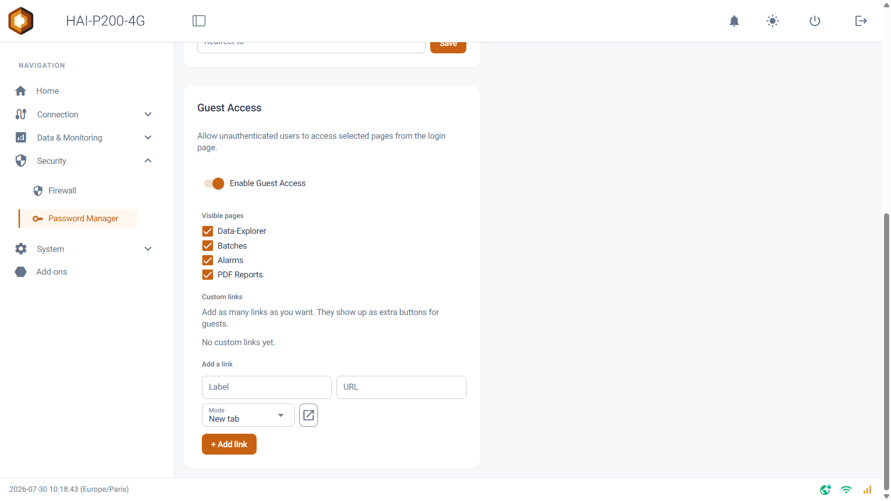
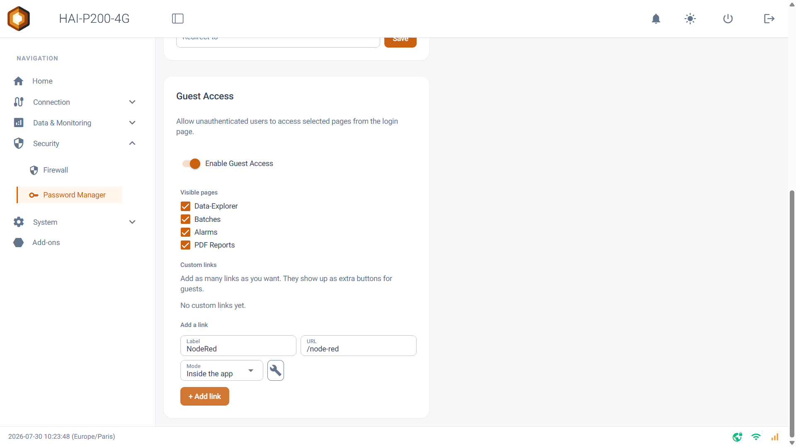
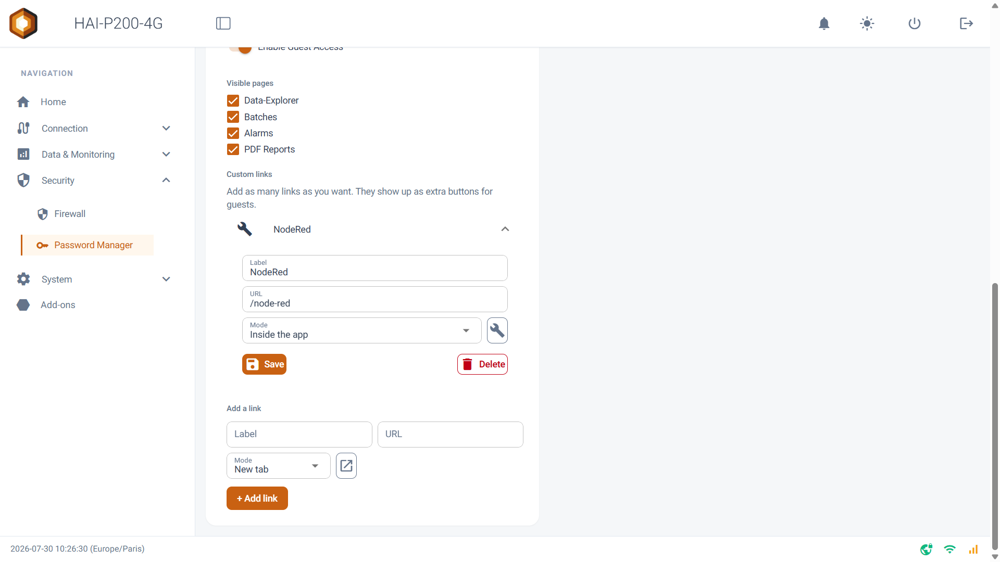
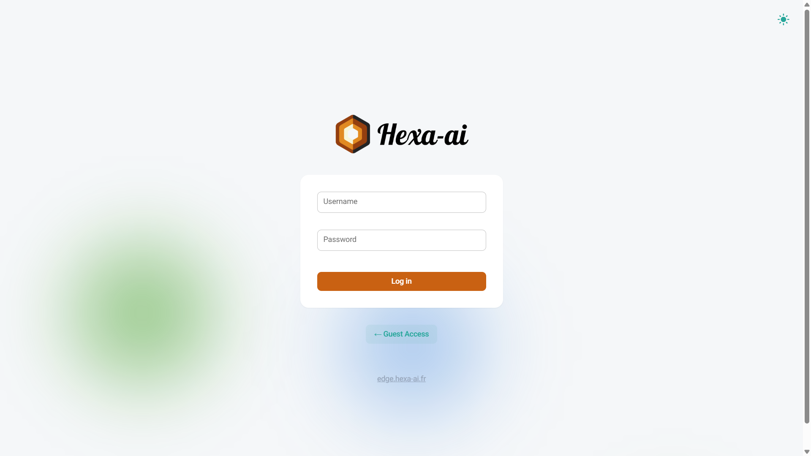
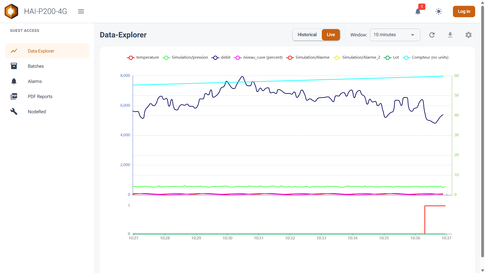

L'Accès Invité permet d'ouvrir une partie de l'interface du contrôleur à des utilisateurs non authentifiés. Vos opérateurs, techniciens de maintenance ou visiteurs peuvent ainsi consulter les données, les alarmes et les rapports sans mot de passe, et sans aucun risque de modifier la configuration du contrôleur.

## Prérequis

- Le contrôleur HAI-P200-4G
- HAI-OS
- Un accès administrateur (utilisateur admin) pour activer et configurer le mode

## Principe de fonctionnement

Par défaut, toutes les pages du contrôleur exigent une authentification. Lorsque l'Accès Invité est activé, une liste blanche de pages devient accessible sans identifiants. Toute tentative d'accès à une page hors de cette liste blanche est automatiquement redirigée vers la première page autorisée : un invité ne peut donc jamais atteindre les pages de configuration, même en saisissant l'URL directement dans son navigateur.

## Activation de l'Accès Invité

Rendez-vous dans le menu **Security > Password Manager**. La section **Guest Access** se trouve en bas de la page.

Activez l'interrupteur **Enable Guest Access**. Les options de configuration détaillées (pages visibles et liens personnalisés) n'apparaissent que lorsque cet interrupteur est actif.

## Choix des pages visibles

Sous le titre **Visible pages**, cochez les pages que vous souhaitez exposer aux invités. Quatre pages sont disponibles, toutes activées par défaut :

- **Data-Explorer** : consultation et tracé des données historisées
- **Batches** : suivi des lots de production
- **Alarms** : suivi des alarmes en temps réel et historique
- **PDF Reports** : consultation et téléchargement des rapports générés

Vous pouvez n'en activer qu'une seule. Par exemple, en ne cochant que **Alarms**, l'invité n'aura accès qu'à la supervision des alarmes.

**Astuce** : chaque case est enregistrée immédiatement, il n'y a pas de bouton de sauvegarde à cliquer pour cette liste.

## Ajout de liens personnalisés

La section **Custom links** vous permet d'ajouter au menu Invité autant de liens que vous le souhaitez, vers n'importe quelle adresse : la supervision d'un automate, un tableau de bord tiers, une documentation interne, une caméra IP…

Pour créer un lien, renseignez la ligne **Add a link** :

- **Label** : le nom affiché dans le menu Invité _(obligatoire)_
- **URL** : l'adresse cible, par exemple https://... _(obligatoire)_
- **Mode** : détermine comment le lien s'ouvre

    - **New tab** : ouvre l'adresse dans un nouvel onglet du navigateur
    - **Inside the app** : affiche la page cible intégrée directement dans l'interface du contrôleur, en conservant l'en-tête et le menu Invité autour
- **Icône** : cliquez sur le bouton d'icône pour choisir le pictogramme affiché dans le menu

Cliquez ensuite sur **\+ Add link**.

Les liens déjà créés apparaissent au-dessus sous forme de volets dépliables. Cliquez sur un volet pour modifier son libellé, son URL, son mode ou son icône, puis validez avec **Save** — ou supprimez-le avec **Delete**.

**À savoir sur le mode « Inside the app »** : certains sites web refusent techniquement d'être affichés à l'intérieur d'une autre page. Si votre lien intégré reste vide, basculez-le en mode **New tab**.

## Se connecter en tant qu'invité

Une fois l'Accès Invité activé, un bouton **← Guest Access** apparaît sur la page de connexion, sous le formulaire d'identification. Ce bouton est invisible tant que la fonction est désactivée.

En cliquant dessus, l'utilisateur accède directement à la première page autorisée, sans saisir de mot de passe.

## L'interface Invité

L'invité arrive sur une interface épurée, distincte de l'interface administrateur :

- Un **en-tête** portant le nom du contrôleur, avec un bouton de menu, une **cloche d'alarmes** affichant en badge rouge le nombre d'alarmes actives (rafraîchi automatiquement), un bouton de bascule **mode sombre / mode clair**, et un bouton **Log in** permettant à tout moment de revenir à la page de connexion administrateur.
- Un **menu latéral** intitulé **Guest Access**, listant uniquement les pages que vous avez cochées, suivies de vos liens personnalisés.

Aucun menu de configuration, aucune section d'administration n'est accessible depuis cette interface.

## Ce qu'un invité peut et ne peut pas faire

Les pages exposées restent pleinement fonctionnelles en consultation :

- Sur la page **Alarms** : les modes Live et Historical, les filtres, la sélection de période et l'**Analyse de Cause Racine (RCA)** sont tous disponibles.
- Sur le **Data-Explorer** : le tracé des courbes, les réglages d'affichage et l'export CSV restent accessibles, mais l'invité **ne peut pas enregistrer de configuration**.
- Sur **PDF Reports** : la consultation et le téléchargement des rapports sont possibles, mais l'invité **ne peut pas supprimer** de rapport.

**Important** : l'Accès Invité protège la configuration du contrôleur, mais il n'authentifie personne. Toute personne ayant accès au réseau du contrôleur pourra consulter ces pages et exporter ces données. Il n'y a pas d'expiration automatique de session invité. N'activez cette fonction que sur un réseau de confiance.
