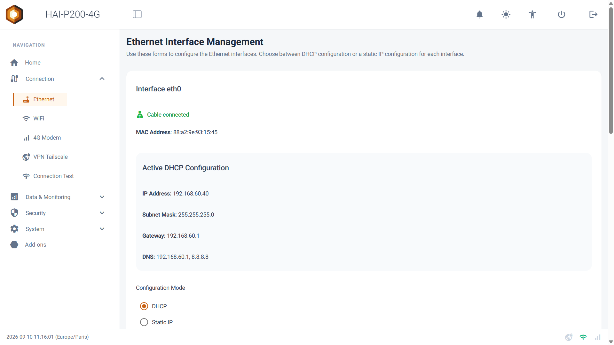
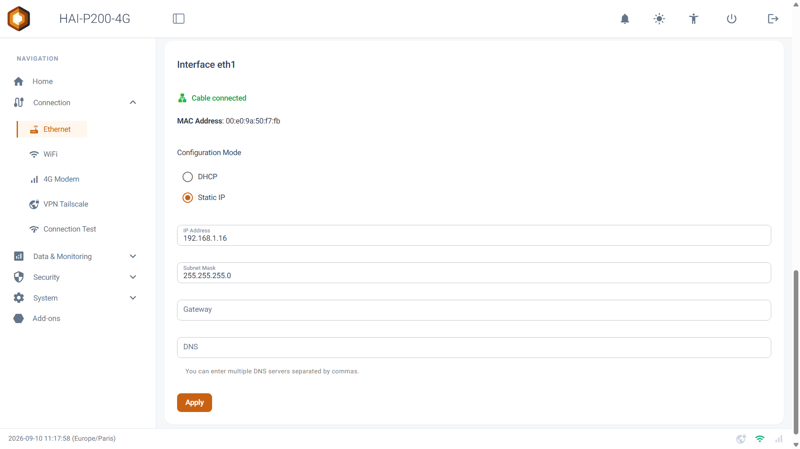
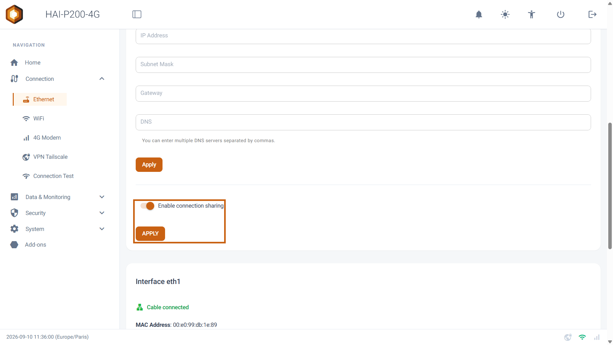
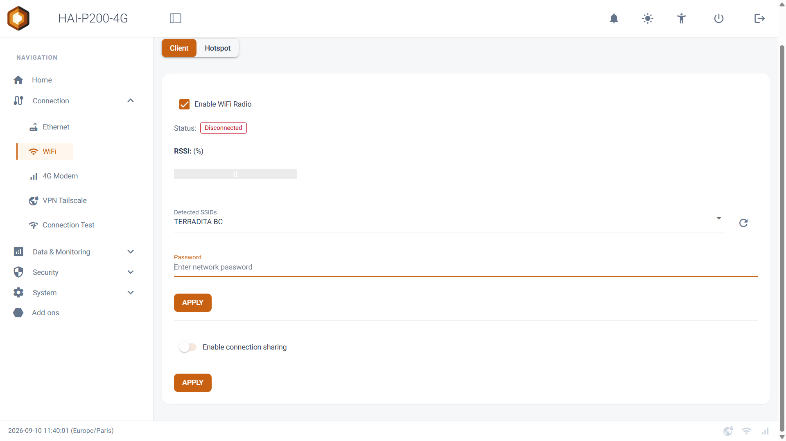
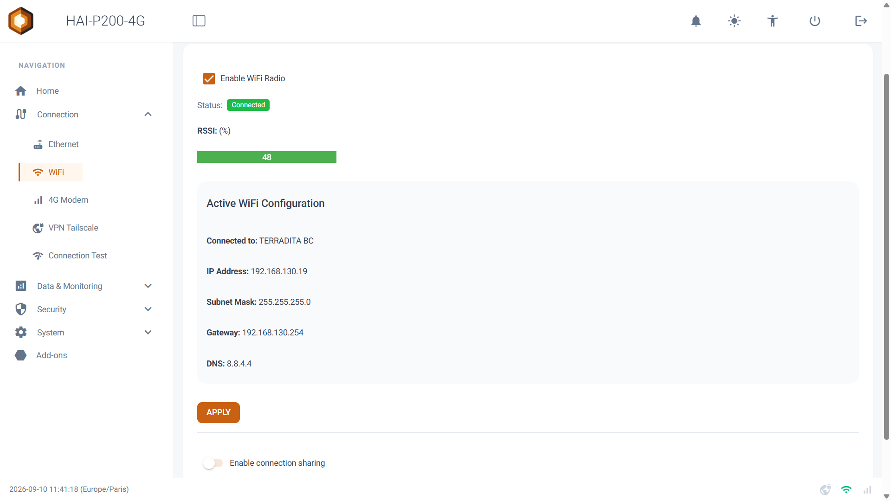
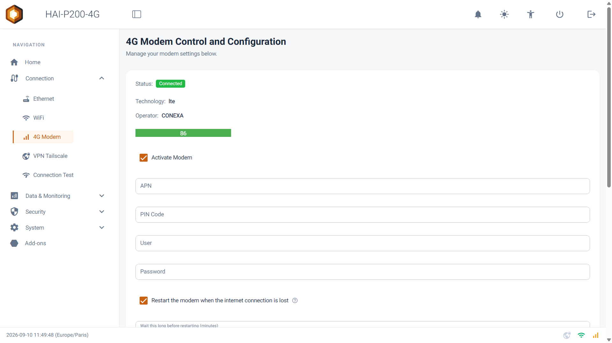
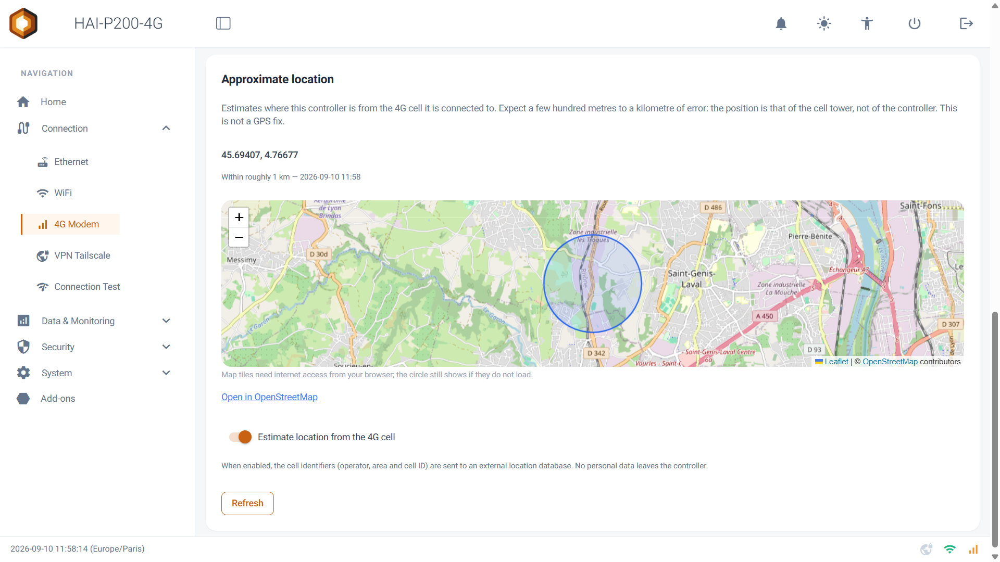
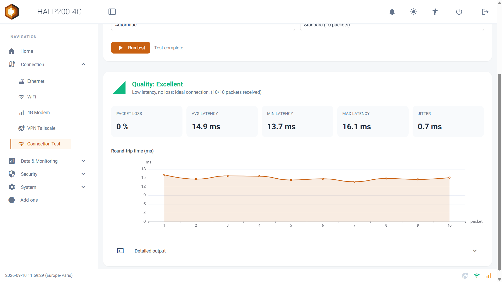

Bienvenue dans ce guide des connexions réseau. Le contrôleur HAI-P200-4G dispose de **deux ports Ethernet**, d'une **radio Wi-Fi** et d'un **modem 4G**. Ce guide explique comment configurer chacune de ces liaisons, comment le contrôleur choisit celle qui porte Internet, et comment partager cette connexion avec vos équipements.

Tout se passe dans le menu **Connection** de l'interface, qui regroupe les pages **Ethernet**, **WiFi**, **4G Modem**, **VPN Tailscale** et **Connection Test**.

## Prérequis

- Le contrôleur HAI-P200-4G sous tension
- HAI-OS, accessible depuis un navigateur (voir [Première connexion](/getting-started/first-connection/))
- Pour la 4G : une carte SIM avec un forfait données, et les paramètres de votre opérateur (APN, éventuellement code PIN)

## Vue d'ensemble

| Liaison | Nom dans l'interface | Rôle | Configuration d'usine |
|---------|----------------------|------|-----------------------|
| Ethernet, port du haut | **eth0** | Réseau de l'entreprise, sortie Internet filaire | DHCP |
| Ethernet, port du bas | **eth1** | Réseau local machine : automate, PC de maintenance | IP fixe **192.168.1.16**, masque 255.255.255.0 |
| Wi-Fi | **wlan0** | Client d'un réseau Wi-Fi existant, ou point d'accès | Mode Client, aucun réseau mémorisé |
| 4G | **wwan0** | Internet mobile, de secours ou principal | Désactivé |

:::tip
Les deux ports Ethernet sont indépendants : aucun trafic ne passe de l'un à l'autre tant que vous n'activez pas le **partage de connexion** décrit plus bas. Un automate branché sur eth1 reste donc isolé du réseau de l'entreprise.
:::

### Comment le contrôleur choisit sa sortie Internet

Plusieurs liaisons peuvent être actives en même temps. Le contrôleur vérifie **toutes les 15 secondes** laquelle donne réellement accès à Internet, en envoyant un ping à travers chaque liaison, dans cet ordre de préférence :

1. Ethernet **eth0**
2. Ethernet **eth1**
3. Wi-Fi **wlan0**
4. 4G **wwan0**

La **première liaison qui répond** porte le trafic Internet du contrôleur. Concrètement :

- Un câble branché sur un réseau **sans Internet** (le réseau d'un automate, par exemple) n'est jamais choisi, même s'il est « connecté ».
- La **4G n'est utilisée que si rien d'autre ne répond**. Tant qu'une liaison filaire ou Wi-Fi fonctionne, elle n'est même pas testée : ce mécanisme ne consomme pas de données mobiles.
- Un **câble débranché** est détecté en une seconde environ et la bascule est immédiate.
- Quand une liaison prioritaire **revient**, le contrôleur attend deux vérifications réussies d'affilée avant d'y rebasculer, pour éviter les allers-retours sur un câble défaillant.
- Une liaison qui ne répond plus est abandonnée après **trois échecs consécutifs**, soit environ 45 secondes.

Les réseaux locaux restent toujours joignables : un port raccordé à un automate continue de communiquer avec lui, qu'il porte ou non la sortie Internet.

:::note
L'ordre de préférence n'est pas modifiable depuis l'interface. La première évaluation a lieu environ 25 secondes après le démarrage.
:::

### Les icônes du pied de page

En bas de chaque page, trois icônes résument l'état des liaisons, rafraîchies toutes les 10 secondes :

- **Wi-Fi** : verte lorsque le contrôleur est connecté à un réseau Wi-Fi. Elle prend la forme d'une antenne de partage lorsque le point d'accès est actif.
- **4G** : orange lorsque la connexion mobile est établie.
- **VPN** : verte lorsque Tailscale est connecté.

## Ethernet

Rendez-vous dans **Connection > Ethernet**. La page présente une carte par port : **Interface eth0** et **Interface eth1**.

### Lire l'état d'un port

En tête de chaque carte :

- **Cable connected** (vert) ou **No cable connected** (rouge) indique la présence physique d'un câble, rafraîchie toutes les 3 secondes. **Status unknown** signifie que le port n'est pas vu par le système.
- Le badge **Internet output** apparaît sur le port qui porte **actuellement** la sortie Internet du contrôleur.
- **MAC Address** : l'adresse matérielle du port, utile pour une réservation DHCP sur votre réseau.
- En mode DHCP, le bloc **Active DHCP Configuration** affiche l'adresse effectivement obtenue : **IP Address**, **Subnet Mask**, **Gateway**, **DNS**.

:::tip
Un câble connecté ne signifie pas qu'Internet passe par ce port : c'est le badge **Internet output** qui le dit. Sur un port raccordé à un automate, l'absence de ce badge est normale.
:::

### Configurer un port en DHCP

1. Dans **Configuration Mode**, choisissez **DHCP**. Les champs d'adresse se grisent.
2. Cliquez sur **Apply**.

Le port redémarre et demande une adresse au réseau. La notification **Configuration applied for eth0.** confirme l'opération, et le bloc **Active DHCP Configuration** se met à jour.

### Configurer un port en IP fixe

1. Dans **Configuration Mode**, choisissez **Static IP**.
2. Renseignez **IP Address**, **Subnet Mask**, **Gateway** et **DNS**. Plusieurs serveurs DNS peuvent être saisis, séparés par des virgules. La passerelle et les DNS sont facultatifs.
3. Cliquez sur **Apply**.

La modification est appliquée immédiatement, sans redémarrage du contrôleur. Si les valeurs sont refusées, la notification **Failed to apply configuration for eth0.** s'affiche : vérifiez le format des adresses.

:::caution
Si vous modifiez l'adresse du port **par lequel vous êtes connecté**, la page ne répondra plus : le port redémarre avec sa nouvelle adresse. Reconnectez-vous sur cette nouvelle adresse, après avoir adapté si besoin la configuration réseau de votre PC.
:::

:::caution
**Conflit d'adressage à connaître.** Le port eth1 est livré en **192.168.1.16/24**, et 192.168.1.0/24 est aussi le plan d'adressage le plus répandu chez les opérateurs et dans les entreprises. Si eth0 obtient une adresse dans ce même réseau, les deux ports revendiquent le même sous-réseau : le routage devient incohérent, et le partage de connexion vers eth1 cesse de fonctionner correctement. Dans ce cas, changez l'adresse d'eth1 pour un autre réseau (par exemple 192.168.10.16 / 255.255.255.0) et reconfigurez les équipements qui y sont raccordés.
:::

:::note
Chaque changement de configuration Ethernet, accepté ou refusé, est consigné dans le journal d'audit du contrôleur avec le mode choisi, l'adresse et la passerelle. Ce journal s'exporte depuis **Security > Audit & Logs** (**Download the audit logs**).
:::

### Partager la connexion d'eth0 vers eth1

Le contrôleur peut servir de routeur pour les équipements branchés sur eth1, en leur donnant accès à Internet par eth0. Sous la carte **Interface eth0** :

1. Activez l'interrupteur **Enable connection sharing**.
2. Cliquez sur le bouton **APPLY** situé juste en dessous (distinct du bouton **Apply** de la configuration d'adresse).

Côté équipement, configurez une **adresse IP fixe** dans le réseau d'eth1, avec le contrôleur comme passerelle et serveur DNS. Avec la configuration d'usine :

| Paramètre de l'équipement | Valeur |
|---------------------------|--------|
| Adresse IP | 192.168.1.x (autre que .16) |
| Masque | 255.255.255.0 |
| Passerelle | 192.168.1.16 |
| DNS | 192.168.1.16 |

:::caution
Le contrôleur **ne distribue pas d'adresses IP sur eth1** : il relaie seulement les requêtes DNS. Un équipement en DHCP sur eth1 n'obtiendra pas d'adresse. Configurez-le en IP fixe.
:::

Le partage est rétabli automatiquement à chaque démarrage, même si la liaison source met du temps à s'établir. Une **seule source** peut être partagée vers eth1 à la fois : activer le partage depuis eth0 désactive un éventuel partage depuis le Wi-Fi ou la 4G, et l'interrupteur se grise avec la mention **(Disabled: sharing on WiFi active)** ou **(Disabled: sharing on 4G active)** quand un autre partage est actif.

:::note
Un point d'accès Wi-Fi qui partage lui aussi une connexion Internet est incompatible avec ce partage : il est alors arrêté, et l'interface vous en informe (**WiFi access point stopped: it cannot run while eth0 shares its connection to eth1.**). Un point d'accès **sans** source Internet (**None**) peut fonctionner en parallèle. Voir [Point d'accès Wi-Fi](/network/wifi-hotspot/).
:::

:::tip
Si les équipements d'eth1 n'ont plus Internet après une coupure de la liaison source, réappliquez le partage avec **APPLY**.
:::

## Wi-Fi (mode Client)

Rendez-vous dans **Connection > WiFi**. Le sélecteur en haut de page bascule entre **Client** (le contrôleur rejoint un réseau Wi-Fi existant) et **Hotspot** (le contrôleur diffuse son propre réseau). Ce guide traite du mode **Client** ; le mode Hotspot fait l'objet du guide [Point d'accès Wi-Fi](/network/wifi-hotspot/).

### Se connecter à un réseau Wi-Fi

1. Si la radio est éteinte (statut **Radio Off**), cochez **Enable WiFi Radio** puis cliquez sur **APPLY**. La liste des réseaux apparaît.
2. Cliquez sur le bouton de rafraîchissement à droite de **Detected SSIDs** pour rechercher les réseaux. La notification **Scan completed: N network(s) found.** confirme la recherche.
3. Sélectionnez votre réseau dans **Detected SSIDs**. Pour un réseau masqué, choisissez **Other** et saisissez son nom dans **Enter SSID manually**.
4. Saisissez le mot de passe dans **Password**.
5. Cliquez sur **APPLY**.

La notification **Connected to <nom du réseau>** confirme la connexion. Le statut passe à **Connected**, la barre de signal s'affiche en pourcentage, et le bloc **Active WiFi Configuration** indique le réseau (**Connected to**), l'**IP Address**, le **Subnet Mask**, la **Gateway** et le **DNS** obtenus.

:::note
Il n'y a pas de réglage d'adresse fixe pour le Wi-Fi : l'adresse est attribuée par le réseau rejoint. Le réseau est mémorisé, et le contrôleur s'y reconnecte de lui-même au démarrage.
:::

:::tip
Pour rejoindre à nouveau un réseau déjà connu, il n'est pas nécessaire de ressaisir le mot de passe : sélectionnez le réseau et cliquez sur **APPLY**, le mot de passe mémorisé est réutilisé.
:::

### Changer de réseau ou se déconnecter

Tant que le contrôleur est connecté, les champs de connexion sont masqués.

- **Se déconnecter** : cliquez sur **APPLY**. Le contrôleur quitte le réseau (**Disconnected from WiFi**) et la liste des réseaux réapparaît ; vous pouvez alors en choisir un autre.
- **Éteindre la radio** : décochez **Enable WiFi Radio** puis cliquez sur **APPLY** (**WiFi radio disabled and disconnected**).

### Client ou Hotspot : une seule radio

Le contrôleur ne possède qu'une radio Wi-Fi : elle ne peut pas être à la fois cliente d'un réseau et point d'accès.

- Se connecter à un réseau alors que le point d'accès est actif **arrête le point d'accès**.
- Basculer le sélecteur de **Hotspot** vers **Client** arrête le point d'accès et remet le contrôleur sur son réseau mémorisé (**Access point stopped: wlan0 is back on its WiFi network.**). S'il n'a aucun réseau mémorisé, la liste des réseaux est rafraîchie pour vous laisser en choisir un (**Access point stopped. Select a network to reconnect wlan0.**).

:::caution
Si le contrôleur accède à Internet uniquement par le Wi-Fi, passer en Hotspot coupe cet accès. Assurez-vous d'avoir une autre voie (Ethernet, 4G ou Tailscale) avant de basculer.
:::

### Partager la connexion Wi-Fi vers eth1

Sous la carte Client, l'interrupteur **Enable connection sharing** suivi de son bouton **APPLY** partage l'Internet du réseau Wi-Fi rejoint avec les équipements branchés sur eth1. Le fonctionnement et la configuration des équipements sont les mêmes que pour le [partage depuis eth0](#partager-la-connexion-deth0-vers-eth1).

Ce partage occupe la radio en mode client : le point d'accès devient alors indisponible, et le sélecteur **Hotspot** se grise avec le message **Hotspot unavailable: wlan0 is used as a WiFi client sharing its connection to eth1. Disable that share to use the access point.**

## 4G

Rendez-vous dans **Connection > 4G Modem**.

### Lire l'état du modem

| Statut | Signification |
|--------|---------------|
| **Checking...** | La page interroge le modem. |
| **No SIM** | Aucune carte SIM détectée. Tous les réglages sont désactivés. |
| **Disconnected** | La connexion mobile n'est pas établie. |
| **Connecting...** | Le modem est attaché au réseau de l'opérateur, mais Internet ne répond pas encore à travers lui. |
| **Connected** | Internet répond à travers le modem. |

Une fois la connexion établie, la page affiche la **Technology** (par exemple `lte`), l'**Operator** et la **qualité du signal** en pourcentage. L'état est rafraîchi toutes les 5 secondes.

:::note
Sans carte SIM, la page affiche **No SIM card detected — insert one and 4G restarts on its own within 15 minutes, or reboot to pick it up now.** Le contrôleur re-vérifie la présence d'une carte toutes les 15 minutes ; un redémarrage la prend en compte immédiatement.
:::

### Activer la 4G

1. Renseignez l'**APN** fourni par votre opérateur. Ce champ est obligatoire.
2. Si la carte SIM est protégée, saisissez son **PIN Code**.
3. Si votre opérateur l'exige, renseignez **User** et **Password**. Ces champs restent vides dans la plupart des cas.
4. Cochez **Activate Modem**.
5. Cliquez sur **Apply**.

La connexion prend de quelques secondes à une minute. Les notifications s'enchaînent : **Connecting modem... Please wait**, puis **Modem connected (nmcli). Validating connectivity...**, et enfin **Modem connected successfully.** lorsque Internet répond à travers le modem.

Si la connexion mobile est établie mais qu'Internet ne répond pas encore, la notification **Modem connected, but nothing answered through it yet. The card stays enabled — check the APN and the subscription, or give the network a moment to attach.** s'affiche. La 4G reste activée : le réseau peut mettre un moment à s'attacher, et l'état se mettra à jour de lui-même.

:::caution
L'interface le rappelle sous le bouton **Apply** : après toute modification des réglages du modem, un **redémarrage électrique complet** du contrôleur est requis (coupure puis remise de l'alimentation).
:::

:::tip
Les champs APN, PIN, User et Password sont enregistrés dès le clic sur **Apply**, même si la connexion échoue. En cas d'échec, la case **Activate Modem** se décoche d'elle-même : corrigez le paramètre en cause et recommencez.
:::

**Messages d'erreur possibles :**

| Message | Signification et action |
|---------|------------------------|
| _Please enter an APN_ | Le champ APN est vide. |
| _Wrong PIN code !_ | Le code PIN est refusé par la carte SIM. |
| _No SIM card detected. The modem reports an empty slot — check that the card is fully inserted, the right way round, and in slot 1._ | La carte n'est pas détectée : vérifiez son insertion et son sens. |
| _No mobile device detected yet. The modem may still be starting up — try again in a minute._ | Le module 4G n'a pas fini de démarrer. Réessayez dans une minute. |
| _The modem is in a failed state and cannot connect. See the Modem log for the reason reported by the module._ | Le module 4G est en défaut. Vérifiez la carte SIM, puis redémarrez électriquement le contrôleur. |
| _Modem connection failed (nmcli)._ | L'opérateur a refusé la connexion. Vérifiez l'APN, les identifiants et le forfait. |

### Désactiver la 4G

Décochez **Activate Modem**, puis cliquez sur **Apply**. La notification **Modem disconnected.** confirme l'arrêt.

### Surveillance et redémarrage automatique du modem

Une fois la 4G activée, le contrôleur surveille la connexion **chaque minute** : la connexion mobile est-elle établie, et Internet répond-il à travers le modem ?

- Si la connexion mobile tombe, le contrôleur la rétablit de lui-même, en trois tentatives espacées de 30 secondes.
- Si ces tentatives échouent, ou si la connexion reste établie sans qu'Internet ne réponde pendant trop longtemps, le module 4G est **redémarré électriquement** (coupure de sa ligne de reset), à condition que l'option ci-dessous soit active.

Deux réglages pilotent ce redémarrage :

- **Restart the modem when the internet connection is lost** : actif par défaut. Une icône **?** à côté détaille le fonctionnement.
- **Wait this long before restarting (minutes)** : durée sans Internet avant le redémarrage du module, de 1 à 240 minutes. Par défaut : 10 minutes.

Le redémarrage du module obéit à des garde-fous :

- **jamais pendant un appel vocal** d'alarme ;
- **jamais dans les quatre premières minutes** après le démarrage du contrôleur, le temps que le module s'attache au réseau ;
- un **délai croissant entre deux redémarrages** : 5 minutes après le premier, puis le double à chaque fois, jusqu'à 30 minutes. Ce compteur repart de zéro dès que la connexion revient.

:::tip
Une perte d'un seul ping n'est pas considérée comme une panne : il faut deux vérifications manquées d'affilée, soit deux minutes, pour que la liaison soit signalée dégradée. Et une carte SIM dont le forfait est épuisé ne provoquera pas une boucle de redémarrages : le délai croissant l'empêche.
:::

### Le voyant 4G du boîtier

Le voyant **4G** en face avant reflète l'état surveillé :

| Voyant | Signification |
|--------|---------------|
| Éteint | Pas de connexion mobile, ou 4G désactivée. |
| Clignotant | Connexion mobile établie, mais Internet ne répond pas encore (ou plus) à travers le modem. |
| Allumé fixe | Connexion 4G avec Internet fonctionnel. |

### Partager la 4G vers eth1

Sous les réglages du modem, l'interrupteur **Enable connection sharing** suivi de son bouton **APPLY** partage la connexion mobile avec les équipements branchés sur eth1. Le fonctionnement et la configuration des équipements sont les mêmes que pour le [partage depuis eth0](#partager-la-connexion-deth0-vers-eth1). Le partage est rétabli au démarrage, y compris lorsque le modem met du temps à s'attacher : il est activé dès que la connexion mobile est disponible.

:::caution
Avec ce partage, **tout le trafic Internet des équipements d'eth1 passe par votre forfait mobile**. Sur un abonnement limité, vérifiez ce que ces équipements échangent.
:::

### Accéder à l'interface à distance par la 4G

:::caution
L'interface web du contrôleur **ne répond jamais sur la liaison 4G**, même avec une carte SIM disposant d'une adresse IP publique : le pare-feu réserve l'interface aux réseaux locaux et au VPN. Pour accéder au contrôleur à distance à travers la 4G, utilisez le [VPN Tailscale](/network/tailscale-vpn/).
:::

### Position approximative

La carte **Approximate location**, en bas de page, estime la position du contrôleur à partir de l'antenne 4G à laquelle il est connecté. Ce n'est pas un GPS : la position est celle de l'antenne-relais, avec une erreur de quelques centaines de mètres à un kilomètre.

- Activez **Estimate location from the 4G cell**. La recherche démarre aussitôt.
- Le bouton **Refresh** relance une estimation ; le lien **Open in OpenStreetMap** ouvre la position dans un navigateur, et une carte s'affiche sur la page.
- La position est également affichée sur la page d'accueil.

Cette fonction est **désactivée par défaut** : lorsqu'elle est active, les identifiants de la cellule (opérateur, zone et identifiant d'antenne) sont envoyés à une base de localisation externe. Aucune donnée personnelle ne quitte le contrôleur.

:::note
Si la notification **No position: the modem must be connected, and the cell must be known to the location database.** apparaît, la 4G n'est pas connectée ou l'antenne n'est pas référencée. Réessayez avec **Refresh** une fois la 4G connectée.
:::

## Tester une liaison : Connection Test

La page **Connection > Connection Test** mesure la qualité d'une liaison par un test de ping : latence, gigue et perte de paquets.

1. Choisissez la cible dans **Target** : **Google DNS (8.8.8.8)**, **Cloudflare DNS (1.1.1.1)**, **Google (google.com)**, **Network gateway** (la passerelle actuellement utilisée) ou **Custom target…** pour saisir une adresse ou un nom d'hôte.
2. Choisissez la liaison dans **Network interface** : **Automatic** laisse le contrôleur utiliser sa sortie Internet actuelle, ou forcez **eth0**, **eth1**, **wlan0** ou **wwan0**.
3. Choisissez la durée dans **Test length** : **Quick (5 packets)**, **Standard (10 packets)** ou **Thorough (20 packets)**.
4. Cliquez sur **Run test**. Le bouton **Stop** interrompt le test en cours.

Les résultats affichent un bandeau de **qualité**, la **Packet loss**, les latences **Avg**, **Min** et **Max**, le **Jitter**, une courbe des temps de réponse et, dans **Detailed output**, la sortie brute du test.

:::tip
Sélectionnez explicitement **wwan0** pour tester la 4G alors qu'Ethernet porte Internet : c'est le seul moyen de vérifier la liaison de secours sans débrancher le câble. Testez **Network gateway** pour distinguer un problème local (la passerelle ne répond pas) d'un problème d'accès Internet.
:::

## Dépannage

| Symptôme | Cause probable et action |
|----------|--------------------------|
| **Cable connected** mais pas de badge **Internet output** | Le réseau raccordé n'a pas de passerelle ou n'atteint pas Internet. Normal pour un réseau d'automate. Testez la liaison dans **Connection Test** avec l'interface forcée. |
| La page Ethernet ne répond plus après **Apply** | Vous avez changé l'adresse du port par lequel vous étiez connecté. Reconnectez-vous sur la nouvelle adresse. |
| Un équipement sur eth1 n'a pas Internet | Vérifiez que le partage est activé sur une seule source, que l'équipement est en IP fixe avec le contrôleur comme passerelle et DNS, et qu'eth0 n'est pas dans le même sous-réseau qu'eth1. Réappliquez le partage avec **APPLY**. |
| _Connection failed_ (Wi-Fi) | Mot de passe incorrect, ou réseau hors de portée. Relancez un scan et vérifiez le niveau de signal. |
| _No WiFi network found._ | Aucun réseau détecté. Vérifiez l'antenne et la portée, puis relancez le scan. |
| _Access point still running on wlan0: stop it to scan for networks._ | Le point d'accès est actif : basculez le sélecteur sur **Client** pour l'arrêter avant de rechercher des réseaux. |
| _Failed to enable WiFi radio_ | La radio n'a pas pu s'allumer. Réessayez ; si le problème persiste, redémarrez le contrôleur. |
| Statut **Connecting...** qui persiste (4G) | Le modem est attaché au réseau mais Internet ne répond pas : APN incorrect, forfait données épuisé ou non activé. Si le redémarrage automatique est actif, le module est redémarré passé le délai réglé. |
| Statut **No SIM** alors qu'une carte est insérée | Carte mal insérée ou mal orientée. Réinsérez-la, puis redémarrez le contrôleur pour une détection immédiate. |
| Le voyant 4G clignote en permanence | Connexion mobile établie sans Internet. Même diagnostic que **Connecting...**. |
| L'interface est inaccessible par l'adresse IP de la SIM | Comportement normal : l'interface ne répond pas sur la 4G. Utilisez le VPN Tailscale. |
