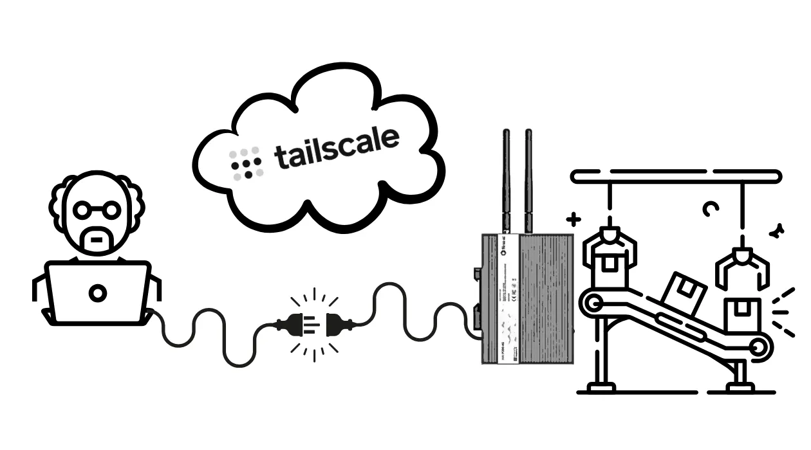
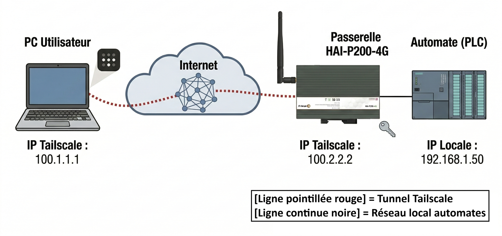
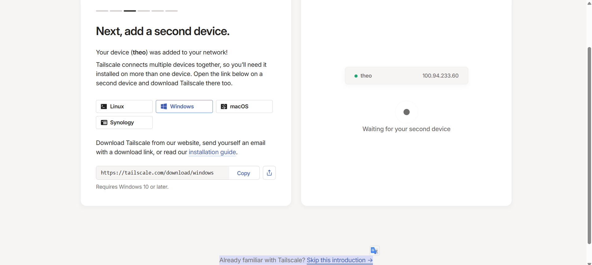
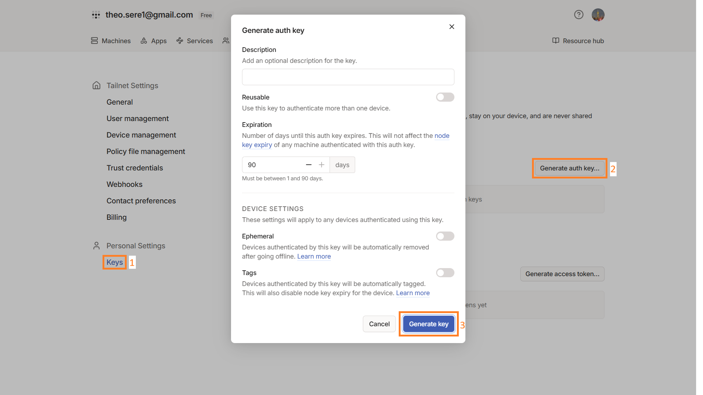
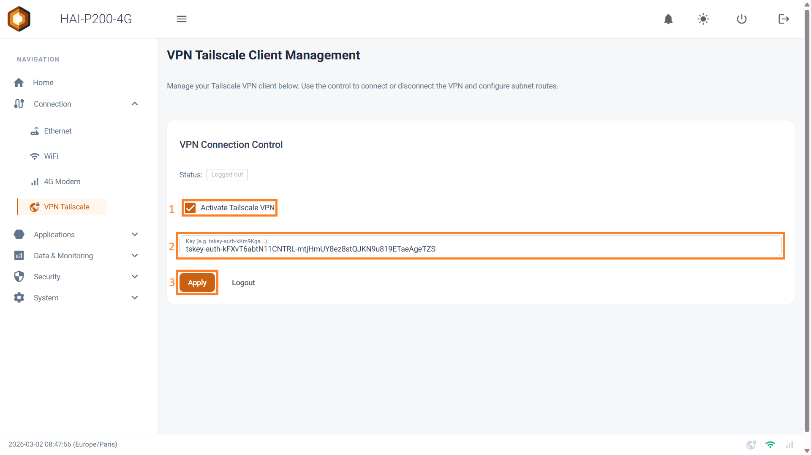
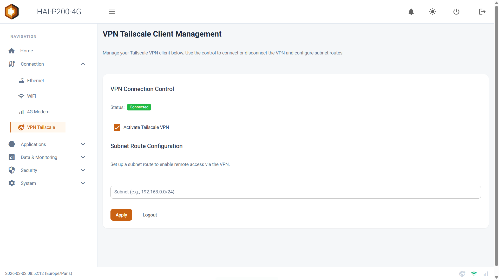
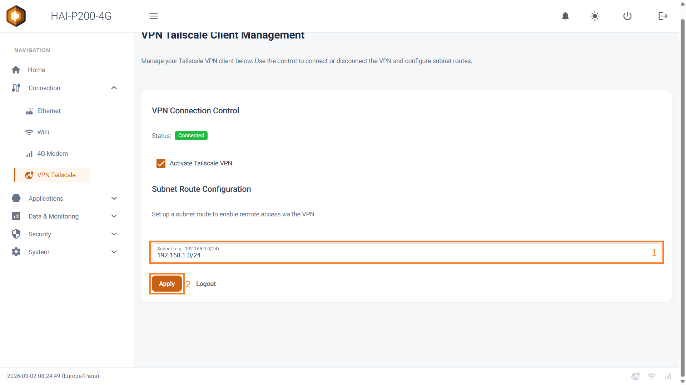
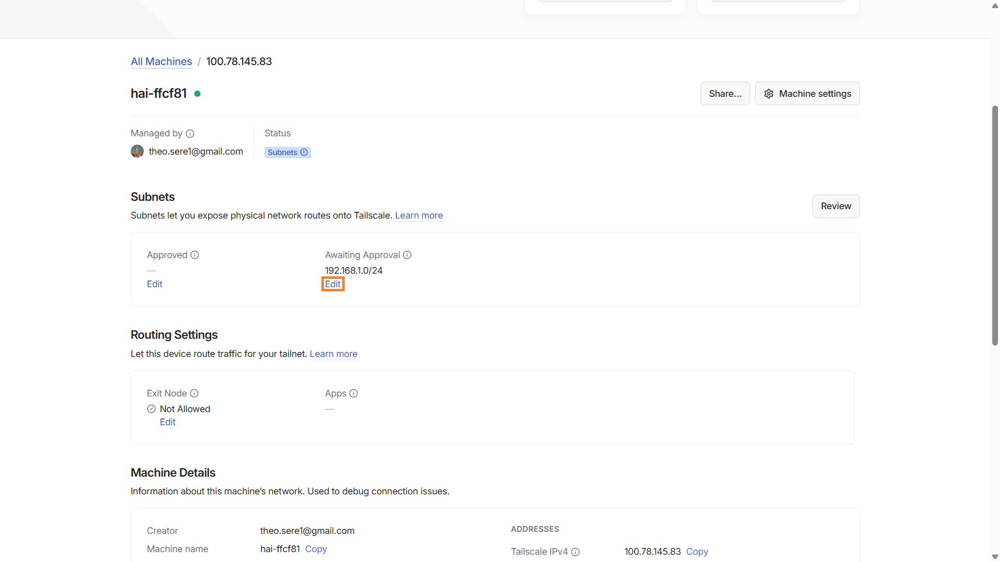
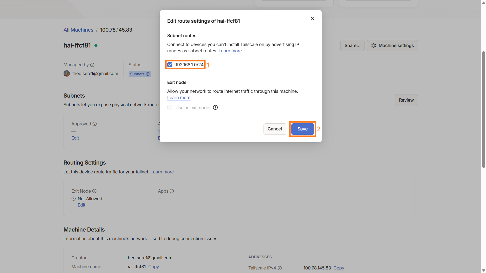

## Qu'est-ce que Tailscale ?

Tailscale est une solution de réseau privé virtuel (VPN) moderne et sécurisée qui permet de connecter facilement des appareils entre eux, où qu'ils se trouvent dans le monde. Contrairement aux VPN traditionnels, Tailscale utilise le protocole WireGuard et une approche « zero-config » qui simplifie considérablement la mise en place et la gestion du réseau.

## Principaux avantages

- Configuration simple et rapide : pas besoin de gérer des serveurs VPN complexes
- Sécurité de haut niveau grâce au protocole WireGuard
- Fonctionne à travers les pare-feu et NAT sans configuration particulière
- Parfait pour les équipes en télétravail et les infrastructures distribuées

## Comment ça marche ?

Tailscale crée un réseau maillé (mesh network) entre vos appareils. Chaque appareil se connecte directement aux autres, sans passer par un serveur central, ce qui optimise les performances et la sécurité. L'authentification est gérée via des fournisseurs d'identité existants (comme Google, Microsoft ou GitHub), simplifiant ainsi la gestion des accès.

_💡_

À noter : Tailscale propose une version gratuite pour un usage personnel et des versions payantes pour les entreprises avec des fonctionnalités avancées.

## Nécessaire

- Le contrôleur HAI-P200-4G connecté à Internet
- Un ordinateur connecté à internet

## Installation de Tailscale sur votre ordinateur

- Rendez-vous sur [https://tailscale.com/](https://tailscale.com/) et créez votre compte.
- Choisissez la version correspondant à votre système d'exploitation et téléchargez-la.
- Ouvrez le fichier d'installation, acceptez la licence et cliquez sur **Install**.
- Une fois l'installation terminée, connectez-vous à votre compte Tailscale. Cela ouvrira généralement une page dans votre navigateur web pour l'authentification.

## Configuration de vos appareils

Une fois installé, connectez votre ordinateur en cliquant sur la flèche à droite de votre barre Windows. Cliquez sur l’**icône de Tailscale** (un carré rempli de points).

Cela aura pour effet d’ouvrir un onglet de votre navigateur internet. Cliquez alors sur le bouton **Connect**.

Vous remarquerez alors qu’en revenant sur votre onglet d’inscription, l’appareil a été ajouté.

Ne rajoutez pas directement un second appareil.

Cliquez sur **Skip this introduction** en bas de l’écran.

Vous retrouverez alors une interface d’administration qui liste les appareils connectés (et donc votre ordinateur).

Dans les onglets, ouvrez **Settings** et cliquez sur **Keys** dans le menu vertical à gauche de votre écran.

Créez alors une clé avec les paramètres que vous souhaitez lui appliquer (durée de validité, etc.).

Cette clé peut être copiée. Vous pouvez alors vous rendre sur l’interface web de votre passerelle HAI-P200-4G. Cliquez sur **VPN Tailscale** et renseignez votre clé dans la zone de texte. Cochez **Activate Tailscale VPN** et cliquez sur **Apply**.

En retournant sur votre interface d’administrateur sur Tailscale, vous pouvez bien voir votre appareil connecté.

## Me connecter à la passerelle

Une fois les deux appareils appairés, vous pouvez vous reconnecter à la passerelle en cliquant sur la **flèche** à droite de la barre Windows, puis sur le **logo de Tailscale**.

Cliquez alors sur **Network devices**, puis **My devices**, et sélectionnez votre passerelle HAI-P200-4G.

Votre ordinateur est connecté à votre passerelle !

Son adresse IP a été copiée, vous pouvez la coller pour vous y connecter via votre navigateur, sur CODESYS…

## Exposition des sous réseaux

Il est possible d’exposer un sous-réseau, afin de pouvoir utiliser les appareils connectés à celui-ci tel que des automates, qui ne sont pas forcément compatibles avec Tailscale.

Pour ce faire, connectez-vous à votre passerelle et allez dans **VPN Tailscale**.

Entrez l’adresse du sous-réseau dans la zone de texte Subnet, au format **192.168.1.0/24** (notation CDIR), et cliquez sur **Apply**.

Une fois validé, vous pouvez vous rendre sur l’interface d’administration de Tailscale, sur leur site, et cliquer sur le nom de votre passerelle.

Dans **Subnets**, vous devriez voir la liste des sous-réseaux validés et de ceux en attente de validation.

Cherchez l’adresse du réseau que vous avez tapée et cliquez sur **Edit.**

Dans la pop-up qui s’ouvre, cochez l’adresse du sous-réseau et sauvegardez.

Vous pouvez à présent utiliser les appareils connectés au sous-réseau !

## Port Forwarding

L'exposition de sous-réseau décrite ci-dessus rend accessible tout le réseau de la machine. Quand ce n'est pas souhaitable — un client qui refuse d'ouvrir un segment entier, ou deux sites qui utilisent le même plan d'adressage — la passerelle sait n'exposer qu'un seul équipement, sur un seul port.

Sur la page **VPN Tailscale**, la ligne **Mode** propose Subnet Route (le comportement par défaut) et Port Forwarding. Les deux s'excluent : choisir Port Forwarding retire la route de sous-réseau annoncée, et inversement. Les deux configurations sont conservées, revenir sur l'autre mode ne demande aucune ressaisie. Le sélecteur n'apparaît qu'une fois la clé renseignée et la passerelle enrôlée.

En mode Port Forwarding, la carte **Add a forwarding rule** demande trois valeurs :

- **Tailscale port** : le port par lequel on entrera, sur l'adresse Tailscale de la passerelle ;
- **Target IP** : l'adresse de l'équipement à joindre (IPv4 privée, sur un réseau directement connecté à la passerelle) ;
- **Target port** : le port TCP du service visé — 80 pour une IHM web, 22 pour SSH, 502 pour du Modbus/TCP.

Le bouton **Test** vérifie, sans rien enregistrer, que le service répond et que le port choisi est libre. **Add** enregistre la règle et l'active immédiatement : le bouton **Apply** en bas de page ne concerne que la connexion VPN. **Test all** resonde toutes les règles du tableau, et l'icône corbeille en supprime une (les connexions en cours sont alors coupées).

L'adresse à communiquer est celle de la passerelle sur le tailnet, suivie du port choisi : avec une règle 8080 → 192.168.1.50:80, on ouvre http://100.84.12.7:8080. L'équipement cible n'a rien à configurer — pas de passerelle ni de route de retour à déclarer, il voit une connexion venant de la passerelle.

À noter : la redirection ne fonctionne qu'en **TCP** (ni UDP, ni ping), et n'est joignable **que depuis le VPN** — jamais depuis le réseau local, la 4G ou l'Ethernet d'usine. Chaque ajout et chaque suppression est journalisé dans **Security > Audit & Logs**.
