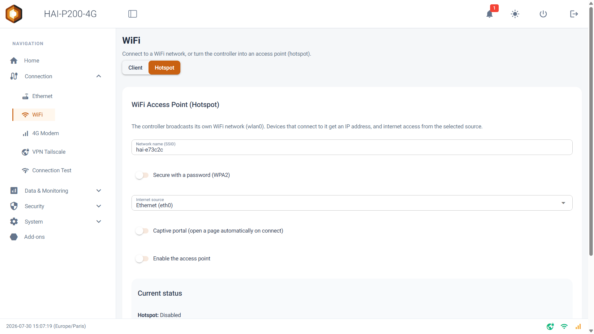
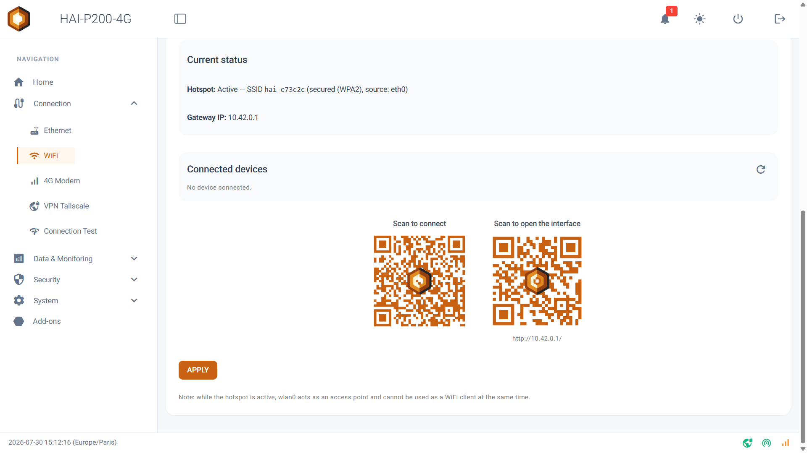

Bienvenue dans ce guide de prise en main du point d'accès Wi-Fi. Cette fonctionnalité transforme votre contrôleur HAI-P200-4G en borne Wi-Fi : vos téléphones, tablettes et PC portables s'y connectent directement, accèdent à l'interface du contrôleur, et peuvent même bénéficier de sa connexion Internet 4G ou Ethernet. C'est l'outil idéal pour intervenir sur une installation sans réseau, ou pour dépanner une machine isolée.

## Prérequis

- Le contrôleur HAI-P200-4G
- HAI-OS
- Pour partager Internet : un câble Ethernet raccordé, ou une carte SIM active dans le modem 4G

## À quoi sert le point d'accès ?

Trois usages principaux :

- **Intervenir sur site sans infrastructure réseau.** Vous arrivez devant une armoire, vous vous connectez au Wi-Fi du contrôleur avec votre tablette, et vous accédez immédiatement au Data-Explorer, aux alarmes et à la configuration — sans câble, sans switch, sans demander un accès au réseau du client.
- **Donner Internet à un équipement isolé.** Le contrôleur partage sa connexion 4G ou Ethernet avec les appareils connectés à son Wi-Fi : pratique pour dépanner un PC portable dans un local sans réseau.
- **Créer un réseau local fermé.** En choisissant de ne partager aucune connexion, vous obtenez un réseau Wi-Fi isolé où le contrôleur distribue les adresses IP : utile pour un banc d'essai ou une démonstration.

## Important : Client ou Hotspot, il faut choisir

Le contrôleur ne possède **qu'une seule radio Wi-Fi**. Elle peut soit se connecter à un réseau existant (mode **Client**), soit diffuser son propre réseau (mode **Hotspot**), mais **jamais les deux en même temps**.

:::caution
**Conséquence à bien anticiper** : si le contrôleur est actuellement connecté à Internet **par le Wi-Fi**, activer le point d'accès va couper cette connexion. Si vous êtes vous-même en train d'administrer le contrôleur à distance via ce Wi-Fi, vous perdrez l'accès. Assurez-vous d'avoir une autre voie d'accès (Ethernet, 4G ou Tailscale) avant de basculer.
:::

Le basculement est automatique dans les deux sens : activer le point d'accès déconnecte le Wi-Fi client, et repasser en mode Client arrête le point d'accès puis tente de rejoindre le réseau précédent.

## Créer votre point d'accès

Rendez-vous dans le menu **Connection > WiFi**, puis basculez le sélecteur en haut de page de **Client** vers **Hotspot**. La carte **WiFi Access Point (Hotspot)** apparaît.

Renseignez les champs dans l'ordre :

**1\. Network name (SSID)** — le nom du réseau Wi-Fi tel qu'il apparaîtra sur les téléphones. Par défaut, le nom du contrôleur. Ce champ est obligatoire.

**2\. Secure with a password (WPA2)** — laissez cet interrupteur activé pour protéger votre réseau. En le désactivant, vous créez un réseau **ouvert**, accessible à quiconque à portée.

**3\. Password** — le mot de passe Wi-Fi, de **8 à 63 caractères**.

**4\. Internet source** — détermine si les appareils connectés ont accès à Internet, et par quelle voie :

- **Ethernet (eth0)** : partage la connexion filaire du contrôleur.
- **4G (wwan0)** : partage la connexion mobile.
- **None (no internet)** : aucun partage. Les appareils accèdent uniquement au contrôleur.

**5\. Captive portal** — voir la section dédiée ci-dessous. Laissez désactivé si vous ne savez pas encore.

**6\. Enable the access point** — activez cet interrupteur.

**7.** Cliquez sur **APPLY**.

Le bloc **Current status** confirme alors l'activation : nom du réseau diffusé, mode de sécurité et source Internet retenue. L'icône Wi-Fi en bas de l'interface passe au vert lorsque le point d'accès est actif.

:::tip
**Réglages figés** : la bande (2,4 GHz), le chiffrement (WPA2), l'adresse du contrôleur (**10.42.0.1**) et la plage d'adresses distribuées (10.42.0.10 à 10.42.0.254, baux de 24 h) ne sont pas configurables. C'est volontaire : ces valeurs couvrent la quasi-totalité des usages et évitent les erreurs de configuration radio.
:::

## Se connecter au point d'accès

Une fois le point d'accès actif, deux QR codes s'affichent sur la page :

- **Scan to connect** : scannez-le avec l'appareil photo d'un téléphone pour rejoindre le réseau **sans saisir le mot de passe**.
- **Scan to open the interface** : ouvre directement l'interface du contrôleur dans le navigateur.

Cliquez sur un QR code pour l'agrandir — pratique pour le faire scanner par un collègue, ou pour l'afficher depuis un poste distant.

Manuellement, connectez-vous au réseau Wi-Fi puis ouvrez http://10.42.0.1 dans un navigateur. Cette adresse est celle du contrôleur sur son propre réseau, et elle ne change jamais.

## Le portail captif

Activez **Captive portal (open a page automatically on connect)** pour qu'une page s'ouvre **automatiquement** sur les appareils qui se connectent, comme dans un hôtel ou un aéroport. Le champ **Portal page** détermine la destination : un chemin de l'interface (par exemple /apps) ou une URL complète commençant par http:// ou https://. Par défaut, la page d'accueil du contrôleur.

Le comportement dépend de la source Internet choisie :

- **Avec une source Internet** (Ethernet ou 4G) : l'utilisateur voit une page d'accueil lui indiquant qu'il est connecté, avec l'adresse du contrôleur, un bouton pour ouvrir l'interface dans son vrai navigateur, et un bouton **Continue to the internet** qui débloque son accès Internet. C'est le fonctionnement classique du « clic pour accepter ».
- **Sans source Internet** (None) : le portail devient un réseau fermé permanent. Toute navigation ramène sur la page du contrôleur, sans possibilité de sortir. Idéal pour une borne de consultation.

Trois points à connaître sur le portail captif :

- La fenêtre qui s'ouvre automatiquement sur les téléphones est un mini-navigateur limité. Il affichera un **avertissement de certificat** en accédant au contrôleur en HTTPS : c'est normal, le contrôleur utilise un certificat auto-signé. Utilisez le bouton **Open in my browser** pour basculer sur le navigateur complet du téléphone.
- L'autorisation d'accès Internet accordée par le bouton **Continue to the internet** n'est pas permanente : après une réinitialisation interne du pare-feu, l'utilisateur devra cliquer à nouveau. Sans conséquence sur la connexion Wi-Fi elle-même.
- Certains appareils n'afficheront pas le portail si la source internet sélectionnée est sur None.

Si vous n'activez pas le portail captif, rien ne s'ouvre automatiquement : les utilisateurs saisissent http://10.42.0.1 ou scannent le QR code.

## Suivre et gérer les appareils connectés

Le bloc **Connected devices** liste les appareils présents sur votre point d'accès. Pour chacun :

- son **nom d'hôte**, tel qu'il s'est annoncé (unknown s'il n'en fournit pas)
- son **adresse IP**, son **adresse MAC** et sa **durée de connexion**
- le **volume de données** échangées (↓ reçu, ↑ envoyé), s'il y a eu du trafic
- un badge **internet** s'il a été autorisé à sortir via le portail captif, ou **blocked** s'il est bloqué

:::caution
Cette liste **ne se rafraîchit pas automatiquement**. Utilisez le bouton de rafraîchissement pour l'actualiser.
:::

La force du signal n'est pas affichée : le matériel ne la remonte pas lorsqu'il fonctionne en point d'accès.

## Bloquer un appareil

Le bouton **Block** interdit à un appareil d'utiliser le réseau : il est déconnecté immédiatement, ne reçoit plus d'adresse IP et son trafic est rejeté. Le blocage est **conservé après un redémarrage** du contrôleur, et les appareils bloqués restent listés même absents, pour pouvoir les débloquer plus tard avec **Unblock**.

À savoir : un appareil bloqué peut techniquement encore _s'associer_ au réseau Wi-Fi, mais il n'obtiendra aucune adresse et ne pourra rien faire. Le blocage est efficace, mais il n'est pas invisible pour l'utilisateur bloqué.

## Le partage de connexion Internet

Quand vous choisissez une source Internet, le contrôleur route le trafic des appareils Wi-Fi vers cette interface et gère la traduction d'adresses. Trois comportements à connaître :

**Si la source Internet devient indisponible** (câble débranché, modem hors service), le point d'accès **continue de fonctionner** : le Wi-Fi reste diffusé, les appareils reçoivent toujours une adresse IP et accèdent au contrôleur. Seul Internet est coupé. En revanche, lorsque la connexion revient, **réappliquez la configuration du hotspot** (bouton **APPLY**) pour rétablir le partage.

**Avec la source 4G**, tout le trafic Internet de vos visiteurs — mises à jour de téléphones, vidéos, sauvegardes cloud — passe par votre forfait mobile. Sur un abonnement limité, privilégiez None (no internet) ou la source Ethernet.

**Certaines configurations sont incompatibles.** Si le contrôleur partage déjà sa connexion vers un équipement filaire, l'interface vous en avertit : soit le mode Hotspot est indisponible et il faut désactiver ce partage, soit la source Internet est verrouillée sur None (no internet). Le message affiché indique précisément quel partage bloque quoi.

## Limites et bonnes pratiques

- **Une seule radio** : le mode Client et le mode Hotspot s'excluent. Prévoyez toujours une seconde voie d'accès au contrôleur avant de basculer.
- **Environ 245 appareils** peuvent recevoir une adresse, mais en pratique une borne 2,4 GHz reste confortable jusqu'à une dizaine de clients simultanés.
- **Réactivation automatique au démarrage** : si le point d'accès était actif, il redémarre seul après le boot, avec un délai de mise en route de quelques dizaines de secondes. Ne concluez pas trop vite à une panne.
- **L'accès distant par Tailscale continue de fonctionner** lorsque le point d'accès est actif : il est préservé par la configuration réseau. C'est votre filet de sécurité si vous coupez le Wi-Fi client par erreur.
- **Mot de passe** : ne laissez pas un point d'accès ouvert sur une installation en production. Un réseau sans mot de passe donne à toute personne à portée un accès direct à l'interface du contrôleur — et à Internet si vous le partagez.

## Dépannage

| Message | Signification et action |
| --- | --- |
| _Network name (SSID) is required._ | Le nom du réseau est vide. |
| _WPA2 password must be 8 to 63 characters._ | Mot de passe trop court ou trop long. |
| _Portal page must be a path (/apps) or a full http(s):// URL._ | La page du portail doit commencer par /, http:// ou https://. |
| _Failed to start the WiFi access point (wlan0)._ | La radio n'a pas pu passer en point d'accès. Vérifiez qu'aucune connexion Wi-Fi client n'est en cours d'établissement, puis réessayez. |
| _Hotspot unavailable: wlan0 is used as a WiFi client sharing its connection…_ | Un partage de connexion utilise déjà le Wi-Fi. Désactivez-le pour libérer la radio. |
| _Connection sharing to eth1 … was turned off…_ | Le partage filaire a été désactivé automatiquement, incompatible avec le point d'accès. |
| _Access point stopped: wlan0 is back on its WiFi network._ | Vous êtes repassé en mode Client : le point d'accès a été arrêté, c'est normal. |
| _Access point still running on wlan0: stop it to scan for networks._ | Pour rechercher des réseaux Wi-Fi, arrêtez d'abord le point d'accès. |

**Les appareils ne reçoivent pas d'adresse IP ?** Réappliquez la configuration avec **APPLY**. C'est le geste qui remet en place l'ensemble du service (distribution d'adresses, routage, portail).
