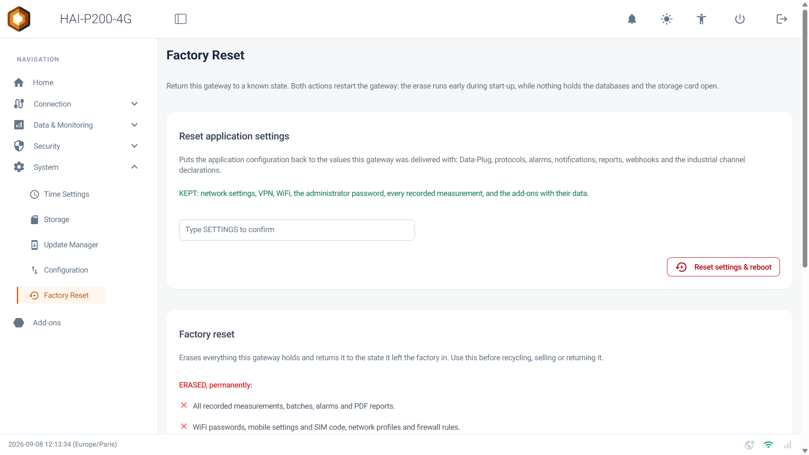
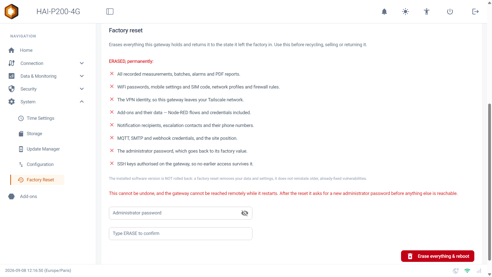
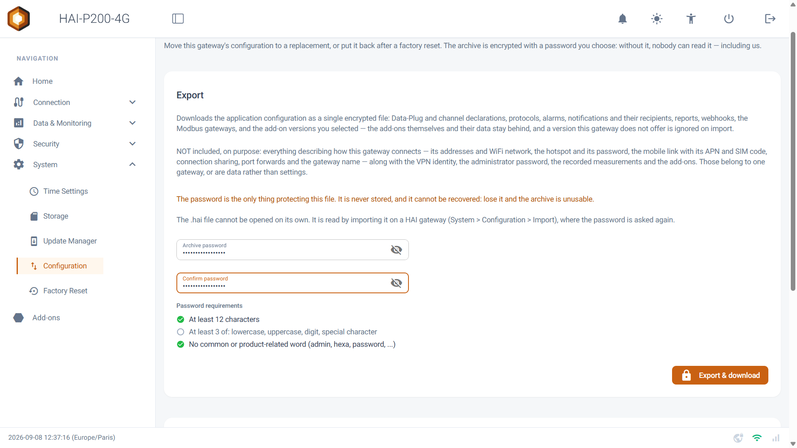
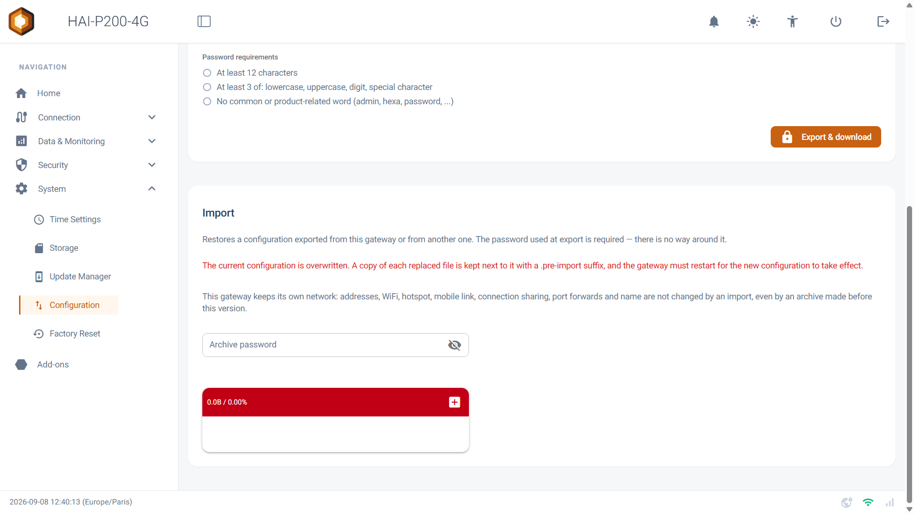
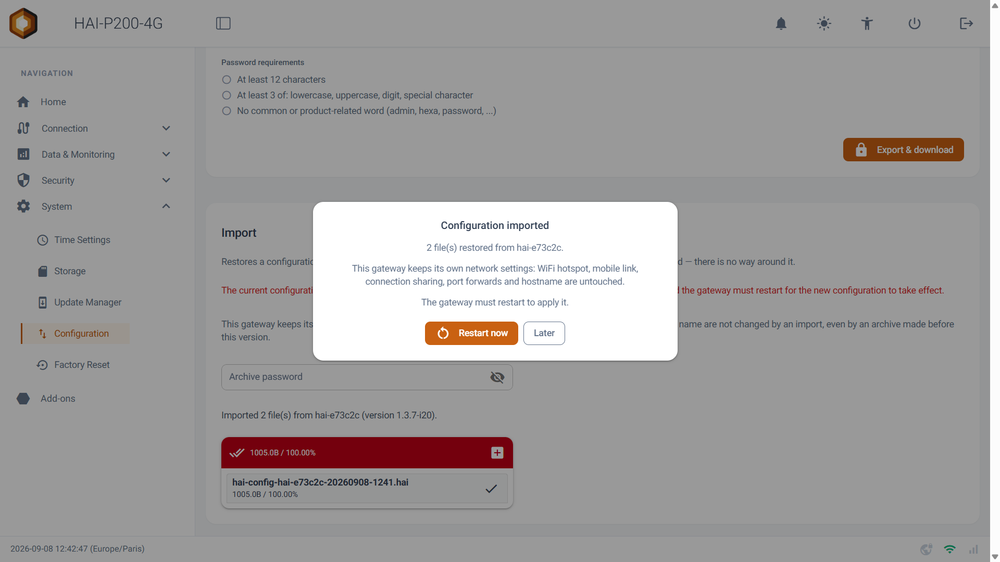

Bienvenue dans ce guide de prise en main des pages **Factory Reset** et **Configuration**. Elles répondent à trois besoins : repartir d'une configuration propre, effacer un contrôleur avant de s'en séparer, et déplacer une configuration d'un boîtier vers un autre.

## Prérequis

- Le contrôleur HAI-P200-4G
- HAI-OS
- Pour l'effacement sans réseau : un écran HDMI et un clavier USB

## 1. Quelle opération choisir ?

Quatre situations, quatre réponses différentes. Ce tableau vous évitera d'effacer plus que nécessaire.

| Votre situation | L'opération |
| --- | --- |
| Ma configuration applicative est devenue incompréhensible, je veux repartir de zéro sans perdre mes mesures ni mon réseau | **Reset application settings** (§2) |
| Je rends, revends ou mets au rebut ce contrôleur | **Factory reset** (§3) |
| Le contrôleur n'est plus raccordé à rien et je dois quand même l'effacer | **Factory reset depuis l'écran** (§4) |
| Je remplace un contrôleur, ou je veux dupliquer une configuration sur un second site | **Export puis Import** (§5 et §6) |

:::tip
Avant toute remise à zéro, pensez à faire un **export de configuration** (§5). C'est ce qui vous permettra de remonter vos réglages en quelques minutes plutôt que de tout resaisir.
:::

## 2. Réinitialiser les réglages de l'application

Rendez-vous dans le menu **System > Factory Reset**. La première carte, **Reset application settings**, remet la configuration applicative dans l'état de livraison — sans toucher à votre réseau ni à vos données.

**Remis à zéro :**

- Le Data-Plug et ses protocoles
- Les déclarations de variables industrielles
- Les alarmes
- Les notifications et les rapports
- Les webhooks

**Conservé :**

- La configuration réseau et le WiFi
- Le VPN
- Le mot de passe administrateur
- Toutes les mesures enregistrées
- Les add-ons et leurs données

**La marche à suivre :**

1.  Saisissez SETTINGS dans le champ de confirmation.
2.  Cliquez sur **Reset settings & reboot**.
3.  Le contrôleur redémarre. L'interface est indisponible quelques minutes.

:::tip
**Pourquoi un redémarrage ?** L'effacement a lieu très tôt au démarrage, à un moment où plus aucun programme ne tient les bases de données ni la carte de stockage ouvertes. C'est ce qui garantit qu'il est complet.
:::



## 3. La remise à zéro complète

La seconde carte, **Factory reset**, efface tout ce que contient le contrôleur et le ramène dans l'état où il a quitté l'usine. C'est l'opération à faire avant de le recycler, de le revendre ou de le retourner.

**Ce qui est effacé, définitivement :**

- Toutes les mesures enregistrées, les lots, les alarmes et les rapports PDF.
- Les mots de passe WiFi, les réglages mobiles et le code SIM, les profils réseau et les règles de pare-feu.
- L'identité VPN : le contrôleur quitte votre réseau Tailscale.
- Les add-ons et leurs données — flux Node-RED et identifiants compris.
- Les destinataires de notifications, les contacts d'escalade et leurs numéros de téléphone.
- Les identifiants MQTT, SMTP et webhook, ainsi que la position du site.
- Le mot de passe administrateur, qui revient à sa valeur d'usine.
- Les clés SSH autorisées, afin qu'aucun accès antérieur ne survive à l'effacement.

:::tip
**La version logicielle n'est pas remise en arrière.** Une remise à zéro efface vos données et vos réglages ; elle ne réinstalle pas une version ancienne, et ne réintroduit donc pas de failles déjà corrigées.
:::

**La marche à suivre :**

1.  Saisissez votre **mot de passe administrateur**. Une opération irréversible ne doit pas être à un clic d'une session laissée ouverte.
2.  Saisissez ERASE dans le champ de confirmation.
3.  Cliquez sur **Erase everything & reboot**.
4.  Le contrôleur redémarre et s'efface. Comptez quelques minutes.
5.  Au retour, il vous demande de **choisir un nouveau mot de passe administrateur** avant de donner accès à quoi que ce soit.

:::caution
**Cette opération est irréversible**, et le contrôleur est injoignable à distance pendant qu'il redémarre. **Ne coupez pas l'alimentation** pendant l'effacement.
:::



Après le redémarrage, un message vous confirme que l'opération s'est bien déroulée. Si une étape a échoué, le message vous **nomme laquelle** : une remise à zéro annoncée comme un échec global ne vous dirait pas si vos données ont réellement été effacées.

:::tip
Après une remise à zéro complète, le pare-feu revient à sa configuration de livraison et l'accès SSH est fermé. Vous repartez donc d'une base saine, y compris si des règles avaient été ajoutées entre-temps.
:::

## 4. Effacer un contrôleur sans réseau

Le moment où l'on efface un boîtier est justement celui où on l'a débranché de tout : retour fournisseur, revente, mise au rebut. Un bouton dans l'interface web ne sert alors à rien.

Branchez un **écran HDMI** et un **clavier USB** sur le contrôleur. L'écran n'affiche plus une invite de connexion, mais un tableau de bord :

```
  HAI-P200-4G   hai-93132f   v1.3.8
  --------------------------------------------------------------------

  NETWORK

  Ethernet 1 (WAN)     192.168.60.23/24     up
  Ethernet 2 (LAN)     192.168.1.16/24      up
  WiFi                 192.168.130.36/24    up   << ReseauClient >>
  Mobile 4G            --                   down
  VPN Tailscale        100.101.64.109       connected

  DNS                  8.8.8.8, 8.8.4.4
  Web interface        https://192.168.1.16/

  --------------------------------------------------------------------
  R  Refresh this screen
  F  Factory reset - erase everything on this gateway,
     before recycling, selling or returning it
  Alt+F2  Login prompt (for an engineer)
```

Cet écran vous donne l'adresse de chaque interface, les serveurs DNS et l'adresse de l'interface web — pratique aussi quand vous cherchez simplement à quelle adresse joindre un contrôleur.

La touche **F** ouvre l'écran d'effacement. Celui-ci annonce d'abord la marche à suivre, puis la liste de ce qui sera détruit :

1.  Vous saisissez ERASE et appuyez sur Entrée.
2.  Le contrôleur redémarre et s'efface.
3.  Il vous demande ensuite de choisir un nouveau mot de passe administrateur.

:::caution
**Aucun mot de passe n'est demandé sur cet écran.** C'est volontaire : un boîtier coupé de tout doit rester effaçable, y compris par quelqu'un qui n'en connaît pas les identifiants. En contrepartie, l'accès physique au contrôleur doit être considéré comme un accès privilégié, et **toute utilisation de cet écran est enregistrée** dans le journal d'audit (voir le guide _🛡️ Sécurité (Mot de passe, Pare-feu et Journaux)_).
:::

## 5. Exporter la configuration

Rendez-vous dans le menu **System > Configuration**. La carte **Export** télécharge la configuration applicative sous la forme d'un **fichier unique chiffré**, portant l'extension .hai.

**Ce qui voyage :**

- Le Data-Plug et les déclarations de variables
- Les protocoles configurés
- Les alarmes
- Les notifications et leurs destinataires
- Les rapports
- Les webhooks
- Les passerelles Modbus
- Les versions d'add-ons sélectionnées

**Ce qui reste sur place :**

- Les adresses réseau et le WiFi
- Le point d'accès et son mot de passe
- La liaison mobile, l'APN et le code SIM
- Le partage de connexion et les redirections de ports
- Le nom du contrôleur
- L'identité VPN
- Le mot de passe administrateur
- Les mesures enregistrées et les add-ons eux-mêmes

Cette séparation est volontaire : ce qui décrit _comment un contrôleur se raccorde_ lui appartient en propre, et l'importer ailleurs mettrait deux appareils en conflit sur le même réseau.

**La marche à suivre :**

1.  Choisissez un **mot de passe d'archive** et saisissez-le deux fois. Il obéit aux mêmes règles que le mot de passe administrateur : au moins 12 caractères et trois familles de caractères. Les règles se cochent au fur et à mesure.
2.  Cliquez sur **Export & download**.
3.  Le fichier .hai est téléchargé sur votre poste, et un message vous indique le nombre de fichiers de configuration exportés.

:::caution
**Ce mot de passe est la seule chose qui protège ce fichier.** Il n'est stocké nulle part et ne peut pas être récupéré — y compris par nous. Si vous le perdez, l'archive est définitivement inutilisable. Conservez-le dans votre gestionnaire de mots de passe, avec le fichier.
:::

:::tip
Le fichier .hai ne s'ouvre pas tout seul. Il se lit uniquement en l'important sur un contrôleur HAI, où le mot de passe est redemandé.
:::



## 6. Importer une configuration

La carte **Import**, sur la même page, restaure une configuration exportée depuis ce contrôleur ou depuis un autre.

**La marche à suivre :**

1.  Saisissez le **mot de passe de l'archive** — celui choisi lors de l'export. Il n'existe aucun moyen de s'en passer.
2.  Déposez le fichier .hai dans la zone de téléversement.
3.  Une fenêtre confirme l'import et vous indique combien de fichiers ont été restaurés, et depuis quel contrôleur ils proviennent.
4.  Cliquez sur **Restart now** pour appliquer la configuration, ou sur **Later** si vous préférez choisir le moment.

:::caution
**La configuration actuelle est écrasée.** Une copie de chaque fichier remplacé est cependant conservée à côté de l'original, avec le suffixe .pre-import.
:::

:::tip
**Votre réseau n'est jamais touché.** Le contrôleur qui reçoit l'import conserve ses adresses, son WiFi, son point d'accès, sa liaison mobile, son partage de connexion, ses redirections de ports et son nom — y compris si l'archive a été fabriquée avant cette version.
:::



:::tip
**Versions d'add-ons :** si l'archive demande une version d'add-on que ce contrôleur ne propose pas, elle est simplement ignorée. L'import ne se bloque pas pour autant.
:::



## 7. Cas pratique : remplacer un contrôleur

C'est l'usage le plus fréquent des deux pages ensemble.

1.  **Sur l'ancien contrôleur**, s'il est encore accessible : **System > Configuration > Export**, choisissez un mot de passe, téléchargez le fichier .hai.
2.  **Sur le nouveau contrôleur** : effectuez la première mise en service (choix du mot de passe administrateur), puis configurez son **réseau** — adresses, WiFi ou 4G — car cette partie ne voyage pas.
3.  Toujours sur le nouveau : **System > Configuration > Import**, saisissez le mot de passe de l'archive et déposez le fichier.
4.  Redémarrez le contrôleur.
5.  Reconnectez le **VPN Tailscale** avec une nouvelle clé d'authentification : l'identité VPN ne se transfère pas.
6.  Réinstallez les **add-ons** dont vous avez besoin depuis le menu **Add-ons**. Leurs données ne sont pas dans l'archive.
7.  **Sur l'ancien contrôleur**, avant de vous en séparer : effectuez une **remise à zéro complète** (§3), ou l'effacement depuis l'écran (§4) s'il est déjà débranché.

:::caution
**Note importante :** les mesures enregistrées ne sont pas transférées par cette procédure. Si l'historique du site doit être conservé, exportez vos données depuis le Data-Explorer, ou récupérez la carte microSD de l'ancien contrôleur avant de l'effacer.
:::

## 8. Points d'attention

- **Un export n'est pas une sauvegarde de vos données.** Il contient vos réglages, pas vos mesures.
- **Le mot de passe d'archive ne se récupère pas.** C'est la contrepartie d'un chiffrement dont nous ne détenons pas la clé.
- **Les deux remises à zéro passent par un redémarrage.** Prévoyez une fenêtre de quelques minutes d'indisponibilité, et une présence sur site si le contrôleur pilote une installation en production.
- **L'écran HDMI permet d'effacer sans mot de passe.** Traitez l'accès physique au contrôleur comme un accès privilégié.
