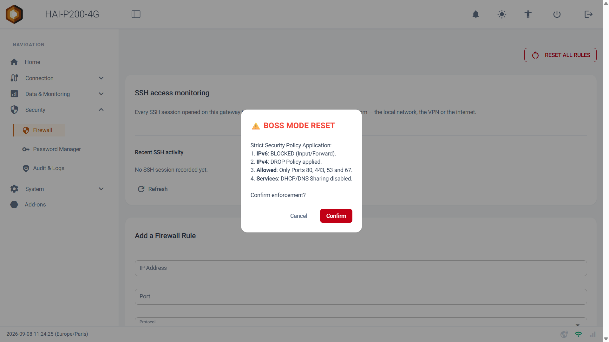

Bienvenue dans ce guide de prise en main du menu **Security**. Ce module regroupe tout ce qui protège votre contrôleur : le mot de passe qui en garde l'accès, le pare-feu qui filtre ce qui peut l'atteindre, et le journal d'audit qui conserve la trace de ce qui s'y passe. La version 1.3.8 y apporte des nouveautés importantes, présentées ici une par une.

## Prérequis

- Le contrôleur HAI-P200-4G
- Un compte administrateur (utilisateur admin)

## 1. Le mot de passe administrateur

### À la première mise en service

Un contrôleur neuf ne vous présente pas de page de connexion. Il ouvre directement un **écran de configuration** qui vous demande de choisir votre mot de passe administrateur. Tant que ce n'est pas fait, aucune page et aucun réglage ne sont accessibles.

Le mot de passe demandé doit respecter deux règles :

- **Au moins 12 caractères.**
- **Au moins trois familles de caractères** parmi : minuscules, majuscules, chiffres, caractères spéciaux.

Les mots trop évidents (liés au produit, ou classiques du genre _admin_ et _azerty_) sont refusés. Les règles s'affichent à l'écran et se cochent au fur et à mesure de votre saisie.

:::tip
**Pourquoi ce changement ?** Jusqu'à la version précédente, tous les contrôleurs sortaient d'usine avec le même mot de passe. Un identifiant partagé par toute une flotte n'en est plus vraiment un : la réglementation européenne sur la cyberrésilience l'interdit désormais. Chaque contrôleur possède maintenant le sien, choisi par vous.
:::

### Le modifier par la suite

Le mot de passe reste modifiable à tout moment :

1.  Rendez-vous dans le menu **Security > Password Manager**.
2.  Renseignez votre **Current Password** (mot de passe actuel).
3.  Saisissez le nouveau dans **New Password**, puis à nouveau dans **Confirm New Password**.
4.  Cliquez sur **Change Password**.

Les mêmes règles de robustesse s'appliquent qu'à la première mise en service.

:::tip
**Astuce :** c'est également sur cette page que se règle l'**accès invité**, si vous souhaitez qu'un opérateur puisse consulter le Data-Explorer, les lots, les alarmes ou les rapports PDF sans avoir besoin de ce mot de passe.
:::

### Que se passe-t-il en cas d'erreurs répétées ?

Après **cinq échecs consécutifs**, le contrôleur ralentit les tentatives suivantes : 5 secondes d'attente, puis 10, puis 20, et ainsi de suite jusqu'à un maximum de **5 minutes**. Le compteur s'efface après un quart d'heure sans nouvelle tentative, et une saisie correcte le remet à zéro.

:::caution
Le compte n'est **jamais bloqué définitivement**. Personne ne peut vous enfermer hors de votre propre contrôleur en se trompant volontairement de mot de passe. Chaque tentative, réussie ou non, est inscrite au journal d'audit.
:::

## 2. Les mots de passe des add-ons

Certains add-ons possèdent leur propre compte, indépendant de celui du contrôleur : **Grafana**, **Ignition**, **PostgreSQL** et **pgAdmin**. Node-RED, lui, n'en a pas.

Jusqu'à la version précédente, ces mots de passe étaient identiques sur tous les contrôleurs et imprimés dans nos manuels. Ils sont désormais **générés au premier démarrage de votre appareil** et propres à lui seul. Comme ils ne peuvent plus figurer dans une documentation, le contrôleur vous les montre directement.

### Où les retrouver ?

1.  Rendez-vous dans le menu **Add-ons**.
2.  Sur la carte de l'add-on concerné, ouvrez le menu **⋮** (les trois points).
3.  Cliquez sur **Credentials**.

Une fenêtre affiche alors deux champs :

- **User :** le nom d'utilisateur, en clair.
- **Password :** le mot de passe, **masqué par défaut**. L'icône en forme d'œil le révèle, et le bouton **Copy** le place dans votre presse-papiers sans avoir à l'afficher.

:::tip
**Pourquoi masqué par défaut ?** Cet écran est souvent ouvert pendant une mise en service, sur un écran que d'autres personnes peuvent voir. Le bouton **Copy** vous évite d'avoir à dévoiler le mot de passe pour l'utiliser.
:::

:::caution
**Cas des add-ons installés avant la version 1.3.8.** Un add-on conserve dans ses données le mot de passe créé lors de sa première installation. Grafana et PostgreSQL sont corrigés automatiquement par la mise à jour ; **Ignition et pgAdmin conservent l'ancien mot de passe** tant qu'ils ne sont pas réinstallés avec l'option de suppression des données. Si l'écran **Credentials** vous affiche un mot de passe qui ne fonctionne pas, c'est cette situation.
:::

:::tip
Si la fenêtre indique que le mot de passe n'a pas encore été généré, redémarrez le contrôleur — la génération a lieu au démarrage.
:::

## 3. Le Pare-feu (Firewall)

La page **Security > Firewall** vous montre ce qui a le droit d'atteindre votre contrôleur, et vous permet de l'ajuster. À la livraison, l'interface web ne répond que sur vos réseaux locaux et sur le VPN — jamais sur la liaison 4G — et l'accès SSH est fermé.

### Ajouter une règle

Dans la carte **Add a Firewall Rule**, renseignez les champs suivants :

- **IP Address :** l'adresse concernée. Ne saisissez rien pour « depuis n'importe où ».
- **Port :** le port visé (ex : 502 pour du Modbus/TCP).
- **Protocol :** tcp ou udp.
- **Action :** **Allow** pour autoriser, **Block** pour bloquer.
- **Direction :** **IN** pour ce qui entre vers le contrôleur, **OUT** pour ce qui en sort.
- **Networks :** les réseaux sur lesquels la règle s'applique.

Puis cliquez sur **Add Rule**.

### Le champ Networks : local ou 4G ?

Ce champ propose deux valeurs :

- **Local networks only (recommended)** — valeur par défaut. La règle ne s'applique qu'à vos réseaux locaux et au VPN. C'est ce qu'il vous faut pour ouvrir un port à un technicien présent sur le site.
- **Every network, including the 4G link** — la règle s'applique aussi à la liaison mobile. Un bandeau orange apparaît alors pour vous alerter.

:::caution
**Attention à la seconde option.** Si votre carte SIM dispose d'une adresse publique, le port devient joignable depuis Internet par n'importe qui. Restreignez alors la règle à une adresse source précise, ou restez sur les réseaux locaux.
:::

### Relire ses règles

Le tableau des règles reprend cette portée pour chaque ligne, dans une colonne **Networks** : Local only ou ⚠ Including 4G. Un simple coup d'œil vous indique donc ce qui est exposé au-delà de votre atelier.

### Les règles maintenues par le contrôleur

La section dépliante **System rules — maintained by the gateway** affiche les règles que le contrôleur installe et met à jour lui-même. Elles ne sont pas modifiables : supprimer la boucle locale ou le suivi des réponses couperait le contrôleur de lui-même.

Elles vous sont malgré tout **montrées**, accompagnées d'une traduction en langage clair. Une page qui se présente comme la vue de votre pare-feu doit tout vous montrer, y compris ce qu'elle ne vous laisse pas modifier.

### Surveiller les accès SSH

La carte **SSH access monitoring** liste les dernières connexions SSH ouvertes sur le contrôleur, avec l'adresse d'origine et le réseau emprunté : réseau local, VPN ou Internet. Elle se trouve sur cette page parce que c'est ici que l'on ouvre, ou non, le port 22.

### Le bouton RESET ALL RULES

En haut de la page, ce bouton applique une politique de sécurité stricte après une simple confirmation :

- **IPv6** bloqué en entrée et en transit ;
- **IPv4** en politique _DROP_ : tout ce qui n'est pas explicitement autorisé est rejeté ;
- seuls les **ports 80, 443, 53 et 67** restent ouverts ;
- le **partage DHCP/DNS** est désactivé.

:::caution
**Toutes vos règles personnalisées sont supprimées.** Réservez ce bouton au cas où la configuration du pare-feu est devenue incompréhensible et où vous souhaitez repartir d'une base saine.
:::

## 4. Audits et Journaux (Audit & Logs)

La page **Security > Audit & Logs** rassemble tout ce que votre contrôleur conserve sur lui-même : les accès, les changements de configuration et les actions d'administration.

### Qu'est-ce qui est enregistré ?

Chaque événement porte une date, une action et une catégorie. La liste **Recent activity** se filtre par catégorie à l'aide du menu **Show** :

| Catégorie | Ce que vous y trouverez |
| --- | --- |
| Authentication | Les connexions à l'interface, réussies comme échouées, et le ralentissement déclenché par une série d'échecs. |
| Network and firewall | Les règles de pare-feu ajoutées ou supprimées, les changements réseau, les redirections de ports du VPN. |
| Administration | Les installations et suppressions d'add-ons, les mises à jour, les changements de réglages. |
| System | Les démarrages de services et les événements propres à l'appareil. |

### Les accès physiques

Une carte séparée recense ce qui se passe **devant la machine** : un écran et un clavier branchés sur le contrôleur, une session ouverte sur une console texte ou sur le port série, et l'ouverture de l'écran de remise à zéro.

:::caution
Toute personne disposant d'un écran et d'un clavier peut lire l'état réseau du contrôleur et lancer une remise à zéro d'usine, sans mot de passe. C'est volontaire : un boîtier coupé de tout doit rester effaçable. En contrepartie, chacun de ces accès laisse une trace ici.
:::

### Les accès réseau (SSH)

La carte suivante fait de même pour les sessions ouvertes depuis une autre machine, en conservant leur origine. Les échecs répétés sont consignés **une fois par série** plutôt qu'une ligne par tentative : un balayage automatisé ne peut donc pas noyer vos vraies sessions dans le bruit.

### Télécharger l'archive

Le bouton **Download audit logs** produit un fichier .tar.gz qui contient la piste d'audit de l'application, le journal du démon d'audit système, la liste des sessions SSH, un extrait du journal système, et un **manifeste avec l'empreinte SHA-256 de chaque fichier**.

Cette empreinte vous permet de démontrer que l'archive n'a pas été retouchée après coup. C'est le format à remettre à un auditeur, ou à conserver avant une intervention.

### Combien de temps les journaux sont-ils conservés ?

La piste d'audit est écrite sur la mémoire interne du contrôleur : elle survit donc à une coupure de courant. Elle est plafonnée à **10 Mo au total**, soit plusieurs mois d'usage courant ; au-delà, les enregistrements les plus anciens sont abandonnés, afin qu'un journal ne puisse jamais remplir le stockage et bloquer le contrôleur.

Le journal système, lui, reste en mémoire vive et disparaît à chaque redémarrage — c'est précisément pour cette raison que la piste d'audit est écrite séparément.

### Couper l'enregistrement

Un interrupteur unique, **Record security activity on this gateway**, gouverne l'ensemble : la piste d'audit, le démon système et la surveillance SSH.

:::caution
**L'éteindre supprime tout ce qui a déjà été enregistré** sur le contrôleur : connexions, changements réseau et pare-feu, installations d'add-ons, sessions SSH. Une fenêtre vous le rappelle avant de valider. Ensuite, plus rien localement ne pourra dire qui a fait quoi. **Téléchargez l'archive avant** si elle peut vous être utile.
:::

## 5. Repartir d'une base saine

Deux pages du menu **System** complètent ce dispositif. Elles font l'objet d'un guide détaillé à part ; en voici l'essentiel.

### Factory Reset (Remise à zéro)

Deux niveaux d'effacement vous sont proposés : tout ce que contient le contrôleur, ou seulement les réglages de l'application — en conservant dans ce cas les réseaux, le VPN, le mot de passe et les mesures enregistrées. Après un effacement complet, le contrôleur vous redemande un mot de passe administrateur au premier accès et revient au pare-feu de livraison, SSH fermé.

### Configuration (Export / Import)

Cette page exporte les réglages de votre contrôleur dans un **fichier chiffré**, que vous pouvez réimporter sur un autre — pour remplacer un boîtier, ou le restaurer après une remise à zéro. Ce qui est propre à un appareil ne voyage pas : la configuration réseau, l'identité VPN, le mot de passe et les mesures restent sur leur contrôleur d'origine.

## 6. Le démarrage sécurisé (Secure Boot)

Le démarrage sécurisé scelle l'appareil : le processeur vérifie la signature du logiciel avant de le lancer, et refuse de démarrer sur un système qui ne serait pas le nôtre. Un contrôleur scellé ne peut donc pas être reprogrammé par quelqu'un qui aurait un accès physique à la carte.

**Cette protection arrive sur nos prochains appareils.** Les contrôleurs déjà en service n'en disposent pas : il s'agit d'une propriété gravée à la fabrication, elle ne peut pas être ajoutée par une mise à jour.

### Comment savoir si mon contrôleur en dispose ?

Ouvrez la page **Home**. L'information est affichée avec la version de HAI-OS et le noyau, dans l'un de ces trois cas :

✅**Secure boot: sealed device** Votre appareil est scellé. Seul un logiciel signé par Hexa-AI peut y démarrer.

⚠️**Secure boot: not enabled on this device** Votre appareil n'est pas scellé : c'est le cas de la génération actuelle.

**Aucune ligne affichée** Le contrôleur n'a pas pu lire l'information. Il préfère alors ne rien afficher plutôt que d'annoncer à tort une absence de scellement.

La valeur est lue une seule fois au démarrage, dans des fusibles gravés définitivement : elle ne peut ni changer pendant que la machine fonctionne, ni être modifiée par un logiciel.

## 7. Les autres protections

Ces protections ne demandent aucune manipulation de votre part. Elles sont mentionnées ici pour que vous sachiez ce qui a changé :

- **L'interface web n'est plus accessible que depuis vos réseaux locaux et le VPN.** Elle répondait auparavant sur toutes les interfaces, y compris la 4G, ce qui la plaçait sur Internet avec une carte SIM à adresse publique.
- **Chaque contrôleur signe désormais ses sessions avec sa propre clé.** Cette clé était identique sur tous les appareils fabriqués depuis avril 2025.
- **Les mises à jour sont vérifiées avant installation.** L'interface web n'installe plus rien elle-même : elle dépose la demande, et un service isolé contrôle la signature Hexa-AI. Les téléchargements passent exclusivement par HTTPS.
- **Node-RED ne fonctionne plus en administrateur**, ce qui empêche un flux de prendre la main sur le contrôleur. Deux conséquences : un flux jouant le rôle de _serveur_ sur un port inférieur à 1024 doit remonter au-dessus (un serveur Modbus/TCP en 502 passe en 1502 ; interroger un équipement sur le port 502 n'est pas concerné), et les nœuds exec ne s'exécutent plus en administrateur.
- **Les services redémarrent indéfiniment** au lieu d'abandonner après quelques tentatives, et un chien de garde matériel relance le contrôleur si le système se fige.
